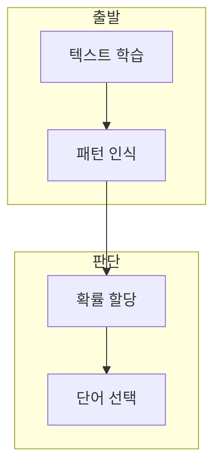

> [!abstract] 한 줄 요약
> 언어 모델은 단어 시퀀스에 확률을 할당하고, 문맥에서 자연스러운 다음 단어 또는 빈칸을 예측한다.

## 이 노트의 지도



## 1. 언어 모델의 예측 대상

강의는 이전 단어들이 주어졌을 때 다음 단어를 예측하는 동작을 언어 모델링의 기본 예로 든다. ==확률 할당== 는 후보 단어마다 선택 가능성을 수치로 두는 과정.

**확률과 선택.** 가장 높은 확률의 단어를 고르는 예시는 학습 데이터의 패턴과 입력 문맥을 함께 전제로 한다.

## 2. 예측 방향의 차이

강의는 이전 문맥에서 다음 단어를 예측하는 자기회귀와 양쪽 문맥에서 가운데 단어를 다루는 양방향 모델을 구분한다.

<Tabs>
  <Tab label="자기회귀">이전 토큰을 바탕으로 다음 토큰의 확률을 계산한다.</Tab>
  <Tab label="언어 모델,문장 확률 모델,자연스러운 시퀀스 탐색,자기회귀,과거 문맥 사용,다음 단어 생성,양방향,양쪽 문맥 사용,빈칸 예측">양쪽 문맥을 활용해 가운데 토큰을 예측한다.</Tab>
</Tabs>

<details>
<summary>응용을 읽는 방법</summary>

텍스트 자동완성, 챗봇, 콘텐츠 생성, 기계 번역은 모두 입력·출력 단위와 평가 기준이 다르다.

</details>

<details>
<summary>입출력 과제</summary>

자동완성·대화·번역은 같은 언어 모델이라도 입력과 정답의 단위가 다르다.

</details>

## 데이터로 보기

```html preview
<div style="font-family:system-ui,sans-serif;padding:20px">
  <div id="cards" style="display:flex;gap:14px;flex-wrap:wrap"></div>
  <script>
    var stats = [
      ['학습', '텍스트', '패턴 관찰', 'var(--chart-1)'],
      ['예측', '다음 단어', '문맥 사용', 'var(--chart-2)'],
      ['응용', '4가지', '자동완성 등', 'var(--chart-3)']
    ];
    document.getElementById('cards').innerHTML = stats.map(function (s) {
      return '<div style="flex:1;min-width:150px;padding:16px;background:var(--card);' +
        'color:var(--card-foreground);border:1px solid var(--border);' +
        'border-radius:var(--radius)">' +
        '<div style="font-size:13px;color:var(--muted-foreground)">' + s[0] + '</div>' +
        '<div style="font-size:26px;font-weight:700;margin-top:4px">' + s[1] + '</div>' +
        '<div style="font-size:12px;font-weight:600;margin-top:4px;color:' + s[3] + '">' + s[2] + '</div>' +
        '</div>';
    }).join('');
  </script>
</div>
```

> [!warning] 확률의 과해석
> 강의의 예시 확률을 모델의 보편적 정확도나 사실성 보장으로 해석하지 않는다.

## 핵심 정리

| 개념 | 정의 | 학습 판단 |
| :-- | :-- | :-- |
| 언어 모델 | 문장 확률 모델 | 자연스러운 시퀀스 탐색 |
| 자기회귀 | 과거 문맥 사용 | 다음 단어 생성 |
| 양방향 | 양쪽 문맥 사용 | 빈칸 예측 |

## 관련 개념

- Transformer Self-Attention은 토큰 간 관계를 계산한다.
- Word2Vec은 단어의 벡터 표현을 학습한다.

> [!question]- 스스로 점검
> **Q.** 자기회귀와 양방향 모델의 입력 문맥은 어떻게 다른가?
>
> **A.** 자기회귀는 이전 토큰을, 양방향은 양쪽 토큰을 활용한다.
