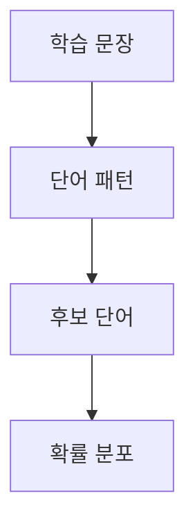
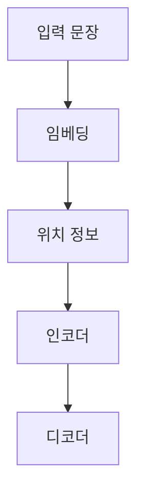

> [!NOTE]
> 언어 모델은 앞뒤 단어의 패턴에서 다음 단어의 확률을 만들고, Transformer는 embedding에 위치 정보를 더한 뒤 encoder와 decoder로 sequence를 변환한다.

---

## 언어 모델의 다음 단어 선택



원본은 “학교에” 다음에 나타나는 세 후보를 세어 가장 높은 확률의 단어를 선택하는 예를 사용한다.

```html preview
<div style="font-family:system-ui,sans-serif;padding:20px;color:var(--foreground)">
  <h3 style="margin:0 0 14px;font-size:15px;font-weight:600">학교에 다음 단어 확률</h3>
  <div id="bars" style="display:flex;align-items:flex-end;gap:14px;height:170px"></div>
  <script>
    var data = [['갔다', 25], ['간다', 50], ['도착했다', 25]];
    var max = Math.max.apply(null, data.map(function (d) { return d[1]; }));
    document.getElementById('bars').innerHTML = data.map(function (d, i) {
      return '<div style="flex:1;display:flex;flex-direction:column;align-items:center;' +
        'gap:6px;height:100%;justify-content:flex-end">' +
        '<span style="font-size:12px;font-weight:600">' + d[1] + '</span>' +
        '<div style="width:100%;height:' + (d[1] / max * 100) + '%;' +
        'background:var(--chart-' + (i + 1) + ');' +
        'border-radius:var(--radius) var(--radius) 0 0"></div>' +
        '<span style="font-size:12px;color:var(--muted-foreground)">' + d[0] + '</span>' +
        '</div>';
    }).join('');
  </script>
</div>
```

<details>
<summary>확률 예에 사용된 문장</summary>

- 나는 오늘 학교에 갔다
- 친구는 학교에 간다
- 그는 매일 학교에 간다
- 친구들은 학교에 도착했다

</details>

---

## 언어 모델의 두 방향

<Tabs>
  <Tab label="Autoregressive">앞에서 생성된 단어를 조건으로 다음 단어를 차례로 예측한다.</Tab>
  <Tab label="Bidirectional">한 위치의 단어를 판단할 때 양쪽 문맥을 함께 사용한다.</Tab>
</Tabs>

| 활용 | 언어 모델이 맡는 기능 |
| :-- | :-- |
| 자동 완성 | 앞선 입력에 이어질 단어 제안 |
| Chatbot | 대화 문맥에 맞는 응답 생성 |
| Content generation | 이어지는 문장 생성 |
| Translation | 입력 sequence를 다른 언어 sequence로 변환 |

---

## RNN에서 Transformer까지

| 시기 | 원본의 이정표 |
| --: | :-- |
| 1986 | RNN |
| 2014 | Seq2Seq |
| 2015 | Attention |
| 2017 | Transformer |
| 2018 | GPT-1 |
| 2019 | BERT |
| 2020 | GPT-3 |

이 연표는 구조의 등장 순서만 보여 주며 성능 비교를 뜻하지 않는다.

---

## Encoder-decoder 번역

**핵심:** encoder는 영어 입력을 context 표현으로 바꾸고, decoder는 SOS 토큰부터 프랑스어 출력을 순서대로 만든다.

| 단계 | 입력 또는 출력 |
| :-- | :-- |
| Encoder 입력 | I → am → a → student |
| Decoder 시작 | SOS |
| Decoder 출력 | je → suis → étudiant → EOS |

원본은 학습 시 영어와 프랑스어 문장을 함께 사용하고, 출력 단계에서는 프랑스어 다음 token을 예측하는 흐름을 제시한다.

---

## Embedding과 위치 정보

<Tabs>
  <Tab label="Embedding">단어를 실수 vector로 바꾼다. Student의 예시는 $[0.17,-0.12,0.55,\ldots,0.03]$이다.</Tab>
  <Tab label="Position">동시에 처리되는 vector에 위치 index와 차원 index를 반영한 정보를 더한다. 원본의 설명 예에서는 $d_{model}=4$를 사용한다.</Tab>
</Tabs>

“I love you”와 “You love I”는 같은 단어를 포함하지만 순서가 달라 의미가 달라진다. 위치 정보는 Transformer가 이 차이를 구분하도록 한다.

---

## 전체 변환 흐름



| Encoder 내부 | 역할 |
| :-- | :-- |
| Multi-head self-attention | 단어 사이 relevance 학습 |
| Add and norm | 앞 단계 입력과 변환 결과 결합 |
| Feed-forward network | 각 위치의 표현 변환 |

---

## Source 표기의 경계

> [!WARNING]
> 번역 구조를 설명하는 원본 일부에서 decoder 쪽이 Encoders로 잘못 표기된다. 또한 positional encoding의 완전한 수식은 텍스트로 남아 있지 않고, 마지막 장은 전체 45장으로 적으면서 표시 번호는 46이다. 이 문서에서는 오기를 조용히 고치거나 빠진 수식을 외부 지식으로 채우지 않는다.

---

## 정리

| 핵심 개념 | 의미 | 적용 또는 경계 |
| :-- | :-- | :-- |
| 언어 모델 | 단어 sequence에 다음 단어 확률 부여 | source의 빈도 예 범위에서 해석 |
| Encoder | 입력 단어의 문맥 표현 생성 | self-attention 상세는 다음 구간 책임 |
| Decoder | 앞선 출력에서 다음 token 생성 | SOS에서 시작해 EOS로 종료 |
| Positional encoding | vector에 순서 정보 추가 | source에 완전한 식은 없음 |
| Transformer | encoder-decoder 기반 sequence 변환 | 연표는 성능 비교가 아님 |