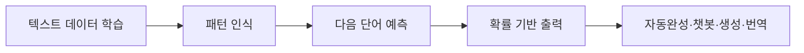
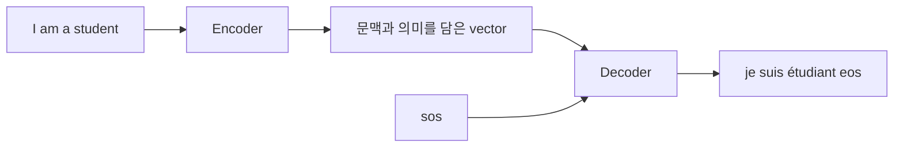

언어 모델은 단어 시퀀스에 확률을 할당해 가장 자연스러운 단어 시퀀스를 찾는다. Transformer 강의 자료는 자기 회귀·양방향 언어 모델, 텍스트 학습 절차, 영어→프랑스어 encoder–decoder를 한 흐름으로 설명한다.

> [!IMPORTANT]
> 확률 예시·토큰 표기·연혁·번역 문장은 원본 슬라이드에 있는 내용만 정리했다. 외부 모델 성능이나 추가 응용은 넣지 않는다.

---

## 언어 모델의 정의와 유형

기본 동작은 이전 단어들이 주어졌을 때 다음 단어를 예측하는 것이다.

| 유형 | 문맥과 예측 방향 |
| --- | --- |
| 자기 회귀 | 이전 단어로부터 다음 단어 예측 |
| 양방향 | 양쪽 문맥으로 가운데 단어 예측 |

예시로 “나는 학교에 ?” 뒤에 갔다·간다·도착했다를 후보로 두고, “인공지능은 데이터를 ?” 뒤에 분석한다·학습한다·좋아한다를 둔다.

```html preview
<div style="font-family:system-ui,sans-serif;padding:20px;color:var(--foreground)">
  <label for="amt" style="font-size:14px;font-weight:600">다음 단어 확률(%)</label>
  <div id="out" style="font-size:30px;font-weight:700;color:var(--chart-1);margin:6px 0">50</div>
  <input id="amt" type="range" min="25" max="50" step="25" value="50"
    style="width:100%;accent-color:var(--primary)" />
  <p style="font-size:13px;color:var(--muted-foreground)">자료 예시의 25%, 50%, 25% 확률 중 높은 후보를 선택한다.</p>
  <script>
    var amt = document.getElementById('amt');
    var out = document.getElementById('out');
    amt.addEventListener('input', function () {
      out.textContent = '' + Number(amt.value).toLocaleString();
    });
  </script>
</div>
```

---

## 언어 모델링 파이프라인

자료의 예시 학습 데이터는 다음과 같다.

- “나는 오늘 학교에 갔다”
- “친구는 학교에 간다”
- “그는 매일 학교에 간다”
- “친구들은 학교에 도착했다”

“나는 오늘 학교에” 다음을 예측할 때 갔다 25%, 간다 50%, 도착했다 25%를 할당하고 최종 출력은 간다로 둔다.



언어 모델의 응용으로 텍스트 자동완성, 챗봇 및 대화 시스템, 콘텐츠 생성, 기계 번역을 제시한다. 역사 흐름은 RNN(1986) → Seq2Seq(NIPS 2014) → Attention(ICLR 2015) → Transformer(NIPS 2017) → GPT-1(2018) → BERT(NAACL 2019) → GPT-3(2020)이다.

---

## Transformer 기계번역 전체 구조

입력은 영어 문장, 출력은 프랑스어 문장이다.

<Tabs>
  <Tab label="학습 입력">
    Encoder에는 I am a student, decoder에는 &lt;sos&gt; je suis étudiant를 입력한다.
  </Tab>
  <Tab label="학습 출력">
    decoder는 je suis étudiant &lt;eos&gt;를 순서대로 예측한다.
  </Tab>
  <Tab label="추론">
    입력 영어에서 문맥·의미를 포함하는 고차원 vector를 추출하고, decoder가 다음 프랑스어 단어를 예측한다.
  </Tab>
</Tabs>



---

## Embedding과 positional encoding

각 영어·프랑스어 단어를 embedding vector로 바꾼다. 원본의 예시에서 Student는 [0.17, -0.12, 0.55, ..., 0.03]으로 표현된다.

Positional encoding은 각 vector에 위치 정보를 더한다. “I love you”와 “You love I”는 단어 집합이 같아도 순서가 다르므로 위치를 더해야 한다.

1. 단어를 embedding한다.
2. 위치별 encoding을 만든다.
3. 두 vector를 더해 위치와 차원을 함께 표현한다.
4. encoder·decoder의 attention 입력으로 전달한다.

> [!NOTE]
> 원본은 positional encoding의 구체적인 사인·코사인 식을 제시하지 않고, 위치 인덱스(pos)·차원 인덱스(i)·전체 차원 d_model의 역할과 덧셈만 설명한다.

---

## Encoder와 decoder의 역할

Encoder는 단어 간 유사도와 attention으로 입력 문맥을 학습한다. Decoder는 자체 masked self-attention 뒤 encoder의 K,V를 참고하는 multi-head attention을 사용하고, 최종적으로 출력 문장을 생성한다.

| 블록 | 자료에서의 입력 |
| --- | --- |
| Encoder | 영어 embedding + positional encoding |
| Decoder self-attention | &lt;sos&gt;와 지금까지 생성한 프랑스어 토큰 |
| Decoder cross-attention | Encoder가 만든 K,V와 decoder의 Q |

<details>
<summary>토큰 흐름 점검</summary>

&lt;sos&gt;는 Start of Sequence, &lt;eos&gt;는 End of Sequence다. 학습 시 decoder 입력과 출력이 한 칸씩 어긋나며, 추론에서는 생성된 단어를 다음 입력으로 사용한다는 구조를 확인한다.

</details>

> [!WARNING]
> 원본의 구조 그림에는 encoder·decoder 블록 이름이 반복되거나 “Encoders”로 표기된 부분이 있다. 여기서는 역할을 구분해 설명했지만, 원본 표기의 혼용 자체는 수정 대상이 아니므로 사실로 기록한다.
