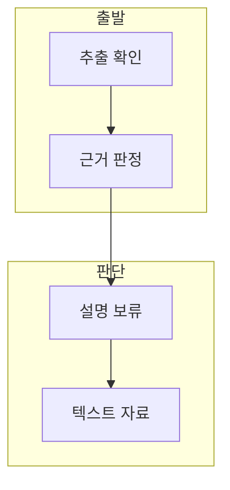

> [!abstract] 한 줄 요약
> 이 추출본은 제목 외에 구조·수식·예시를 뒷받침할 텍스트가 부족하므로, Transformer 개념 설명을 독립적으로 만들지 않는다.

## 이 노트의 지도



## 1. 제목과 근거의 차이

자료에 나타난 ==Transformer== 는 주제 표지로 확인되는 이름.

> [!important] 제목은 본문이 아니다
> 제목만으로 self-attention이나 디코더 동작의 세부 설명을 확정하지 않는다.

## 2. 공개 노트의 보류 기준

이미지 자산과 텍스트형 페이지 표시는 공개 노트에 넣지 않는 정책을 유지한다.

<details>
<summary>확인 가능한 범위</summary>

추출 텍스트는 제목과 디코더 표기 외의 구조 근거를 충분히 제공하지 않는다.

</details>

<details>
<summary>대체 자료 사용</summary>

언어 모델링과 self-attention은 텍스트가 확보된 Transformer 강의자료에서 학습한다.

</details>

## 데이터로 보기

```html preview
<div style="font-family:system-ui,sans-serif;padding:20px">
  <div id="cards" style="display:flex;gap:14px;flex-wrap:wrap"></div>
  <script>
    var stats = [
      ['구조 주장', '보류', '본문 근거 부족', 'var(--chart-1)'],
      ['이미지', '미사용', '공개 정책', 'var(--chart-2)'],
      ['대체', '강의자료', '텍스트 근거', 'var(--chart-3)']
    ];
    document.getElementById('cards').innerHTML = stats.map(function (s) {
      return '<div style="flex:1;min-width:150px;padding:16px;background:var(--card);' +
        'color:var(--card-foreground);border:1px solid var(--border);' +
        'border-radius:var(--radius)">' +
        '<div style="font-size:13px;color:var(--muted-foreground)">' + s[0] + '</div>' +
        '<div style="font-size:26px;font-weight:700;margin-top:4px">' + s[1] + '</div>' +
        '<div style="font-size:12px;font-weight:600;margin-top:4px;color:' + s[3] + '">' + s[2] + '</div>' +
        '</div>';
    }).join('');
  </script>
</div>
```

> [!warning] 그림 추정 금지
> 보이지 않는 도표의 내용을 추측해 채우거나 원본 이미지를 공개 노트에 넣지 않는다.

## 핵심 정리

| 개념 | 정의 | 학습 판단 |
| :-- | :-- | :-- |
| 자료 제목 | 주제 단서 | 독립 설명 근거 아님 |
| 추출 본문 | 세부 근거 | 현재 부족 |
| 대체 텍스트 | 학습 근거 | 별도 노트 사용 |

## 관련 개념

- Transformer 언어 모델링은 확률과 예측 방향을 다룬다.
- Transformer Self-Attention은 인코더·디코더 흐름을 다룬다.

> [!question]- 스스로 점검
> **Q.** 이 자료만으로 attention 수식을 기록할 수 있는가?
>
> **A.** 아니다. 수식을 뒷받침하는 텍스트 근거가 필요하다.
