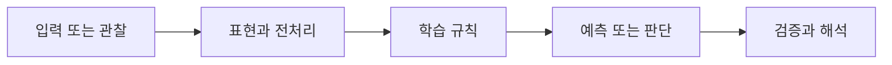

> [!abstract] 핵심
> 이 예시 자료는 Transformer라는 주제 외에 읽을 수 있는 본문이 거의 추출되지 않아, 원본 이미지를 사용하지 않는 조건에서는 예시 절차를 확정할 수 없다.

## 문제를 모델로 바꾸기

주제명만 확인되는 경우 예시의 입력, 계산, 출력이나 코드 동작을 추정해 작성하지 않는다. 이 노트는 Transformer 개념을 대신 설명하지 않고, 해당 예시 자료에서 재구성 가능한 근거의 범위를 구분한다.



| 관점 | 이 노트에서 확인할 질문 | 학습할 때의 점검 |
| --- | --- | --- |
| 확인 가능 | Transformer라는 주제 | 주제명 범위를 넘는 주장을 하지 않는다 |
| 확인 불가 | 예시의 입력·수식·출력 | 추정이나 외부 지식으로 보완하지 않는다 |
| 후속 조건 | 읽을 수 있는 본문 텍스트 | 근거와 설명을 문장 단위로 연결한다 |

> [!note] 흐름
> 읽을 수 있는 본문이 확보되기 전에는 자료의 예시 흐름을 채우지 않는다. 이후 텍스트가 제공되면 입력·연산·출력·검증의 순서로 근거를 분리해 새 노트로 확장한다.

```html preview h=170
<div style="font-family:system-ui,sans-serif;padding:16px;border:1px solid var(--background-modifier-border);background:var(--background-primary-alt);color:var(--foreground);border-radius:10px">
  <div style="font-weight:700;margin-bottom:10px">01. Transformer 예시 자료의 텍스트 추출 한계 · 학습 흐름</div>
  <div style="display:grid;grid-template-columns:repeat(4,1fr);gap:8px">
    <div style="padding:10px;border:1px solid var(--background-modifier-border);border-radius:8px">입력</div>
    <div style="padding:10px;border:1px solid var(--background-modifier-border);border-radius:8px">표현</div>
    <div style="padding:10px;border:1px solid var(--background-modifier-border);border-radius:8px">학습</div>
    <div style="padding:10px;border:1px solid var(--background-modifier-border);border-radius:8px">점검</div>
  </div>
</div>
```

## 관점을 나누어 보기

<Tabs>
<Tab label="개념">

이 문서는 Transformer 자체의 설명 노트가 아니다. 예시 자료에서 현재 확인할 수 있는 정보와 없는 정보를 구분한다.

</Tab>
<Tab label="실행">

원본 이미지를 참조하거나 옮기지 않는다. 추출 텍스트가 보강될 때까지 세부 예시 재구성을 보류한다.

</Tab>
<Tab label="검증">

다른 Transformer 노트의 일반 설명을 이 자료의 예시 근거로 착각하지 않는다. 근거가 추가됐는지를 먼저 확인한다.

</Tab>
</Tabs>

<details>
<summary>복습 질문</summary>

주제명만으로 예시의 계산 과정을 쓰면 왜 문제가 되는가? 새 텍스트가 생기면 어떤 정보를 먼저 확인해야 하는가?

</details>

> [!tip] 학습 전략
> 입력, 모델의 가정, 평가 기준을 한 문장씩 연결해 설명해 본다. 계산 결과만 적지 말고 어떤 선택이 결과를 바꾸는지도 기록한다.
> [!warning] 해석 주의
> 원문 텍스트 추출 한계: 현재 읽을 수 있는 본문이 매우 제한적이므로, 원본 내용을 보정하거나 추정해 예시를 만들지 않았다. 원본 이미지는 사용하지 않았다.
