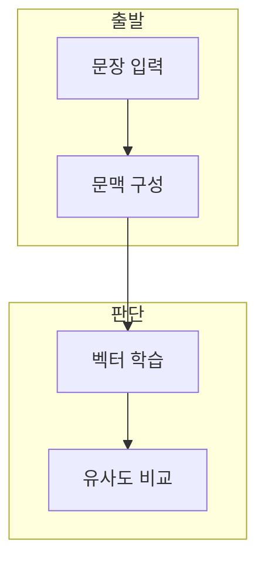

> [!abstract] 한 줄 요약
> Word2Vec은 one-hot 표현의 희소성과 단어 간 독립성 한계를 줄이기 위해 문맥에서 단어 벡터를 학습한다.

## 이 노트의 지도



## 1. one-hot을 넘는 표현

one-hot 벡터는 어휘 크기만큼 길고 한 요소만 1이어서 단어 사이 관계를 직접 담기 어렵다. ==분산 표현== 는 단어를 여러 실수 값의 벡터로 나타내는 방식.

**문맥이 학습 신호.** Word2Vec은 단어를 독립적으로 놓지 않고 문맥에서 예측 문제를 만들어 관계를 학습한다.

## 2. 두 가지 학습 방향

CBOW와 Skip-Gram은 입력과 정답으로 삼는 단어의 방향이 반대다.

<Tabs>
  <Tab label="CBOW">여러 주변 단어를 입력으로 두고 가운데 단어를 예측한다.</Tab>
  <Tab label="one-hot,희소 단어 벡터,표현 한계를 확인,CBOW,문맥에서 중심어 예측,문맥 결합,Skip-Gram,중심어에서 주변어 예측,관계 학습">하나의 중심 단어를 입력으로 두고 주변 단어를 예측한다.</Tab>
</Tabs>

<details>
<summary>RNN·LSTM과의 연결</summary>

강의는 RNN의 기울기 소실과 LSTM의 gate를 리뷰한 뒤 Word2Vec으로 단어 표현 문제를 다룬다.

</details>

<details>
<summary>학습 쌍 구성</summary>

CBOW와 Skip-Gram은 같은 문장에서도 입력과 정답으로 삼는 단어쌍이 다르다.

</details>

## 데이터로 보기

```html preview
<div style="font-family:system-ui,sans-serif;padding:20px">
  <div id="cards" style="display:flex;gap:14px;flex-wrap:wrap"></div>
  <script>
    var stats = [
      ['입력', '문맥', 'CBOW 시작', 'var(--chart-1)'],
      ['입력', '중심어', 'Skip-Gram 시작', 'var(--chart-2)'],
      ['출력', '벡터', '유사도 비교', 'var(--chart-3)']
    ];
    document.getElementById('cards').innerHTML = stats.map(function (s) {
      return '<div style="flex:1;min-width:150px;padding:16px;background:var(--card);' +
        'color:var(--card-foreground);border:1px solid var(--border);' +
        'border-radius:var(--radius)">' +
        '<div style="font-size:13px;color:var(--muted-foreground)">' + s[0] + '</div>' +
        '<div style="font-size:26px;font-weight:700;margin-top:4px">' + s[1] + '</div>' +
        '<div style="font-size:12px;font-weight:600;margin-top:4px;color:' + s[3] + '">' + s[2] + '</div>' +
        '</div>';
    }).join('');
  </script>
</div>
```

> [!warning] 유사도는 의미의 전부가 아님
> 가까운 벡터를 곧바로 사실적·윤리적으로 같은 의미라고 단정하지 않는다. 학습 코퍼스와 과제를 함께 본다.

## 핵심 정리

| 개념 | 정의 | 학습 판단 |
| :-- | :-- | :-- |
| one-hot | 희소 단어 벡터 | 표현 한계를 확인 |
| CBOW | 문맥에서 중심어 예측 | 문맥 결합 |
| Skip-Gram | 중심어에서 주변어 예측 | 관계 학습 |

## 관련 개념

- RNN·LSTM은 순차 문맥을 상태로 전달한다.
- Transformer는 self-attention으로 토큰 관계를 다룬다.

> [!question]- 스스로 점검
> **Q.** CBOW와 Skip-Gram의 예측 방향 차이는?
>
> **A.** CBOW는 문맥에서 중심어를, Skip-Gram은 중심어에서 주변어를 예측한다.
