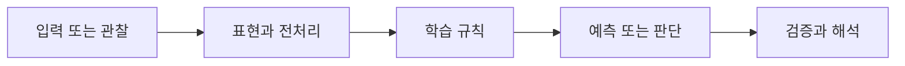

> [!abstract] 핵심
> 결정 트리의 규칙 학습과 KNN의 거리 기반 예측을 같은 데이터 분할과 평가 절차 안에서 비교하는 실습 관점이다.

## 문제를 모델로 바꾸기

결정 트리는 특성 공간을 연속적인 질문으로 나누어 리프에서 예측을 내린다. KNN은 훈련 데이터를 보존하고 새 입력에 가까운 $K$개 관측값을 이용한다. 두 방법은 같은 분류 문제를 풀어도 모델을 저장하는 방식과 새 입력을 처리하는 시점이 다르다.



| 관점 | 이 노트에서 확인할 질문 | 학습할 때의 점검 |
| --- | --- | --- |
| 데이터 분리 | 보지 않은 자료에서 성능을 재기 | 학습 자료와 검증 자료를 섞지 않는다 |
| 트리 설정 | 분할 규칙의 복잡도를 제한 | 깊이와 최소 표본 수를 기록한다 |
| 이웃 설정 | 가까움의 정의를 결정 | 정규화 뒤 여러 홀수 $K$를 비교한다 |

> [!note] 흐름
> 데이터를 학습·검증으로 나누고, 숫자 특성의 범위를 확인한다. 트리는 깊이·리프 조건을, KNN은 정규화·거리·$K$를 후보로 두어 반복 비교한다.

```html preview h=170
<div style="font-family:system-ui,sans-serif;padding:16px;border:1px solid var(--background-modifier-border);background:var(--background-primary-alt);color:var(--foreground);border-radius:10px">
  <div style="font-weight:700;margin-bottom:10px">01. 결정 트리와 KNN 실습 · 학습 흐름</div>
  <div style="display:grid;grid-template-columns:repeat(4,1fr);gap:8px">
    <div style="padding:10px;border:1px solid var(--background-modifier-border);border-radius:8px">입력</div>
    <div style="padding:10px;border:1px solid var(--background-modifier-border);border-radius:8px">표현</div>
    <div style="padding:10px;border:1px solid var(--background-modifier-border);border-radius:8px">학습</div>
    <div style="padding:10px;border:1px solid var(--background-modifier-border);border-radius:8px">점검</div>
  </div>
</div>
```

## 관점을 나누어 보기

<Tabs>
<Tab label="개념">

결정 트리는 사람이 읽을 수 있는 질문의 연쇄로 표현할 수 있다. KNN은 지역적 이웃의 라벨을 이용하는 비모수적 접근이다.

</Tab>
<Tab label="실행">

실행 전 결측값과 특성 범위를 확인한다. 각 후보 설정에서 같은 검증 자료를 사용해야 비교가 공정하다.

</Tab>
<Tab label="검증">

정확도 하나만 보지 않고 어떤 범주에서 틀렸는지, 특정 설정에만 결과가 의존하는지 확인한다.

</Tab>
</Tabs>

<details>
<summary>복습 질문</summary>

트리의 깊이를 하나 늘렸을 때 훈련 성능과 검증 성능이 다르게 움직이면 무엇을 의심해야 하는가? KNN의 $K$를 너무 작게 또는 크게 두면 어떤 현상이 생기는가?

</details>

> [!tip] 학습 전략
> 입력, 모델의 가정, 평가 기준을 한 문장씩 연결해 설명해 본다. 계산 결과만 적지 말고 어떤 선택이 결과를 바꾸는지도 기록한다.

> [!warning] 해석 주의
> 검증 자료를 이용해 설정을 반복 선택했다면 그 자료는 더 이상 완전히 독립적인 최종 평가 자료가 아니다.
