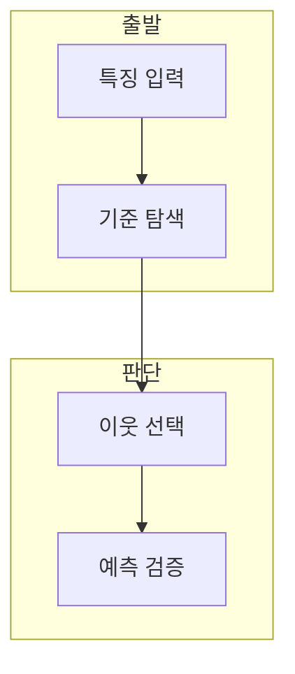

> [!abstract] 한 줄 요약
> 결정 트리는 엔트로피를 낮추는 기준점을 재귀적으로 찾고, KNN은 가까운 K개 이웃의 레이블을 이용해 새 샘플을 분류한다.

## 이 노트의 지도



## 1. 결정 트리의 기준점

실습 리뷰는 데이터에 있는 규칙을 학습해 트리 기반 분류 규칙을 만들고 엔트로피가 감소하는 threshold를 찾는다고 설명한다. ==threshold== 는 분기에서 데이터를 나누는 기준값.

> [!tip] 재귀 구조
> 트리 구현은 한 번의 분기로 끝나지 않고 하위 데이터에 같은 판단을 반복한다.

## 2. KNN의 이웃 수

KNN은 새 샘플에서 가장 가까운 K개 이웃을 찾고 분류에는 다수결을 사용한다.

<Tabs>
  <Tab label="결정 트리">기준값으로 데이터를 나누고 엔트로피 감소를 추적한다.</Tab>
  <Tab label="결정 트리,기준값 분기,규칙을 해석,엔트로피,불확실성 수치,분기 기준 비교,KNN,이웃 기반 예측,거리·K 선택 필요">거리로 이웃을 정하고 K개 레이블을 집계한다.</Tab>
</Tabs>

<details>
<summary>실습 평가</summary>

예측 레이블과 정답 레이블을 비교하고, 거리 함수와 K 값이 결과에 미치는 영향을 기록한다.

</details>

## 데이터로 보기

```html preview
<div style="font-family:system-ui,sans-serif;padding:20px;color:var(--foreground)">
  <label for="amt" style="font-size:14px;font-weight:600">이웃 수 K</label>
  <div id="out" style="font-size:30px;font-weight:700;color:var(--chart-1);margin:6px 0">3</div>
  <input id="amt" type="range" min="1" max="15" step="2" value="3"
    style="width:100%;accent-color:var(--primary)" />
  <p style="font-size:13px;color:var(--muted-foreground)">값에 따라 지역적 판단과 다수결 범위가 달라진다.</p>
  <script>
    var amt = document.getElementById('amt');
    var out = document.getElementById('out');
    amt.addEventListener('input', function () {
      out.textContent = Number(amt.value).toLocaleString();
    });
  </script>
</div>
```

> [!warning] K를 임의로 고르지 않기
> K가 작으면 국소 잡음에 민감하고, 너무 크면 경계가 과도하게 평탄해질 수 있다.

## 핵심 정리

| 개념 | 정의 | 학습 판단 |
| :-- | :-- | :-- |
| 결정 트리 | 기준값 분기 | 규칙을 해석 |
| 엔트로피 | 불확실성 수치 | 분기 기준 비교 |
| KNN | 이웃 기반 예측 | 거리·K 선택 필요 |

## 관련 개념

- 엔트로피·결정 트리·KNN 이론은 기준과 거리식을 다룬다.
- 대비 문제는 K 후보를 평가하는 절차를 다룬다.

> [!question]- 스스로 점검
> **Q.** KNN에서 K와 거리 함수를 함께 점검하는 이유는?
>
> **A.** 둘 다 어떤 이웃을 얼마나 반영할지 결정하기 때문이다.
