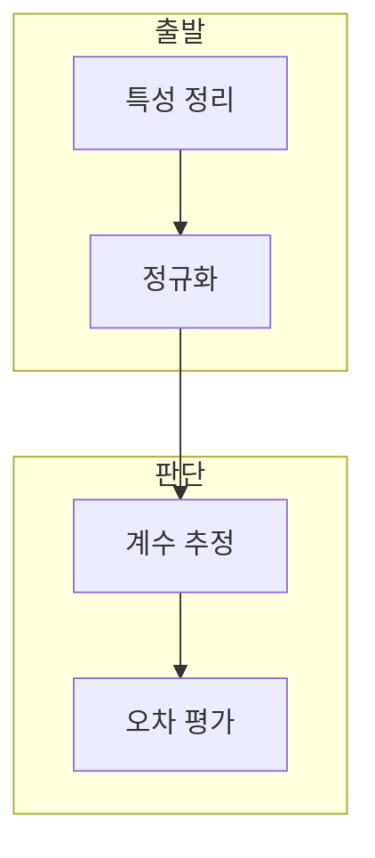

> [!abstract] 한 줄 요약
> 다중 선형 회귀는 여러 독립 변수로 목표 값을 예측하고, 최소제곱법과 정규화로 계수 추정과 해석을 연결한다.

## 이 노트의 지도



## 1. 여러 특성의 역할

강의는 주택 가격을 목표로 실내 면적, 품질 등급 등 여러 특성을 입력에 포함한다. ==다중 선형 회귀== 는 여러 독립 변수로 하나의 종속 변수를 예측하는 모델.

> [!important] 정규화의 순서
> 학습과 새 입력에서 같은 평균·표준편차 기준을 사용해야 예측값을 같은 좌표계에서 해석할 수 있다.

## 2. 최소제곱 계수와 평가

최소제곱법은 설계 행렬과 목표 행렬에서 계수를 구하고, 강의는 MSE로 예측 오차를 확인한다.

$$
\theta=(X^T X)^{-1}X^T Y
$$

<details>
<summary>역정규화의 필요</summary>

정규화된 목표값으로 예측한 뒤 실제 단위로 해석하려면 평균과 표준편차를 이용해 역정규화한다.

</details>

## 데이터로 보기

```html preview
<div style="font-family:system-ui,sans-serif;padding:20px">
  <div id="cards" style="display:flex;gap:14px;flex-wrap:wrap"></div>
  <script>
    var stats = [
      ['주요 특성', '0.702', '실내 면적 상관', 'var(--chart-1)'],
      ['주요 특성', '0.667', '품질 등급 상관', 'var(--chart-2)'],
      ['MSE', '0.33', '강의 예시', 'var(--chart-3)']
    ];
    document.getElementById('cards').innerHTML = stats.map(function (s) {
      return '<div style="flex:1;min-width:150px;padding:16px;background:var(--card);' +
        'color:var(--card-foreground);border:1px solid var(--border);' +
        'border-radius:var(--radius)">' +
        '<div style="font-size:13px;color:var(--muted-foreground)">' + s[0] + '</div>' +
        '<div style="font-size:26px;font-weight:700;margin-top:4px">' + s[1] + '</div>' +
        '<div style="font-size:12px;font-weight:600;margin-top:4px;color:' + s[3] + '">' + s[2] + '</div>' +
        '</div>';
    }).join('');
  </script>
</div>
```

> [!warning] 상관과 인과를 혼동하지 않기
> 상관계수와 MSE는 선택한 데이터·특성·분할의 결과다. 원인 관계나 다른 데이터의 성능으로 단정하지 않는다.

## 핵심 정리

| 개념 | 정의 | 학습 판단 |
| :-- | :-- | :-- |
| 설계 행렬 | 입력 특성 모음 | 계수 계산 기반 |
| 최소제곱법 | 제곱 오차 최소화 | 계수 추정 |
| MSE | 평균 제곱 오차 | 예측 차이 평가 |

## 관련 개념

- 우버 요금 회귀는 거리·승객 수 특성을 사용한다.
- 선형 회귀 이론은 학습률과 손실을 설명한다.

> [!question]- 스스로 점검
> **Q.** 새 입력을 정규화하고 예측을 역정규화하는 이유는?
>
> **A.** 학습 좌표계에 맞춰 계산하고 결과는 원래 단위로 해석하기 위해서다.
