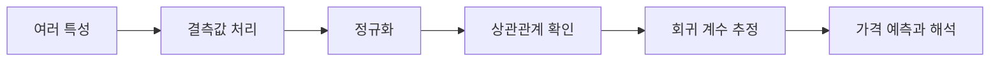

# 다중 선형 회귀

> [!abstract] 핵심
> 다중 선형 회귀는 여러 독립 변수를 사용해 하나의 종속 변수를 예측한다. 주택 가격 예시에서는 면적, 품질 등급처럼 여러 특성이 함께 회귀식에 들어간다.

## 특성이 늘어나면 달라지는 점

모델은 $Y = eta_0 + eta_1X_1 + cdots + eta_nX_n + epsilon$로 표현할 수 있다. 최소제곱법은 설계 행렬의 정보를 이용해 회귀 계수를 찾고, 전처리는 특성의 스케일과 결측값을 다룬다.



| 관점 | 예시 처리 | 이유 |
| --- | --- | --- |
| 불필요한 열 | 식별자와 날짜 제외 | 예측에 직접 쓰지 않는 열 정리 |
| 누락값 | 관측치 제거 | 계산 가능한 행만 사용 |
| 값의 범위 | 평균 0, 표준편차 1 변환 | 특성 스케일 통일 |
| 해석 | 상관관계와 계수 확인 | 특성의 관계를 함께 살핌 |

> [!note] 특성 해석
> 주택 데이터 예시에서는 실내 면적, 품질 등급, 지상 층 면적이 가격과 높은 상관관계를 보이는 특성으로 다뤄진다. 상관관계는 특성 선택의 단서이지 인과관계의 증명은 아니다.

```html preview h=170
<div style="font-family:system-ui,sans-serif;padding:16px;border:1px solid var(--border);background:var(--card);color:var(--foreground)">
  <div style="font-weight:700;margin-bottom:10px">여러 특성이 만드는 예측</div>
  <div style="display:grid;grid-template-columns:repeat(3,minmax(0,1fr));gap:8px">
    <div style="padding:9px;border:1px solid var(--border)">면적</div>
    <div style="padding:9px;border:1px solid var(--border)">등급</div>
    <div style="padding:9px;border:1px solid var(--border)">층 면적</div>
  </div>
  <div style="margin-top:10px;color:var(--muted)">각 특성은 회귀 계수와 함께 예측에 반영된다.</div>
</div>
```

<Tabs>
<Tab label="모형">
여러 입력 열과 절편을 하나의 설계 행렬로 보고 회귀 계수를 계산한다.
</Tab>
<Tab label="전처리">
결측값을 처리하고, 정규화된 값으로 학습과 예측의 기준을 통일한다.
</Tab>
<Tab label="해석">
새 입력을 예측할 때도 같은 정규화 기준을 적용하고, 결과는 원래 단위로 해석한다.
</Tab>
</Tabs>

<details>
<summary>예측 전 확인 질문</summary>

- 학습에 사용한 특성과 새 입력의 특성이 같은 순서인가?
- 새 입력에 학습 때의 평균과 표준편차를 적용했는가?
- 예측값을 해석할 때 역정규화가 필요한가?
</details>

> [!tip] 특성 이름을 보존하기
> 행렬로 바꾸기 전 특성 목록과 순서를 남겨 두면, 새 입력을 만들 때 열의 의미가 섞이는 문제를 줄일 수 있다.

> [!warning] 높은 상관관계의 한계
> 상관관계가 높은 특성만으로 모델의 타당성을 단정할 수 없다. 데이터 처리와 평가 결과를 함께 확인한다.
