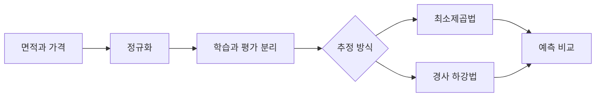

# 단일 선형 회귀: LSM과 경사 하강법

> [!abstract] 핵심
> 단일 선형 회귀 실습에서는 주택의 실내 면적을 입력으로, 판매 가격을 목표값으로 두고 데이터를 정규화한 뒤 최소제곱법 또는 경사 하강법으로 파라미터를 찾는다.

## 두 가지 파라미터 추정 흐름

최소제곱법은 $\theta=(X^TX)^{-1}X^TY$를 이용해 파라미터를 계산한다. 경사 하강법은 현재 파라미터에서 시작해 오차를 줄이는 방향으로 반복 갱신한다.



| 단계 | 최소제곱법 | 경사 하강법 |
| --- | --- | --- |
| 시작 | 설계 행렬 구성 | 초기 파라미터 설정 |
| 계산 | 행렬 연산 | 반복 업데이트 |
| 목표 | 잔차 제곱합 최소화 | 오차 감소 방향 탐색 |

> [!note] 전처리
> 평균과 표준편차를 사용한 가우시안 정규화는 서로 다른 값의 범위를 통일한다. 실습 예시는 학습과 평가 데이터를 8:2로 분리한다.

```html preview h=170
<div style="font-family:system-ui,sans-serif;padding:16px;border:1px solid var(--border);background:var(--card);color:var(--foreground)">
  <div style="display:grid;grid-template-columns:repeat(3,minmax(0,1fr));gap:8px;text-align:center">
    <div style="padding:10px;border:1px solid var(--border)">정규화</div>
    <div style="padding:10px;border:1px solid var(--border)">파라미터</div>
    <div style="padding:10px;border:1px solid var(--border)">예측</div>
  </div>
  <div style="margin-top:10px;color:var(--muted)">같은 흐름 안에서 계산 방식만 달라진다.</div>
</div>
```

<Tabs>
<Tab label="LSM">
행렬을 전치하고 곱한 뒤 역행렬을 이용해 회귀 계수를 계산하는 방법이다.
</Tab>
<Tab label="경사 하강법">
학습률과 반복 횟수를 정하고, 오차를 줄이는 방향으로 가중치와 절편을 갱신한다.
</Tab>
<Tab label="데이터 분리">
학습 집합과 평가 집합을 분리하면 학습에 쓰지 않은 데이터로 결과를 확인할 수 있다.
</Tab>
</Tabs>

<details>
<summary>실습 점검 순서</summary>

1. 입력과 목표값의 배열 모양을 확인한다.
2. 정규화 기준을 기록한다.
3. 학습과 평가에 같은 전처리 기준이 적용되는지 확인한다.
4. 두 추정 방식의 예측 결과를 비교한다.
</details>

> [!tip] 행렬의 의미부터 보기
> 수식을 외우기보다 각 열이 무엇을 뜻하고, 절편을 위해 어떤 열이 추가되는지 확인하면 계산 흐름을 이해하기 쉽다.

> [!warning] 역행렬의 조건
> $X^TX$가 가역이 아니면 역행렬을 구할 수 없으므로 최소제곱법의 행렬 계산 조건을 먼저 점검해야 한다.
