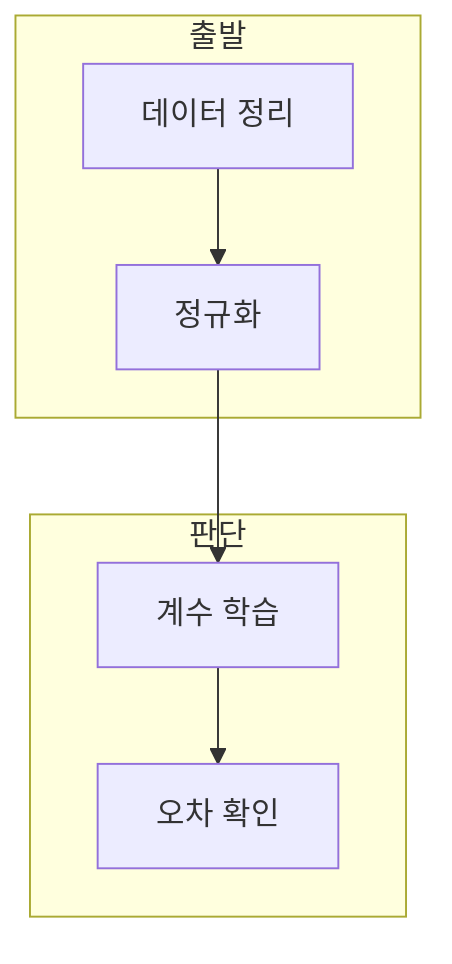

> [!abstract] 한 줄 요약
> 단일 선형 회귀는 입력 한 개와 목표 한 개의 관계를 선으로 근사하고, 최소제곱법 또는 경사 하강법으로 파라미터를 구한다.

## 이 노트의 지도



## 1. 학습 데이터의 준비

강의 실습은 주택 면적과 가격을 선택하고 평균·표준편차로 정규화한 뒤 학습과 테스트로 나눈다. ==단일 선형 회귀== 는 하나의 입력 특성으로 목표값을 예측하는 선형 모델.

**동일한 입력 좌표계.** 학습·테스트·새 입력은 같은 정규화 기준을 써야 계수와 예측을 일관되게 해석할 수 있다.

## 2. 두 가지 파라미터 추정

최소제곱법은 행렬 연산으로 계수를 구하고, 경사 하강법은 학습률과 반복 횟수로 계수를 갱신한다.

<Tabs>
  <Tab label="LSM">정규 방정식으로 계수를 직접 계산한다. $X^T X$의 역행렬 가능 여부를 확인한다.</Tab>
  <Tab label="LSM,최소제곱 해법,행렬 조건 확인,GDM,기울기 기반 갱신,학습률 선택,bias,상수항 열,절편을 학습">손실의 기울기를 따라 반복 갱신한다. 학습률과 반복 횟수를 선택한다.</Tab>
</Tabs>

<details>
<summary>예측과 검증</summary>

테스트 입력에 bias 열을 추가해 예측값을 계산하고 산점도와 예측선을 함께 확인한다.

</details>

<details>
<summary>수렴 확인</summary>

GDM은 손실 변화와 예측선을 함께 확인해 학습률·반복 횟수의 선택을 점검한다.

</details>

## 데이터로 보기

```html preview
<div style="font-family:system-ui,sans-serif;padding:20px;color:var(--foreground)">
  <label for="amt" style="font-size:14px;font-weight:600">반복 횟수</label>
  <div id="out" style="font-size:30px;font-weight:700;color:var(--chart-1);margin:6px 0">1000</div>
  <input id="amt" type="range" min="100" max="2000" step="100" value="1000"
    style="width:100%;accent-color:var(--primary)" />
  <p style="font-size:13px;color:var(--muted-foreground)">반복 수와 학습률은 서로 다른 하이퍼파라미터다.</p>
  <script>
    var amt = document.getElementById('amt');
    var out = document.getElementById('out');
    amt.addEventListener('input', function () {
      out.textContent = Number(amt.value).toLocaleString();
    });
  </script>
</div>
```

> [!warning] 학습률의 극단
> 학습률이 너무 크면 발산할 수 있고, 너무 작으면 수렴이 느려질 수 있다.

## 핵심 정리

| 개념 | 정의 | 학습 판단 |
| :-- | :-- | :-- |
| LSM | 최소제곱 해법 | 행렬 조건 확인 |
| GDM | 기울기 기반 갱신 | 학습률 선택 |
| bias | 상수항 열 | 절편을 학습 |

## 관련 개념

- 선형 회귀 이론은 손실과 편미분을 설명한다.
- 다중 선형 회귀는 여러 특성을 사용한다.

> [!question]- 스스로 점검
> **Q.** LSM과 GDM에서 모두 정규화 기준을 보존해야 하는 이유는?
>
> **A.** 학습 계수와 새 입력이 같은 스케일에서 계산되어야 하기 때문이다.
