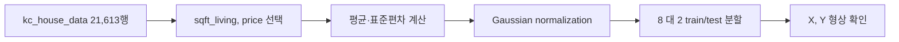

이 실습의 목표는 주택 데이터에서 입력과 정답의 관계를 선형 회귀로 분석하고 예측 모델을 구현하는 것이다. 원본은 설명·환경 구성·LSM 복습·GD 구현 순으로 진행한다.

> [!IMPORTANT]
> 데이터셋의 원본 이미지 대신 슬라이드에 적힌 열 이름, 행 수, 분할 형상, 구현식을 사용했다.

---

## 실습 계약

- 데이터셋: kc_house_data
- 기간: 2014~2015년 판매 주택
- 규모: 21개 변수, 21,613개 데이터
- 입력 $X$: sqft_living(실내 면적)
- 정답 $Y$: price(판매 가격)
- 분할: train:test = 8:2

Google Colaboratory는 원본이 안내한 실행 환경이다. Google 계정으로 로그인하고 Drive에 띄어쓰기·한글이 없는 폴더를 만든 뒤, LMS 5주차 Base code와 데이터셋을 내려받아 실행한다.

---

## 데이터 전처리와 형상

원본 코드는 price와 sqft_living 열만 NumPy 배열로 바꾼다. 평균과 표준편차를 각각 계산해 Gaussian normalization을 적용한다.

$$
x' = \frac{x-\mu}{\sigma}
$$

그 다음 두 배열을 2차원으로 확장하고 train_test_split(..., test_size=0.2, random_state=1234)를 호출한다. 원본 출력 형상은 다음과 같다.

| 배열 | 형상 |
| --- | ---: |
| $X_{train}$ | $(17290,1)$ |
| $Y_{train}$ | $(17290,1)$ |
| $X_{test}$ | $(4323,1)$ |
| $Y_{test}$ | $(4323,1)$ |



> [!WARNING]
> 원본은 정규화된 입력을 시각화하고, 테스트 데이터에는 X_test, Y_test를 사용한다. 정규화하지 않은 새 입력을 그대로 모델에 넣으면 학습 스케일과 달라진다.

---

## LSM 구현

bias 열을 모든 샘플에 추가해 $X$를 $(N\times2)$로 만든다. 구현에 필요한 NumPy 연산은 모두 실습에 적혀 있다.

| 연산 | 코드 역할 |
| --- | --- |
| np.ones(size) | 1로 채운 배열 생성 |
| np.hstack([a,b]) | 열 방향 결합 |
| np.dot(a,b) | 행렬곱 |
| a.T | 전치 |
| np.linalg.inv(a) | 역행렬 |

최소제곱 파라미터는 다음 정규방정식으로 계산한다.

$$
\theta=(X^TX)^{-1}X^TY
$$

fit은 $X^TX$, $X^TY$를 차례로 계산하고 theta를 저장한다. predict는 새 X에도 bias 열을 붙인 후 $\hat{Y}=X\theta$를 반환한다.

<Tabs>
  <Tab label="LSM 학습">
    train 배열로 fit을 호출하고 theta를 저장한다. 역행렬이 존재해야 한다.
  </Tab>
  <Tab label="LSM 테스트">
    test 배열을 predict에 넣고 정답과 예측의 차이를 산점도와 선으로 확인한다.
  </Tab>
</Tabs>

---

## GD 복습과 구현

자료의 GD는 손실이 최소인 $\theta$를 찾기 위해 다음 두 단계를 반복한다.

1. 현재 지점에서 $\partial L/\partial\theta$를 계산한다.
2. gradient에 learning rate를 곱하고 반대 방향으로 갱신한다.

예시 슬라이드는 gradient $0.8$, learning rate $0.1$일 때 이동량 $0.08$을 보여준다. 실습 코드의 모델 생성 예시는 iteration=1000, learning_rate=0.1이며, 클래스 기본값으로 learning_rate=1e-4가 주석과 함께 제시된다.

```html preview
<div style="font-family:system-ui,sans-serif;padding:20px;color:var(--foreground)">
  <label for="amt" style="font-size:14px;font-weight:600">GD 복습 gradient</label>
  <div id="out" style="font-size:30px;font-weight:700;color:var(--chart-1);margin:6px 0">0.8</div>
  <input id="amt" type="range" min="0" max="0.8" step="0.8" value="0.8"
    style="width:100%;accent-color:var(--primary)" />
  <p style="font-size:13px;color:var(--muted-foreground)">자료에 있는 0과 0.8의 gradient 예시 사이를 전환한다.</p>
  <script>
    var amt = document.getElementById('amt');
    var out = document.getElementById('out');
    amt.addEventListener('input', function () {
      out.textContent = '' + Number(amt.value).toLocaleString();
    });
  </script>
</div>
```

코드의 핵심 갱신은 다음 의미를 가진다.

- $\hat{Y}=X\theta$ 계산
- $dw=(2/N)\sum (Y-\hat{Y})(-X)$
- $db=(2/N)\sum (Y-\hat{Y})(-1)$
- $w\leftarrow w-\alpha dw$, $b\leftarrow b-\alpha db$

<details>
<summary>LSM과 GDM 실습 체크리스트</summary>

- bias 열을 train과 test에 모두 추가했는가?
- 정규화에 사용한 평균·표준편차를 새 입력에도 적용하는가?
- iteration과 learning_rate를 생성자에서 확인했는가?
- 테스트 산점도에서 X_test, Y_test, Y_pred를 같은 스케일로 그리는가?

</details>

> [!CAUTION]
> 원본 코드 주석의 식과 실제 배열 모양 표기는 일부 반복·OCR 흔들림이 있다. 구현을 옮길 때는 $X$와 $Y$의 행 수가 같고 bias 열이 하나 추가된다는 구조를 기준으로 확인한다.
