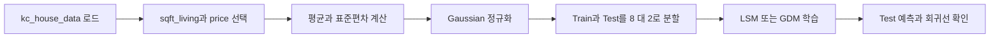

## 실습 목표와 데이터

> [!IMPORTANT]
> 목표는 선형 회귀로 주어진 데이터의 관계를 분석하고, 주택 실내 면적에서 판매 가격을 예측하는 단일 선형 회귀 모델을 LSM과 GDM 두 방식으로 구현하는 것이다.

| 항목 | 자료에 제시된 값 |
| --- | --- |
| 데이터셋 | kc_house_data |
| 판매 시기 | 2014년부터 2015년 |
| 전체 규모 | 21개 변수, 21,613개 관측값 |
| 입력 \(X\) | sqft_living, 주택 실내 면적 |
| 정답 \(Y\) | price, 주택 판매 가격 |
| 분할 | Train : Test = 8 : 2 |

자료는 \(X\)와 \(Y\)의 규모가 너무 크면 학습이 잘되지 않을 수 있으므로 Gaussian 정규화를 수행한다.

$$
x'=\frac{x-\mu_x}{\sigma_x},
\qquad
y'=\frac{y-\mu_y}{\sigma_y}
$$



---

## Colab 실습 준비

1. 웹 브라우저에서 Google 계정으로 로그인한다.
2. Google Drive에 접속한다.
3. Colab을 설치하고 실행한다.
4. Drive 안에 실습 코드 폴더를 만든다. 자료는 폴더 이름에 띄어쓰기와 한글을 쓰지 않도록 지시한다.
5. LMS 5주차 1차시의 Base code와 데이터셋을 내려받아 저장을 확인한다.

> [!TIP]
> 모델 구현 전에 \(X\), \(Y\), train, test의 형상을 먼저 출력한다. 단일 회귀 입력은 한 열이며, bias를 붙이면 설계 행렬은 두 열이 된다.

<Tabs>
  <Tab label="데이터 준비">

- price와 sqft_living만 수집한다.
- NumPy 배열로 변환한다.
- 평균과 표준편차로 두 배열을 각각 정규화한다.
- 1차원 배열을 \(N\times1\) 형태로 확장한다.
- 8:2로 학습·테스트 데이터를 나눈다.

  </Tab>
  <Tab label="검증 준비">

- test 입력과 정답을 산점도로 확인한다.
- 학습한 직선을 test 산점도 위에 그린다.
- 정규화된 입력과 출력이라는 점을 해석에 반영한다.

  </Tab>
</Tabs>

---

## LSM 구현

예제 행렬은 네 입력과 네 정답으로 시작한다.

$$
X_0=
\begin{bmatrix}
-3\\
-1\\
1\\
3
\end{bmatrix},
\quad
Y=
\begin{bmatrix}
-1\\
-1\\
3\\
3
\end{bmatrix}
$$

bias 열을 붙이면 \(X\)는 \(4\times2\), \(\theta=[w,b]^\mathsf{T}\)는 \(2\times1\)이 된다.

$$
\theta=(X^\mathsf{T}X)^{-1}X^\mathsf{T}Y
$$

| 구현 목적 | 자료가 제시한 NumPy 연산 |
| --- | --- |
| 같은 크기의 1 배열 | np.ones_like(a) |
| 행렬 가로 결합 | np.hstack([a, b]) |
| 행렬 곱 | np.dot(a, b) |
| 전치 행렬 | a.T |
| 역행렬 | np.linalg.inv(a) |

LSM의 실행 순서는 \(X^\mathsf{T}\), \(X^\mathsf{T}X\), 역행렬, \(X^\mathsf{T}Y\), 최종 \(\theta\) 계산이다. 예측은 \(\hat{Y}=X\theta\)로 수행한다.

> [!WARNING]
> 실습 슬라이드는 학습자가 핵심 코드 칸을 직접 채우도록 비워 두었다. 따라서 노트는 제시된 수식과 NumPy 연산 순서까지만 확정하며, 빈칸의 완성 코드나 실행 결과를 발명하지 않는다.

---

## GDM 구현

초기 설정은 반복 횟수 1,000, 학습률 \(0.1\), \(w=0.0\), \(b=0.0\)이다. bias 열을 붙인 뒤 반복마다 \(\theta\), 예측값, gradient, 새 파라미터를 계산한다.

$$
\hat{Y}=X\theta,
\qquad
L=\frac{1}{N}\sum_{i=1}^{N}(Y_i-\hat{Y}_i)^2
$$

$$
\frac{\partial L}{\partial w}
=
\frac{2}{N}\sum_{i=1}^{N}(Y_i-\hat{Y}_i)(-X_i)
$$

$$
\frac{\partial L}{\partial b}
=
\frac{2}{N}\sum_{i=1}^{N}(Y_i-\hat{Y}_i)(-1)
$$

$$
w_{t+1}=w_t-\alpha\frac{\partial L}{\partial w},
\qquad
b_{t+1}=b_t-\alpha\frac{\partial L}{\partial b}
$$

자료의 계산 예시는 gradient \(0.8\)과 학습률 \(0.1\)을 곱해 한 번에 \(0.08\)만큼 반대 방향으로 이동한다.

> [!CAUTION]
> 자료 안에 계수 불일치가 있다. 손실 \(N^{-1}\sum(Y-\hat{Y})^2\)의 미분 설명과 구현 주석은 \(2/N\)을 쓰지만, 마지막 구현 안내 수식은 \(1/N\)을 표시한다. 이 노트는 앞선 유도와 구현 주석의 \(2/N\)을 본문에 두고, 마지막 슬라이드의 표기를 원본 오류 후보로 보존한다.

```html preview
<div style="font-family:system-ui,sans-serif;padding:20px;color:var(--foreground)">
  <label for="amt" style="font-size:14px;font-weight:600">GDM 학습 상태</label>
  <div id="out" style="font-size:30px;font-weight:700;color:var(--chart-1);margin:6px 0">반복 = 1,000</div>
  <input id="amt" type="range" min="0" max="1000" step="1000" value="1000"
    style="width:100%;accent-color:var(--primary)" />
  <p style="font-size:13px;color:var(--muted-foreground)">0은 자료의 w=b=0.0 초기 상태, 1,000은 생성자의 기본 반복 횟수다.</p>
  <script>
    var amt = document.getElementById('amt');
    var out = document.getElementById('out');
    amt.addEventListener('input', function () {
      out.textContent = '반복 = ' + Number(amt.value).toLocaleString();
    });
  </script>
</div>
```

---

## 두 구현의 완료 조건

| 단계 | LSM | GDM |
| --- | --- | --- |
| bias 추가 | \(X\)에 1 열 결합 | \(X\)에 1 열 결합 |
| 파라미터 계산 | 정규방정식을 한 번 계산 | 1,000회 gradient 갱신 |
| 하이퍼파라미터 | 별도 학습률 없음 | learning_rate = 0.1 |
| 예측 | \(\hat{Y}=X\theta\) | \(\hat{Y}=X\theta\) |
| 자료의 검증 | test 산점도와 회귀선 | test 산점도와 회귀선 |

<details>
<summary>제출 전 점검표</summary>

- [ ] sqft_living을 \(X\), price를 \(Y\)로 지정했는가?
- [ ] 두 배열을 각각 Gaussian 정규화했는가?
- [ ] 8:2 분할 뒤 test 자료를 따로 보존했는가?
- [ ] bias 열을 중복으로 추가하지 않았는가?
- [ ] LSM 계산 순서와 GDM 갱신 순서를 섞지 않았는가?
- [ ] 마지막 수식의 \(1/N\)과 앞선 \(2/N\) 불일치를 확인했는가?

</details>

==실습의 핵심은 같은 데이터 준비 뒤 해법만 바꾸는 것이다.== LSM은 행렬 계산을 완성하고, GDM은 초기값에서 gradient 갱신을 반복한다.
