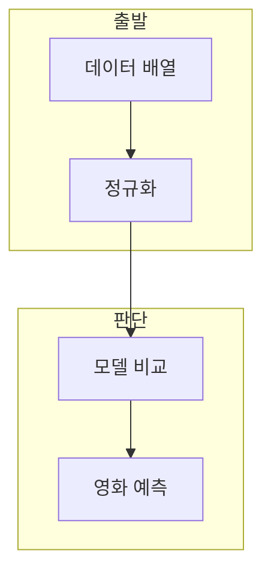

> [!abstract] 한 줄 요약
> 대비 문제는 영화 장르 점수 데이터를 정규화하고, SVM과 KNN의 학습·선택·신규 예측 절차를 단계별로 요구한다.

## 이 노트의 지도



## 1. 데이터를 배열로 다루기

입력은 action·romance 점수이고 레이블은 영화 유형이다. 학습 전 평균과 표준편차로 두 입력 열을 정규화한다. ==train/test 분리== 는 학습에 쓰는 데이터와 성능 확인에 쓰는 데이터를 나누는 절차.

**검증 우선.** K를 고르거나 신규 입력을 예측하기 전에 테스트 데이터에서 후보의 결과를 비교한다.

## 2. 다중 분류의 두 경로

SVM은 클래스별 분류기를 만들고, KNN은 이웃 거리와 후보 K를 사용한다.

<Tabs>
  <Tab label="다중 SVM">각 영화 유형을 양성으로 둔 분류기의 점수를 비교해 예측 클래스를 정한다.</Tab>
  <Tab label="정규화,열별 스케일 통일,거리·갱신 비교,SVM 점수,클래스별 결정값,최고 점수 선택,KNN 정확도,후보 K의 평가값,K 선택 근거">거리로 이웃을 찾고 후보 K의 정확도를 비교해 최적값을 고른다.</Tab>
</Tabs>

<details>
<summary>신규 점수 입력</summary>

새 점수도 학습 데이터의 평균·표준편차로 정규화한 뒤에 모델에 전달한다.

</details>

<details>
<summary>자료 분리</summary>

정규화된 데이터를 학습·테스트로 분리한 뒤 후보 모델의 결과를 비교한다.

</details>

## 데이터로 보기

```html preview
<div style="font-family:system-ui,sans-serif;padding:20px;color:var(--foreground)">
  <label for="amt" style="font-size:14px;font-weight:600">K 후보</label>
  <div id="out" style="font-size:30px;font-weight:700;color:var(--chart-1);margin:6px 0">15</div>
  <input id="amt" type="range" min="1" max="30" step="2" value="15"
    style="width:100%;accent-color:var(--primary)" />
  <p style="font-size:13px;color:var(--muted-foreground)">홀수 후보를 평가해 최적 K를 찾는다.</p>
  <script>
    var amt = document.getElementById('amt');
    var out = document.getElementById('out');
    amt.addEventListener('input', function () {
      out.textContent = Number(amt.value).toLocaleString();
    });
  </script>
</div>
```

> [!warning] 특정 답의 범위
> 특정 장르 점수의 예측 결과는 주어진 데이터와 하이퍼파라미터의 결과다.

## 핵심 정리

| 개념 | 정의 | 학습 판단 |
| :-- | :-- | :-- |
| 정규화 | 열별 스케일 통일 | 거리·갱신 비교 |
| SVM 점수 | 클래스별 결정값 | 최고 점수 선택 |
| KNN 정확도 | 후보 K의 평가값 | K 선택 근거 |

## 관련 개념

- SVM의 마진은 결정 경계의 여유를 다룬다.
- KNN은 거리와 다수결을 사용한다.

> [!question]- 스스로 점검
> **Q.** 신규 입력도 다시 정규화해야 하는 이유는?
>
> **A.** 학습 때의 특성 스케일과 맞춰 모델 입력을 구성해야 하기 때문이다.
