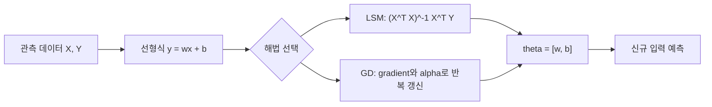

관측된 데이터에서 변수 사이의 숨은 관계를 추정하고, 새 입력의 값을 예측하는 것이 회귀다. 자료는 선형식 $y=wx+b$를 중심으로 최소제곱법(OLS/LSM/Normal Equation)과 경사 하강법(GD)을 나란히 제시한다.

> [!IMPORTANT]
> 아래 설명은 두 원본 슬라이드의 수식·예시·코드에서만 재구성했다. 원본 슬라이드 이미지와 페이지 번호는 공개 노트에 포함하지 않는다.

---

## 학습 목표

- 선형 회귀와 비선형 회귀의 표현 차이를 구분한다.
- $X$, $Y$, $\theta=[w,b]^T$를 이용해 정규방정식을 전개한다.
- MSE의 기울기와 학습률이 GD 갱신에 미치는 방향을 설명한다.

---

## 회귀가 모델링하는 관계

자료의 예시는 다음과 같이 입력 변수 $x$와 목표 변수 $y$를 짝지은다.

| 입력 $x$ | 목표 $y$ |
| --- | --- |
| 사람의 키 | 사람의 몸무게 |
| 주택의 크기 | 주택의 가격 |
| 공부 시간 | 시험 점수 |
| 약품 투입량 | 오염도 |

선형 회귀는 관계를 1차원식 $y=wx+b$로 표현한다. 비선형 회귀는 자료의 표현대로 $w_1x^n+w_2x^{n-1}+\cdots+w_nx+b$처럼 더 높은 차수의 항을 사용한다. 회귀 분석의 목적은 후보식 가운데 오차가 작은 식을 찾고, 그 식으로 신규 데이터를 예측하는 것이다.

<Tabs>
  <Tab label="LSM / OLS">
    잔차 제곱합을 최소화하는 닫힌 형태의 해다. 행렬 역산이 가능하다는 전제가 필요하다.
  </Tab>
  <Tab label="GD">
    현재 파라미터에서 손실의 편미분을 구하고, 학습률을 곱한 뒤 반대 방향으로 반복 이동한다.
  </Tab>
</Tabs>

---

## 행렬로 만든 선형식

원본의 4개 예시는 입력과 정답을 다음처럼 둔다.

$$
X=
\begin{bmatrix}
-3\\-1\\1\\3
\end{bmatrix},
\qquad
Y=
\begin{bmatrix}
-1\\-1\\3\\3
\end{bmatrix},
\qquad
\theta=
\begin{bmatrix}
w\\b
\end{bmatrix}
$$

절편을 포함하려고 $X$에 1인 bias 열을 붙이면

$$
X=
\begin{bmatrix}
-3&1\\-1&1\\1&1\\3&1
\end{bmatrix}
$$

이고 목표는 $X\theta$가 관측된 $Y$와 같아지는 $\theta$를 찾는 것이다. 자료는 $X$가 정방행렬이 아니므로 단순한 $\theta=X^{-1}Y$는 불가능하다고 설명한다.

---

## 최소제곱법의 전개

정규방정식은 다음 순서로 얻는다.

1. $X\theta=Y$에서 양변에 $X^T$를 곱한다.
2. $(X^TX)\theta=X^TY$를 만든다.
3. $(X^TX)^{-1}$을 곱해 파라미터를 계산한다.

$$
\theta=(X^TX)^{-1}X^TY
$$

자료의 예시 계산 결과는

$$
\theta=
\begin{bmatrix}
0.8\\1
\end{bmatrix}
$$

이다. 코드 실습에서는 bias 열을 추가하고 np.dot, 전치 .T, 역행렬 np.linalg.inv를 차례로 사용한다.

> [!WARNING]
> $X^TX$가 비가역이면 역행렬을 구할 수 없다. 원본 실습도 이 경우를 주의사항으로 명시한다.

---

## 경사 하강법과 MSE

예측은 $\hat{Y}=X\theta$로 두고, 자료는 평균제곱오차를 손실로 사용한다.

$$
L(\theta)=\frac{1}{N}\sum_i (Y_i-\hat{Y}_i)^2
=\frac{1}{N}\sum_i (Y_i-wx_i-b)^2
$$

현재 위치에서 gradient를 계산해 다음처럼 갱신한다.

$$
\theta_{t+1}=\theta_t-\alpha\frac{\partial L}{\partial\theta_t}
$$

자료의 설명에서는 gradient가 $0.8$, learning rate가 $0.1$인 예를 들어 $\theta_t-0.08$로 이동한다. $w$와 $b$의 편미분은 각각 잔차에 $-x_i$, $-1$을 곱한 항의 평균으로 제시된다.

```html preview
<div style="font-family:system-ui,sans-serif;padding:20px;color:var(--foreground)">
  <label for="amt" style="font-size:14px;font-weight:600">자료 예시 gradient</label>
  <div id="out" style="font-size:30px;font-weight:700;color:var(--chart-1);margin:6px 0">0.8</div>
  <input id="amt" type="range" min="0" max="0.8" step="0.8" value="0.8"
    style="width:100%;accent-color:var(--primary)" />
  <p style="font-size:13px;color:var(--muted-foreground)">0은 최적점의 gradient, 0.8은 현재 위치 예시다.</p>
  <script>
    var amt = document.getElementById('amt');
    var out = document.getElementById('out');
    amt.addEventListener('input', function () {
      out.textContent = '' + Number(amt.value).toLocaleString();
    });
  </script>
</div>
```

---

## 두 해법의 실행 흐름



| 비교축 | LSM | GD |
| --- | --- | --- |
| 계산 방식 | 정규방정식과 역행렬 | 편미분·반복 갱신 |
| 자료의 핵심 위험 | $X^TX$ 비가역 | 학습률이 너무 크면 발산, 너무 작으면 느린 수렴 |
| 파라미터 갱신 | $w\leftarrow w-\alpha\partial L/\partial w$, $b\leftarrow b-\alpha\partial L/\partial b$ | 반복 이동 |

<details>
<summary>식 읽기 점검</summary>

- $\theta$는 자료에서 $w$와 $b$를 묶은 2차원 벡터다.
- $\alpha$는 learning rate이며 파라미터를 얼마나 움직일지 정한다.
- 원본의 일부 OCR은 실제·예측 $Y$ 기호를 비슷하게 표시한다. 여기서는 예측을 $\hat{Y}$로 명시해 의미를 분리했다.

</details>

> [!CAUTION]
> GD의 안정성은 데이터 스케일과 학습률에 좌우된다. 자료는 학습률을 하이퍼파라미터로 설명하지만 특정 데이터에 대한 최적값을 보장하지 않는다.
