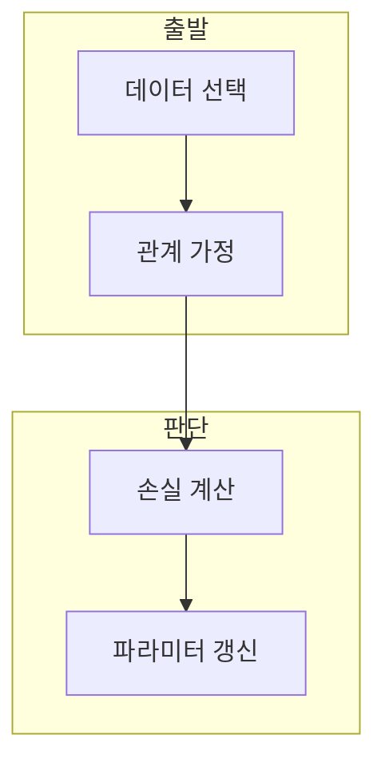

> [!abstract] 한 줄 요약
> 선형 회귀 실습은 주택 데이터의 입력·목표 관계를 정하고, 손실의 기울기로 가중치와 절편을 갱신하는 과정을 구현한다.

## 이 노트의 지도



## 1. 실습의 예측 대상

강의는 주택 크기와 가격의 관계를 단일 선형 회귀 예시로 두고, 데이터 간 관계를 분석해 예측 모델을 구현한다. ==회귀선== 는 입력과 목표의 관계를 근사하는 직선.

> [!important] 목표와 손실
> 가중치와 절편의 갱신은 예측값과 정답의 차이를 줄이는 목적과 연결해야 한다.

## 2. 경사 하강법의 갱신

현재 손실을 파라미터로 편미분하고 학습률을 곱한 반대 방향으로 $w,b$를 갱신한다.

$$
\theta_{t+1}=\theta_t-\alpha\frac{\partial L}{\partial\theta_t}
$$

<details>
<summary>실습 환경과 데이터</summary>

강의는 Colab 환경에서 주택 데이터셋을 사용하고, 단일 특성의 입력과 가격 목표를 다룬다.

</details>

## 데이터로 보기

```html preview
<div style="font-family:system-ui,sans-serif;padding:20px;color:var(--foreground)">
  <label for="amt" style="font-size:14px;font-weight:600">학습률 배율</label>
  <div id="out" style="font-size:30px;font-weight:700;color:var(--chart-1);margin:6px 0">1</div>
  <input id="amt" type="range" min="1" max="10" step="1" value="1"
    style="width:100%;accent-color:var(--primary)" />
  <p style="font-size:13px;color:var(--muted-foreground)">값을 키울수록 한 번의 갱신 크기가 커진다.</p>
  <script>
    var amt = document.getElementById('amt');
    var out = document.getElementById('out');
    amt.addEventListener('input', function () {
      out.textContent = Number(amt.value).toLocaleString();
    });
  </script>
</div>
```

> [!warning] 큰 갱신의 위험
> 학습률을 크게 한다고 항상 더 빨리 좋은 해에 도달하는 것은 아니다.

## 핵심 정리

| 개념 | 정의 | 학습 판단 |
| :-- | :-- | :-- |
| 가중치 | 입력 영향 계수 | 회귀선 기울기 |
| 절편 | 상수항 | 회귀선 위치 |
| 학습률 | 갱신 크기 | 수렴 속도에 영향 |

## 관련 개념

- 선형 회귀 이론은 손실의 편미분을 유도한다.
- LSM과 GDM은 계수 추정 방법을 비교한다.

> [!question]- 스스로 점검
> **Q.** 학습률을 손실 기울기의 반대 방향에 곱하는 이유는?
>
> **A.** 현재 위치에서 손실을 줄이는 방향으로 파라미터를 움직이기 위해서다.
