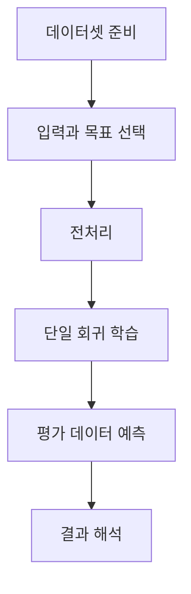

# 선형 회귀 실습 설계

> [!abstract] 목표
> 이 실습은 주어진 데이터셋에서 변수 관계를 분석하고, 단일 선형 회귀로 예측 모델을 구현하는 것을 목표로 한다.

## 실습을 재현 가능한 단계로 나누기

주택 데이터 예시에는 여러 변수와 다수의 관측치가 있으며, 단일 선형 회귀에서는 한 입력과 한 목표값의 관계를 먼저 확인한다. 이후 최소제곱법 또는 경사 하강법으로 모델을 구성한다.



| 실습 단계 | 확인 대상 | 남겨야 할 결과 |
| --- | --- | --- |
| 데이터 선택 | 입력 열과 목표 열 | 분석 질문 |
| 전처리 | 결측값과 값의 범위 | 변환 기준 |
| 학습 | 회귀 계수 | 학습 방식 |
| 평가 | 예측과 실제의 차이 | 해석 메모 |

> [!note] 해법 선택
> 단일 선형 회귀의 실습 해법으로는 최소제곱법, 정규방정식, 경사 하강법이 제시된다. 각 방법은 같은 예측 문제를 서로 다른 계산 절차로 푼다.

```html preview h=170
<div style="font-family:system-ui,sans-serif;padding:16px;border:1px solid var(--border);background:var(--card);color:var(--foreground)">
  <div style="font-weight:700">실습 체크포인트</div>
  <div style="display:flex;gap:8px;flex-wrap:wrap;margin-top:10px">
    <span style="padding:7px;border:1px solid var(--border)">질문</span>
    <span style="padding:7px;border:1px solid var(--border)">데이터</span>
    <span style="padding:7px;border:1px solid var(--border)">학습</span>
    <span style="padding:7px;border:1px solid var(--border)">평가</span>
  </div>
</div>
```

<Tabs>
<Tab label="환경">
실습 환경에서는 데이터 처리, 시각화, 모델 계산을 순서대로 준비한다.
</Tab>
<Tab label="데이터">
주택의 면적과 가격처럼 한 입력과 한 목표의 관계를 먼저 분명하게 둔다.
</Tab>
<Tab label="평가">
학습에 사용하지 않은 데이터에 예측을 적용하고 실제값과의 차이를 살핀다.
</Tab>
</Tabs>

<details>
<summary>재현 메모에 포함할 항목</summary>

- 어떤 열을 입력과 목표로 사용했는가
- 어떤 방식으로 데이터를 나누었는가
- 어떤 파라미터 추정 방식을 사용했는가
- 예측 결과를 어떤 기준으로 해석했는가
</details>

> [!tip] 한 번에 하나씩 확인하기
> 데이터 선택, 전처리, 학습, 평가를 한 번에 바꾸지 않으면 결과 변화의 원인을 더 쉽게 추적할 수 있다.

> [!warning] 시각화만으로 결론 내리지 않기
> 산점도와 예측선은 관계를 살피는 출발점이다. 평가 데이터에서의 오차도 함께 확인해야 한다.
