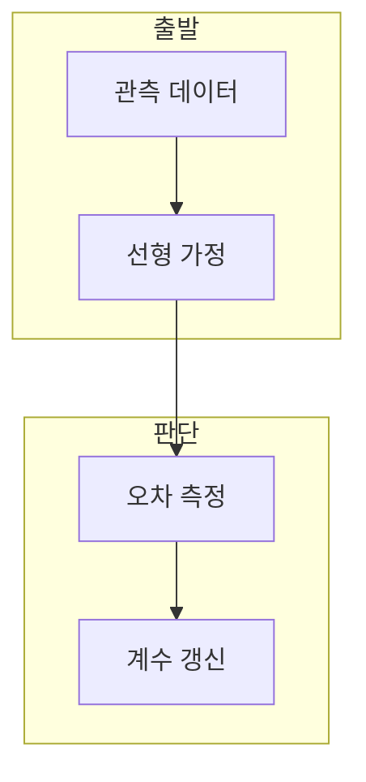

> [!abstract] 한 줄 요약
> 선형 회귀는 관측된 입력과 목표의 관계를 직선으로 근사해 새 입력의 목표를 예측하는 모델이다.

## 이 노트의 지도



## 1. 회귀가 추정하는 관계

강의는 기존 데이터를 사용해 변수 사이의 관계를 수식으로 만들고 새 데이터의 목표값을 예측하는 과정을 회귀로 설명한다. ==선형 모델== 는 입력의 가중합과 절편으로 목표를 표현하는 모델.

> [!important] 오차가 작은 식
> 여러 후보 식 중 예측 오차가 작은 식을 찾는 관점이 회귀 학습의 출발점이다.

## 2. 손실과 기울기

평균 제곱 오차는 예측과 정답의 차이를 제곱해 평균낸 값이며, 경사 하강법은 이 손실의 편미분을 이용한다.

$$
L=\frac{1}{N}\sum_{i=1}^{N}(y_i-\hat y_i)^2
$$

<details>
<summary>파라미터 갱신</summary>

학습률은 파라미터를 얼마나 갱신할지 정하고, 기울기는 현재 손실이 증가하는 방향을 가리킨다.

</details>

## 데이터로 보기

```html preview
<div style="font-family:system-ui,sans-serif;padding:20px;color:var(--foreground)">
  <label for="amt" style="font-size:14px;font-weight:600">학습률 배율</label>
  <div id="out" style="font-size:30px;font-weight:700;color:var(--chart-1);margin:6px 0">1</div>
  <input id="amt" type="range" min="1" max="10" step="1" value="1"
    style="width:100%;accent-color:var(--primary)" />
  <p style="font-size:13px;color:var(--muted-foreground)">같은 기울기에서도 갱신 크기가 달라진다.</p>
  <script>
    var amt = document.getElementById('amt');
    var out = document.getElementById('out');
    amt.addEventListener('input', function () {
      out.textContent = Number(amt.value).toLocaleString();
    });
  </script>
</div>
```

> [!warning] 비선형 관계의 한계
> 입력·목표 관계가 직선으로 충분히 표현되지 않으면 선형 모델의 오차를 별도 해석해야 한다.

## 핵심 정리

| 개념 | 정의 | 학습 판단 |
| :-- | :-- | :-- |
| 회귀 | 관계 추정 | 새 값 예측 |
| MSE | 제곱 오차 평균 | 후보 모델 비교 |
| 경사 하강법 | 기울기 반대 갱신 | 손실 최소화 |

## 관련 개념

- 선형 회귀 실습은 데이터와 갱신 구현을 다룬다.
- 다중 선형 회귀는 여러 입력 특성을 쓴다.

> [!question]- 스스로 점검
> **Q.** MSE에서 오차를 제곱하는 이유는?
>
> **A.** 오차의 부호를 없애고 큰 차이에 더 큰 벌점을 주기 위해서다.
