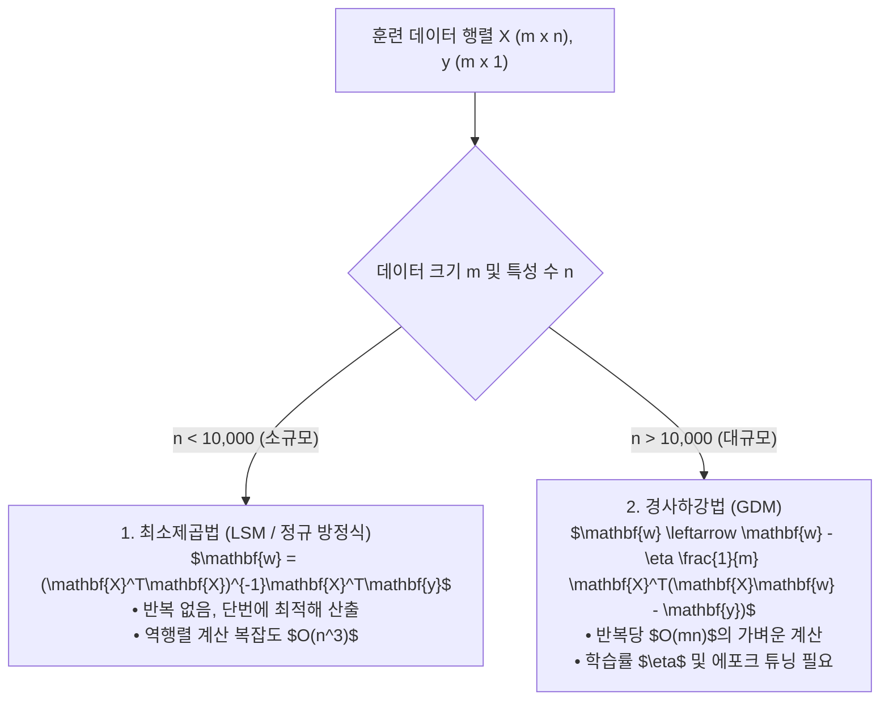

> [!abstract] 핵심 요약
> **선형 회귀(Linear Regression)**는 독립 변수 $\mathbf{x}$와 연속형 종속 변수 $y$ 사이의 선형적 인과 관계를 모델링하는 지도학습 회귀의 기초이다.
> 잔차 제곱합(RSS)을 최소화하기 위해 행렬 미분을 통해 닫힌 해를 직접 구하는 **최소제곱법(LSM / 정규 방정식 $\mathbf{w} = (\mathbf{X}^T \mathbf{X})^{-1} \mathbf{X}^T \mathbf{y}$)**과 대규모 고차원 데이터에서 $O(N^3)$ 역행렬 연산 부담을 피해 반복적으로 가중치를 갱신하는 **경사하강법(GDM)**의 수학적 차이를 명확히 이해해야 한다.

---

## 1. 정규 방정식(Normal Equation) 닫힌 해 수학적 유도

$$J(\mathbf{w}) = \frac{1}{2m} \|\mathbf{X}\mathbf{w} - \mathbf{y}\|_2^2 = \frac{1}{2m} (\mathbf{X}\mathbf{w} - \mathbf{y})^T (\mathbf{X}\mathbf{w} - \mathbf{y})$$
$$\nabla_\mathbf{w} J(\mathbf{w}) = \frac{1}{m} \mathbf{X}^T (\mathbf{X}\mathbf{w} - \mathbf{y}) = 0 \implies \mathbf{X}^T \mathbf{X} \mathbf{w} = \mathbf{X}^T \mathbf{y} \implies \mathbf{w}^* = (\mathbf{X}^T \mathbf{X})^{-1} \mathbf{X}^T \mathbf{y}$$



---

## 2. LSM vs GDM 장단점 비교

| 비교 항목 | 최소제곱법 (LSM / Normal Eq) | 경사하강법 (GDM) |
| :-- | :-- | :-- |
| **학습률 $\eta$ 설정** | 필요 없음 (No Hyperparameter) | 세심한 튜닝 필수 ($\eta$ 너무 크면 발산) |
| **반복(Iteration) 여부** | 0회 (단일 행렬 수식 연산) | 수백~수만 번 수렴할 때까지 반복 |
| **계산 복잡도** | $O(n^3)$ ($\mathbf{X}^T \mathbf{X}$ 역행렬) | $O(k \cdot m \cdot n)$ ($k$회 반복) |
| **특성 스케일링** | 불필요 | **필수** (특성 간 스케일 상이 시 수렴 지연) |

---

## 3. 실시간 LSM vs GDM 단일 선형 회귀선 피팅 시뮬레이터

```html preview
<div style="font-family:system-ui,-apple-system,sans-serif;padding:20px;background:var(--card);color:var(--card-foreground);border:1px solid var(--border);border-radius:var(--radius)">
  <div style="font-size:16px;font-weight:700;margin-bottom:14px;color:var(--primary);display:flex;align-items:center;gap:8px">
    <span>📈 선형 회귀 모델: 최소제곱법(LSM) vs 경사하강법(GDM) 피팅기</span>
  </div>

  <div style="display:flex;gap:8px;margin-bottom:12px">
    <button id="btnSolveLsm" style="padding:6px 14px;background:var(--primary);color:#fff;border:none;border-radius:var(--radius);font-weight:700;cursor:pointer">1. LSM 닫힌 해 즉시 계산</button>
    <button id="btnStepGdm" style="padding:6px 14px;background:var(--chart-1);color:#fff;border:none;border-radius:var(--radius);font-weight:700;cursor:pointer">2. GDM 10 Steps 반복</button>
    <button id="btnResetLr" style="padding:6px 10px;background:var(--muted);color:var(--foreground);border:1px solid var(--border);border-radius:var(--radius);font-size:11px;cursor:pointer">초기화</button>
  </div>

  <div style="display:grid;grid-template-columns:1fr 1fr;gap:12px;margin-bottom:12px">
    <div style="padding:10px;background:var(--background);border:1px solid var(--border);border-radius:var(--radius)">
      <div style="font-size:10px;color:var(--muted-foreground)">현재 회귀식 모델 (y = wx + b)</div>
      <div id="lrModelOut" style="font-family:monospace;font-size:15px;font-weight:800;color:var(--primary);margin-top:2px">y = 0.00x + 0.00</div>
    </div>
    <div style="padding:10px;background:var(--background);border:1px solid var(--border);border-radius:var(--radius)">
      <div style="font-size:10px;color:var(--muted-foreground)">평균 제곱 오차 (MSE Loss)</div>
      <div id="lrMseOut" style="font-family:monospace;font-size:15px;font-weight:800;color:var(--destructive,#ef4444);margin-top:2px">MSE = 18.50</div>
    </div>
  </div>

  <div id="lrLogDesc" style="padding:10px;background:var(--background);border:1px solid var(--border);border-radius:var(--radius);font-size:11px">
    데이터셋: (1, 2), (2, 2.8), (3, 3.6), (4, 4.5), (5, 5.1). 버튼을 눌러 회귀선을 적합하세요.
  </div>

  <script>
    var data = [[1, 2.0], [2, 2.8], [3, 3.6], [4, 4.5], [5, 5.1]];
    var w = 0.0, b = 0.0;
    var gdmSteps = 0;

    function calcMse(currW, currB) {
      var sum = 0;
      for (var i = 0; i < data.length; i++) {
        var pred = currW * data[i][0] + currB;
        var diff = pred - data[i][1];
        sum += diff * diff;
      }
      return sum / data.length;
    }

    function updateLrUI(desc) {
      document.getElementById('lrModelOut').textContent = "y = " + w.toFixed(2) + "x + " + b.toFixed(2);
      document.getElementById('lrMseOut').textContent = "MSE = " + calcMse(w, b).toFixed(4);
      document.getElementById('lrLogDesc').innerHTML = desc;
    }

    document.getElementById('btnSolveLsm').onclick = function() {
      var n = data.length;
      var sumX = 0, sumY = 0, sumXY = 0, sumXX = 0;
      for (var i = 0; i < n; i++) {
        sumX += data[i][0]; sumY += data[i][1];
        sumXY += data[i][0] * data[i][1];
        sumXX += data[i][0] * data[i][0];
      }
      w = (n * sumXY - sumX * sumY) / (n * sumXX - sumX * sumX);
      b = (sumY - w * sumX) / n;
      updateLrUI("✅ <b>[LSM 정규방정식 닫힌 해]</b> 단 1회의 수학적 역행렬 연산으로 최적의 글로벌 파라미터 (w=" + w.toFixed(3) + ", b=" + b.toFixed(3) + ")를 직접 산출했습니다.");
    };

    document.getElementById('btnStepGdm').onclick = function() {
      var lr = 0.05;
      for (var step = 0; step < 10; step++) {
        var gradW = 0, gradB = 0;
        for (var i = 0; i < data.length; i++) {
          var diff = (w * data[i][0] + b) - data[i][1];
          gradW += diff * data[i][0];
          gradB += diff;
        }
        w -= lr * (2 / data.length) * gradW;
        b -= lr * (2 / data.length) * gradB;
        gdmSteps++;
      }
      updateLrUI("📈 <b>[GDM 경사하강법]</b> 총 " + gdmSteps + "회 반복 갱신 중... (w=" + w.toFixed(3) + ", b=" + b.toFixed(3) + ", MSE=" + calcMse(w, b).toFixed(4) + ")");
    };

    document.getElementById('btnResetLr').onclick = function() {
      w = 0.0; b = 0.0; gdmSteps = 0;
      updateLrUI("초기화 완료: w=0, b=0");
    };
  </script>
</div>
```
