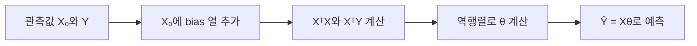

# 선형 회귀의 두 해법

관측된 입력과 출력 사이의 관계를 직선으로 나타내고, 최소제곱법과 경사 하강법이 같은 파라미터를 서로 다른 방식으로 찾는 과정을 정리한다.

> [!IMPORTANT]
> Ordinary Least Squares(OLS), Least Squares Method(LSM), Normal Equation은 같은 해법을 가리킨다. 두 번째 자료는 반복 최적화를 Gradient Descent Method(GDM)라고 표기하며, 첫 번째 자료의 GD와 같은 계열이다.

## 관계를 1차식으로 표현하기

선형 회귀는 관측 데이터로부터 변수 사이의 숨은 관계를 추정해 새 입력의 출력을 예측한다.

| 입력 \(x\) | 출력 \(y\) | 예시 질문 |
| --- | --- | --- |
| 사람의 키 | 사람의 몸무게 | 키로 몸무게를 어떻게 추정할까? |
| 주택의 크기 | 주택의 가격 | 면적으로 가격을 어떻게 예측할까? |
| 공부 시간 | 시험 점수 | 학습 시간과 점수는 어떤 관계일까? |
| 약품 투입량 | 오염도 | 투입량으로 오염도를 어떻게 예측할까? |

단일 선형 회귀의 예측식은 다음과 같다.

$$
\hat{y}=wx+b
$$

<Tabs>
  <Tab label="선형 회귀">

변수 관계를 1차식 \(\hat{y}=wx+b\)로 표현한다. \(w\)는 기울기, \(b\)는 절편이다.

  </Tab>
  <Tab label="비선형 회귀">

자료는 2차 이상의 항을 쓰는 식을 비선형 회귀로 구분한다.

$$
\hat{y}=w_1x^n+w_2x^{n-1}+\cdots+w_nx+b
$$

  </Tab>
</Tabs>

---

## 최소제곱법의 행렬 구성

자료의 예제는 네 관측값을 사용한다.

$$
X_0=
\begin{bmatrix}
-3\\
-1\\
1\\
3
\end{bmatrix},
\quad
Y=
\begin{bmatrix}
-1\\
-1\\
3\\
3
\end{bmatrix}
$$

절편을 함께 구하려면 입력 행렬에 값이 1인 bias 열을 붙인다.

$$
X=
\begin{bmatrix}
-3 & 1\\
-1 & 1\\
1 & 1\\
3 & 1
\end{bmatrix},
\quad
\theta=
\begin{bmatrix}
w\\
b
\end{bmatrix},
\quad
\hat{Y}=X\theta
$$



\(X\)는 \(4\times2\)라 정방행렬이 아니므로 \(X^{-1}Y\)로 풀 수 없다. 양변에 \(X^\mathsf{T}\)를 적용해 정규방정식을 만든다.

$$
X^\mathsf{T}X\theta=X^\mathsf{T}Y
$$

$$
\theta=(X^\mathsf{T}X)^{-1}X^\mathsf{T}Y
$$

예제의 계산 결과는 다음과 같다.

$$
\theta=
\begin{bmatrix}
0.8\\
1
\end{bmatrix}
$$

> [!WARNING]
> 보조 자료는 \(X^\mathsf{T}X\)가 비가역이면 역행렬을 계산할 수 없다고 경고한다. 정규방정식 구현에서는 역행렬 존재 여부가 전제다.

---

## 경사 하강법의 손실과 갱신

경사 하강법은 예측값과 정답의 차이로 평균제곱오차를 만들고, 손실을 줄이는 반대 방향으로 파라미터를 반복 갱신한다.

$$
L(w,b)=\frac{1}{N}\sum_{i=1}^{N}\left(y_i-\hat{y}_i\right)^2
$$

$$
\frac{\partial L}{\partial w}
=
\frac{2}{N}\sum_{i=1}^{N}(y_i-\hat{y}_i)(-x_i)
$$

$$
\frac{\partial L}{\partial b}
=
\frac{2}{N}\sum_{i=1}^{N}(y_i-\hat{y}_i)(-1)
$$

$$
w_{t+1}=w_t-\alpha\frac{\partial L}{\partial w},
\qquad
b_{t+1}=b_t-\alpha\frac{\partial L}{\partial b}
$$

자료의 수치 예에서는 gradient가 \(0.8\), 학습률이 \(0.1\)이므로 한 번의 이동량은 \(0.08\)이다.

> [!CAUTION]
> 보조 자료는 학습률이 너무 크면 발산할 수 있고, 너무 작으면 수렴이 느려질 수 있다고 설명한다. 학습률 \(\alpha\)는 파라미터를 얼마나 갱신할지 정하는 하이퍼파라미터다.

```html preview
<div style="font-family:system-ui,sans-serif;padding:20px;color:var(--foreground)">
  <label for="amt" style="font-size:14px;font-weight:600">정규방정식 예제의 입력 x</label>
  <div id="out" style="font-size:30px;font-weight:700;color:var(--chart-1);margin:6px 0">x = 1</div>
  <input id="amt" type="range" min="-3" max="3" step="2" value="1"
    style="width:100%;accent-color:var(--primary)" />
  <p style="font-size:13px;color:var(--muted-foreground)">슬라이더의 네 정지점은 자료에 제시된 입력값 −3, −1, 1, 3이다.</p>
  <script>
    var amt = document.getElementById('amt');
    var out = document.getElementById('out');
    amt.addEventListener('input', function () {
      out.textContent = 'x = ' + Number(amt.value).toLocaleString();
    });
  </script>
</div>
```

---

## 두 해법을 선택하는 기준

| 관점 | OLS·LSM·Normal Equation | GD·GDM |
| --- | --- | --- |
| 핵심 연산 | 행렬식으로 \(\theta\)를 직접 계산 | gradient로 \(\theta\)를 반복 갱신 |
| 필요한 설정 | bias 열과 가역적인 \(X^\mathsf{T}X\) | 초기값, 반복 횟수, 학습률 |
| 종료 방식 | 정규방정식 계산 완료 | 정한 반복 횟수 또는 수렴까지 반복 |
| 주요 주의점 | 역행렬이 없으면 직접 계산 불가 | 학습률에 따라 발산하거나 느리게 수렴 |

<details>
<summary>구현 순서 점검</summary>

1. 입력 \(X\)와 정답 \(Y\)의 형상을 확인한다.
2. \(X\)에 bias 열을 추가한다.
3. LSM이면 \(X^\mathsf{T}X\)의 역행렬 가능성을 확인한 뒤 \(\theta\)를 계산한다.
4. GDM이면 \(w=b=0\)에서 시작해 \(\hat{Y}\), gradient, 파라미터 갱신을 반복한다.
5. 두 경우 모두 \(\hat{Y}=X\theta\)로 예측한다.

</details>

==핵심은 해법의 이름보다 목적이다.== 두 방법 모두 관측 오차를 작게 만드는 \(w\)와 \(b\)를 찾지만, 하나는 행렬 계산으로 직접 풀고 다른 하나는 손실의 기울기를 따라 이동한다.
