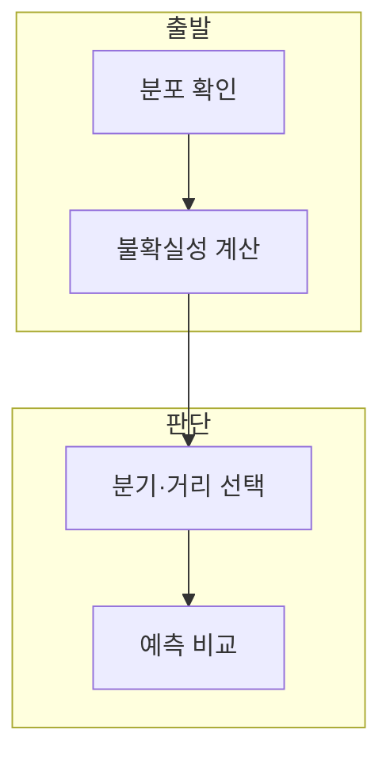

> [!abstract] 한 줄 요약
> 엔트로피는 클래스 분포의 불확실성을 수치화하고, 결정 트리는 이를 낮추는 분기를 찾으며 KNN은 가까운 이웃의 정보를 사용한다.

## 이 노트의 지도



## 1. 엔트로피의 의미

강의는 엔트로피를 불확실성 정도를 나타내는 수치로 설명하고, 균등한 이진 분포의 값이 큰 예를 제시한다. ==엔트로피== 는 클래스 확률 분포의 불확실성을 나타내는 값.

> [!important] 낮은 불확실성의 분기
> 결정 트리는 클래스가 더 분명히 나뉘는 특성·기준값을 먼저 선택하려 한다.

## 2. KNN의 이웃과 거리

KNN은 가까운 K개의 데이터에서 다수결로 분류하거나 이웃 값으로 추정하고, K와 거리 측정이 결과를 바꾼다.

$$
H(X)=-\sum_i p_i\log_2 p_i
$$

<details>
<summary>거리의 선택</summary>

강의는 L1, L2, Mahalanobis, 상관 거리의 예를 제시한다. 특성의 단위와 분포를 확인해 선택한다.

</details>

## 데이터로 보기

```html preview
<div style="font-family:system-ui,sans-serif;padding:20px;color:var(--foreground)">
  <label for="amt" style="font-size:14px;font-weight:600">이웃 수 K</label>
  <div id="out" style="font-size:30px;font-weight:700;color:var(--chart-1);margin:6px 0">3</div>
  <input id="amt" type="range" min="1" max="15" step="2" value="3"
    style="width:100%;accent-color:var(--primary)" />
  <p style="font-size:13px;color:var(--muted-foreground)">K를 바꾸면 지역적 판단과 평활화 정도가 달라진다.</p>
  <script>
    var amt = document.getElementById('amt');
    var out = document.getElementById('out');
    amt.addEventListener('input', function () {
      out.textContent = Number(amt.value).toLocaleString();
    });
  </script>
</div>
```

> [!warning] 엔트로피와 오류의 구별
> 엔트로피가 낮다는 사실만으로 테스트 오류가 반드시 낮다고 단정하지 않는다.

## 핵심 정리

| 개념 | 정의 | 학습 판단 |
| :-- | :-- | :-- |
| 엔트로피 | 불확실성 수치 | 분기 품질 비교 |
| threshold | 분기 기준값 | 하위 분포 생성 |
| KNN | 이웃 기반 방법 | K·거리 선택 |

## 관련 개념

- 결정 트리와 KNN 실습은 재귀와 예측 평가를 다룬다.
- 대비 문제는 K 후보 정확도를 비교한다.

> [!question]- 스스로 점검
> **Q.** 결정 트리에서 엔트로피가 낮아지는 분기가 유용한 이유는?
>
> **A.** 하위 그룹의 클래스가 더 분명해져 분류 규칙을 만들기 쉬워지기 때문이다.
