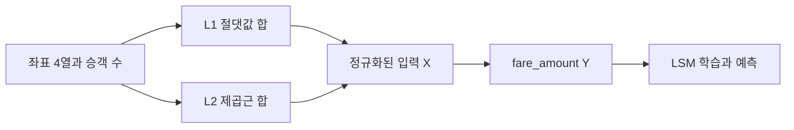

우버 자료의 다중 선형 회귀는 fare_amount를 목표로 하고 좌표 차이에서 만든 두 거리와 승객 수를 입력으로 사용한다.

> [!IMPORTANT]
> 원본 코드의 열 이름·새 입력값·주의사항을 그대로 요약했으며 실제 운임 출력값은 자료에 없으므로 만들지 않았다.

---

## 모델과 열

다중 선형 회귀의 일반식은

$$
Y=\beta_0+\beta_1X_1+\beta_2X_2+\cdots+\beta_nX_n+\epsilon
$$

이다. 자료의 Modified Uber Dataset은 다음 열을 갖는다.

| 역할 | 열 |
| --- | --- |
| 종속 변수 | fare_amount |
| 좌표 입력 | pickup_x, pickup_y, dropoff_x, dropoff_y |
| 승객 입력 | passenger_count |
| 파생 입력 | L1_distance, L2_distance |

---

## 거리 특성 만들기

맨해튼 거리(L1)는 축별 절댓값 차이의 합이다.

$$
L1=|pickup_x-dropoff_x|+|pickup_y-dropoff_y|
$$

유클리드 거리(L2)는 두 축 차이의 제곱합의 제곱근이다.

$$
L2=\sqrt{(pickup_x-dropoff_x)^2+(pickup_y-dropoff_y)^2}
$$

코드에서는 np.abs와 np.sqrt를 이용해 두 열을 추가한다.



---

## 정규화와 분할

모든 열에서 결측 행을 제거한 뒤 평균과 표준편차로 Gaussian normalization을 적용한다.

$$
x'=\frac{x-\mu}{\sigma}
$$

입력은 [L1_distance, L2_distance, passenger_count], 정답은 [fare_amount]로 배열화한다. train_test_split에서 test_size=0.2, random_state=1234를 사용하고 train/test 형상을 확인한다.

<Tabs>
  <Tab label="거리">
    L1은 격자형 이동량을, L2는 직선거리 성분을 나타내며 둘 다 정규화 후 모델 입력이 된다.
  </Tab>
  <Tab label="승객 수">
    passenger_count는 거리와 다른 스케일의 수치 특성이며 새 입력에서는 정수로 넣는다.
  </Tab>
</Tabs>

---

## LSM과 MSE

bias 열을 추가한 행렬 $X$에 최소제곱법을 적용한다.

$$
\theta=(X^TX)^{-1}X^TY,
\qquad
\hat{Y}=X\theta
$$

MSE 구현은 오차 Y-Y_hat를 제곱해 평균한다.

```html preview
<div style="font-family:system-ui,sans-serif;padding:20px;color:var(--foreground)">
  <label for="amt" style="font-size:14px;font-weight:600">자료의 새 입력 L1 거리</label>
  <div id="out" style="font-size:30px;font-weight:700;color:var(--chart-1);margin:6px 0">250</div>
  <input id="amt" type="range" min="197" max="250" step="53" value="250"
    style="width:100%;accent-color:var(--primary)" />
  <p style="font-size:13px;color:var(--muted-foreground)">자료의 새 입력 L2=197과 L1=250을 직접 비교한다.</p>
  <script>
    var amt = document.getElementById('amt');
    var out = document.getElementById('out');
    amt.addEventListener('input', function () {
      out.textContent = '' + Number(amt.value).toLocaleString();
    });
  </script>
</div>
```

---

## 새 입력을 해석하는 순서

자료가 제시한 임의 입력은 L1_distance=250, L2_distance=197, passenger_count=2다.

1. 세 입력을 각각 학습 평균·표준편차로 정규화한다.
2. 정규화한 세 값을 X_new에 넣는다.
3. 학습 모델로 $\hat{Y}$를 예측한다.
4. fare_amount의 표준편차와 평균으로 역정규화한다.

<details>
<summary>운영 체크리스트</summary>

- 새 좌표에서 L1·L2를 실제 거리와 비례하도록 계산했는가?
- 학습 때와 같은 열 순서를 유지했는가?
- 예측 후 운임을 역정규화했는가?
- 승객 수를 정수값으로 입력했는가?

</details>

> [!CAUTION]
> 정규화 전의 250, 197, 2를 곧바로 모델에 넣으면 안 된다. 자료는 새 예측의 최종 숫자 운임을 제공하지 않으므로 결과를 임의로 추정하지 않는다.
