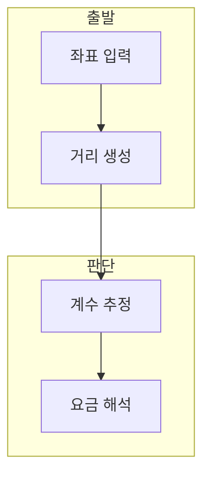

> [!abstract] 한 줄 요약
> 우버 요금 예측 실습은 이동 좌표에서 거리 특성을 만들고, 정규화·최소제곱법·MSE 평가로 요금을 예측한다.

## 이 노트의 지도



## 1. 좌표에서 특성 만들기

실습은 승차·하차 좌표에서 L1 거리와 L2 거리를 계산하고 승객 수와 함께 입력 특성으로 사용한다. ==L1 거리== 는 좌표 차이의 절댓값 합으로 계산하는 맨해튼 거리.

> [!important] 파생 특성의 기준
> 거리 특성은 원시 좌표를 그대로 쓰는 대신 이동량을 표현하지만, 실제 도로 거리를 완전히 뜻하지는 않는다.

## 2. 정규화와 예측

각 특성과 요금을 정규화해 학습하고, 새 입력도 같은 평균·표준편차로 변환한 뒤 예측값을 역정규화한다.

$$
L_2=\sqrt{(x_p-x_d)^2+(y_p-y_d)^2}
$$

<details>
<summary>최소제곱법과 MSE</summary>

강의 구현은 bias 열을 더한 행렬에서 최소제곱 계수를 구하고, 테스트 예측과 정답의 MSE를 계산한다.

</details>

## 데이터로 보기

```html preview
<div style="font-family:system-ui,sans-serif;padding:20px">
  <div id="cards" style="display:flex;gap:14px;flex-wrap:wrap"></div>
  <script>
    var stats = [
      ['입력', 'L1', '좌표 절댓값 합', 'var(--chart-1)'],
      ['입력', 'L2', '좌표 직선거리', 'var(--chart-2)'],
      ['목표', '요금', 'fare amount', 'var(--chart-3)']
    ];
    document.getElementById('cards').innerHTML = stats.map(function (s) {
      return '<div style="flex:1;min-width:150px;padding:16px;background:var(--card);' +
        'color:var(--card-foreground);border:1px solid var(--border);' +
        'border-radius:var(--radius)">' +
        '<div style="font-size:13px;color:var(--muted-foreground)">' + s[0] + '</div>' +
        '<div style="font-size:26px;font-weight:700;margin-top:4px">' + s[1] + '</div>' +
        '<div style="font-size:12px;font-weight:600;margin-top:4px;color:' + s[3] + '">' + s[2] + '</div>' +
        '</div>';
    }).join('');
  </script>
</div>
```

> [!warning] 거리의 해석
> L1·L2는 좌표 기반 특성이다. 실제 이동 경로·교통 상황을 모두 반영하는 값으로 해석하지 않는다.

## 핵심 정리

| 개념 | 정의 | 학습 판단 |
| :-- | :-- | :-- |
| 파생 특성 | 좌표에서 계산 | 입력 정보를 재구성 |
| 정규화 | 평균·표준편차 변환 | 스케일 통일 |
| 역정규화 | 원래 단위 복원 | 요금 해석 |

## 관련 개념

- 다중 선형 회귀는 여러 특성과 MSE 평가를 다룬다.
- KNN은 거리로 이웃을 고르는 비모수 방법이다.

> [!question]- 스스로 점검
> **Q.** 새 요금 입력에도 정규화와 역정규화가 모두 필요한 이유는?
>
> **A.** 모델 계산은 학습 스케일에서 하고 결과는 원래 요금 단위로 해석해야 하기 때문이다.
