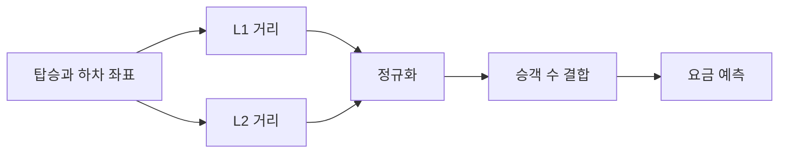

> [!abstract] 핵심
> 우버 요금 예측 예시에서는 탑승·하차 좌표와 승객 수에서 이동거리 특성을 만들고, 이를 이용해 요금 목표값을 예측한다.

## 좌표를 예측 특성으로 바꾸기

원시 좌표는 바로 쓰기보다 출발과 도착의 차이로 요약할 수 있다. 맨해튼 거리 $L1$과 유클리드 거리 $L2$를 추가한 뒤, 승객 수와 함께 입력 행렬을 구성한다.



| 특성 | 계산 또는 의미 | 예측에서의 역할 |
| --- | --- | --- |
| L1 거리 | 좌표 차이의 절댓값 합 | 격자형 이동량 요약 |
| L2 거리 | 좌표 차이의 제곱합에 제곱근 적용 | 직선 거리 요약 |
| 승객 수 | 탑승 인원 | 추가 입력 특성 |
| 요금 | 지불 금액 | 목표값 |

> [!note] 거리 특성
> $L1=|x_1-x_2|+|y_1-y_2|$이고, $L2=\sqrt{(x_1-x_2)^2+(y_1-y_2)^2}$이다. 두 거리는 같은 좌표쌍에서 서로 다른 이동량 요약을 제공한다.

```html preview h=170
<div style="font-family:system-ui,sans-serif;padding:16px;border:1px solid var(--border);background:var(--card);color:var(--foreground)">
  <div style="font-weight:700;margin-bottom:10px">요금 예측 입력 묶음</div>
  <div style="display:flex;gap:8px;flex-wrap:wrap">
    <span style="padding:8px;border:1px solid var(--border)">L1 거리</span>
    <span style="padding:8px;border:1px solid var(--border)">L2 거리</span>
    <span style="padding:8px;border:1px solid var(--border)">승객 수</span>
  </div>
  <div style="margin-top:10px;color:var(--muted)">세 입력은 하나의 특성 행렬로 결합된다.</div>
</div>
```

<Tabs>
<Tab label="목표값">
예측 대상은 요금 지불 금액이며, 다른 열은 이를 설명하는 입력으로 사용한다.
</Tab>
<Tab label="특성 생성">
출발과 도착 좌표에서 L1 및 L2 거리를 계산해 새 열로 추가한다.
</Tab>
<Tab label="전처리">
결측값을 처리하고 정규화한 뒤 학습과 평가 데이터를 분리한다.
</Tab>
</Tabs>

<details>
<summary>특성 생성 확인 목록</summary>

- 좌표 열의 출발·도착 순서가 맞는가?
- L1과 L2가 모두 새 열로 계산되었는가?
- 목표값과 입력 열이 분리되었는가?
- 정규화 기준이 예측 단계에도 유지되는가?
</details>

> [!tip] 중간 열을 확인하기
> 거리 열을 만든 직후 일부 행을 확인하면 좌표 열이 뒤바뀌거나 계산식이 누락된 문제를 일찍 찾을 수 있다.

> [!warning] 거리만으로 요금을 단정하지 않기
> 이 예시는 거리와 승객 수를 입력으로 사용한다. 예측값을 해석할 때 모델에 포함되지 않은 요인을 함께 단정하지 않는다.
