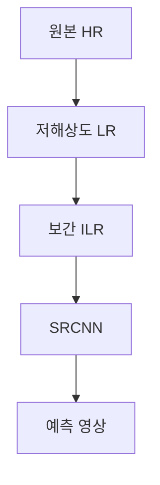

> [!NOTE]
> SRCNN은 고해상도 원본에서 만든 저해상도 입력을 CNN으로 복원하고, 예측 영상과 원본의 차이를 학습한 뒤 PSNR 같은 지표로 검증한다.

---

## 초해상도의 입력 단위

<Tabs>
  <Tab label="SISR">저해상도 이미지 1개를 입력받아 고해상도 이미지 1개를 출력한다.</Tab>
  <Tab label="Video SR">저해상도 이미지 여러 개를 입력받아 고해상도 이미지 1개 또는 여러 개를 출력한다.</Tab>
</Tabs>

| 접근 | 동작 | 원본이 제시한 경계 |
| :-- | :-- | :-- |
| Interpolation-based SR | 픽셀 사이 값을 예측 | 평균화의 smoothing으로 선명도와 고주파 복원력이 저하될 수 있음 |
| Example-based SR | 현재 영상이나 외부 영상의 patch를 검색 | 큰 데이터베이스와 긴 검색 시간이 필요하며 적절한 match가 없으면 화질 저하 가능 |
| CNN 기반 SR | 학습된 convolution으로 복원 | 학습용 입력·정답 쌍과 평가 절차가 필요 |

---

## 응용과 평가 기준

| 구분 | 항목 | 의미 |
| :-- | :-- | :-- |
| 응용 | Artifact Reduction | 압축 과정에서 생긴 잡음 제거 |
| 응용 | Image colorization | 흑백 입력에서 채색 영상 출력 |
| 응용 | Style transfer | content와 style 정보를 결합 |
| 객관 평가 | PSNR, SSIM, MS-SSIM | 영상 간 수치 비교 |
| 주관 평가 | MOS | 사람이 부여한 품질 점수의 평균 |

8-bit 영상에서 원본은 최대 픽셀 값으로 255를 사용하고 PSNR을 dB 단위로 나타낸다.

$$
\operatorname{MSE}
=\frac{1}{wh}\sum_{i=1}^{wh}(O_i-R_i)^2,
\qquad
\operatorname{PSNR}
=10\log_{10}\left(\frac{\operatorname{MAX}^2}{\operatorname{MSE}}\right)
$$

> [!WARNING]
> 원본은 뒤이어 $20\log_{10}(\operatorname{MAX}/\operatorname{MSE})$를 같은 값으로 적지만 앞의 PSNR 식과 일치하지 않는다. 이 문서에서는 원본의 첫 식만 표시하고, 불일치를 외부 지식으로 보정하지 않는다.

---

## SRCNN의 세 합성곱층

**핵심:** SRCNN은 interpolation된 저해상도 영상인 ILR을 입력으로 받아 예측 영상을 출력하는 3-layer CNN이다.

| 계층 | filter 구성 | 역할 |
| :-- | :-- | :-- |
| Conv 1 | $[9 \times 9 \times 3] \times 64$ | 입력 영상에서 patch 특징 추출 |
| Conv 2 | $[1 \times 1 \times 64] \times 32$ | 특징 결합 |
| Conv 3 | $[5 \times 5 \times 32] \times 3$ | 3-channel 예측 영상 생성 |

원본은 2배, 3배, 4배 모델을 제시하며, 3배 예시는 $32 \times 32$ 입력을 $96 \times 96$ 출력으로 연결한다.

---

## 학습 데이터 만들기



```html preview
<div style="font-family:system-ui,sans-serif;padding:20px">
  <div id="cards" style="display:flex;gap:14px;flex-wrap:wrap"></div>
  <script>
    var stats = [
      ['학습 배율', '4배', '원본의 dataset 구성', 'var(--chart-2)'],
      ['T-91', '91장', '학습 이미지', 'var(--chart-1)'],
      ['Set5', '5장', '테스트 이미지', 'var(--chart-5)']
    ];
    document.getElementById('cards').innerHTML = stats.map(function (s) {
      return '<div style="flex:1;min-width:150px;padding:16px;background:var(--card);' +
        'color:var(--card-foreground);border:1px solid var(--border);' +
        'border-radius:var(--radius)">' +
        '<div style="font-size:13px;color:var(--muted-foreground)">' + s[0] + '</div>' +
        '<div style="font-size:26px;font-weight:700;margin-top:4px">' + s[1] + '</div>' +
        '<div style="font-size:12px;font-weight:600;margin-top:4px;color:' + s[3] + '">' +
        s[2] + '</div>' +
        '</div>';
    }).join('');
  </script>
</div>
```

학습 영상은 $32 \times 32$ patch로 나누고 ILR을 입력, 같은 위치의 HR을 label로 사용한다.

<details>
<summary>Data loader와 학습·검증 절차</summary>

- 학습 loader의 초기화 단계에서 이미지 patch를 만든다.
- 길이 함수는 구성된 dataset 수를 반환한다.
- 항목 함수는 주어진 index의 입력과 label을 반환한다.
- 테스트 dataset은 이미지 patch를 수행하지 않는다.
- 학습에서는 loss를 정의하고 최적화하며, 테스트에서는 복원 영상과 평가값을 확인한다.

</details>

---

## 복원 결과 비교

```html preview
<div style="font-family:system-ui,sans-serif;padding:20px;color:var(--foreground)">
  <h3 style="margin:0 0 14px;font-size:15px;font-weight:600">복원 영상의 PSNR</h3>
  <div id="bars" style="display:flex;align-items:flex-end;gap:14px;height:170px"></div>
  <script>
    var data = [['Bicubic', 30.4304], ['SRCNN', 31.1327]];
    var max = Math.max.apply(null, data.map(function (d) { return d[1]; }));
    document.getElementById('bars').innerHTML = data.map(function (d, i) {
      return '<div style="flex:1;display:flex;flex-direction:column;align-items:center;' +
        'gap:6px;height:100%;justify-content:flex-end">' +
        '<span style="font-size:12px;font-weight:600">' + d[1] + '</span>' +
        '<div style="width:100%;height:' + (d[1] / max * 100) + '%;' +
        'background:var(--chart-' + (i + 1) + ');' +
        'border-radius:var(--radius) var(--radius) 0 0"></div>' +
        '<span style="font-size:12px;color:var(--muted-foreground)">' + d[0] + '</span>' +
        '</div>';
    }).join('');
  </script>
</div>
```

두 막대는 같은 dB 단위의 원본 수치만 표시하며, 차이를 별도로 계산하거나 일반화하지 않는다.

---

## 실습 근거의 한계

> [!WARNING]
> 일부 모델 도식은 두 번째 $1 \times 1$ convolution에 padding 2를 표시해 구조상 의심스럽고, 입력 명칭도 LR과 ILR 사이에서 일관되지 않다. 추출된 절차 번호는 중간 코드가 이미지에 들어 있어 연속적이지 않으며, MOS는 평가 항목으로만 제시되고 최종 수치는 없다.

---

## 정리

| 핵심 개념 | 의미 | 적용 또는 경계 |
| :-- | :-- | :-- |
| LR·ILR·HR | 저해상도, 보간 저해상도, 원본 고해상도 | 입력 명칭의 source 불일치 주의 |
| SRCNN | 세 합성곱층으로 ILR을 복원 | 실행 코드 전체는 추출되지 않음 |
| PSNR | MSE에서 계산하는 dB 평가값 | source의 두 번째 등식은 불일치 |
| 데이터 구성 | HR에서 LR·ILR 입력과 HR label 생성 | train만 patch 단위로 구성 |