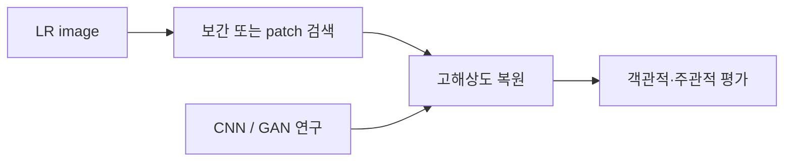
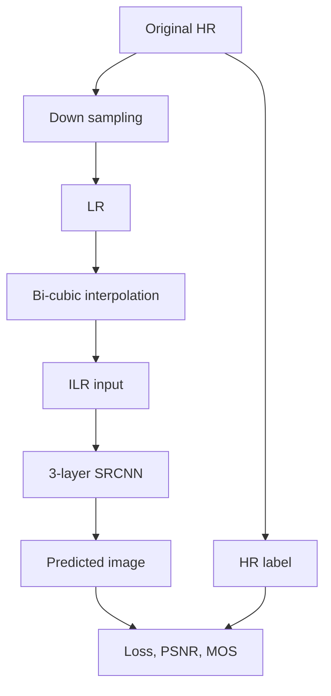

초해상도(SR)는 낮은 해상도 입력에서 고해상도 영상을 복원하는 문제다. 자료는 보간·예제 기반 방법을 거쳐 3층 CNN인 SRCNN의 데이터 구성과 평가로 이어진다.

> [!IMPORTANT]
> 아래 수치와 비교 결과는 원본 실습 슬라이드에 적힌 값만 사용했다. 원본 이미지와 외부 데이터는 넣지 않았다.

---

## SR 문제와 전통적 방법

- **SISR**: 저해상도 이미지 1개를 입력해 고해상도 이미지 1개를 출력한다.
- **Video SR**: 여러 저해상도 프레임으로 고해상도 이미지 1개 또는 여러 개를 출력한다.
- **Interpolation-based SR**: 픽셀 사이 값을 예측해 부드러운 영상을 만들지만 평균화(smoothing)로 선명도와 고주파 복원력이 떨어진다.
- **Example-based SR**: 현재 이미지 또는 외부 데이터베이스의 patch를 검색한다. 방대한 DB와 긴 검색 시간이 필요하고 적절한 match가 없으면 주관적 화질이 떨어질 수 있다.



자료가 소개한 SR 응용은 압축 artifact reduction, 흑백 image colorization, image style transfer다. 방송 영상의 1280×720→3840×2160 재방영 사례도 제시된다.

---

## 평가 지표

객관적 지표는 PSNR, SSIM, MS-SSIM이고 주관적 지표는 MOS다. PSNR은 픽셀 차이의 MSE를 이용하며 log scale이므로 dB로 표시한다.

$$
MSE=\frac{1}{w\cdot h}\sum_{i=1}^{w\cdot h}(O_i-R_i)^2
$$

$$
PSNR=10\log_{10}\left(\frac{MAX^2}{MSE}\right)
=20\log_{10}\left(\frac{MAX}{\sqrt{MSE}}\right)
$$

8-bit 영상에서 $MAX=255$다. MOS는 사람이 직접 품질 점수를 주고 평균을 내는 방식이다.

<Tabs>
  <Tab label="객관적">
    PSNR·SSIM·MS-SSIM으로 복원 영상과 기준 영상의 차이를 수치화한다.
  </Tab>
  <Tab label="주관적">
    MOS는 사람의 품질 점수 평균이며, 원본은 IRB가 표시된 평가 환경 예시를 함께 언급한다.
  </Tab>
</Tabs>

---

## SRCNN 구조와 배율

SRCNN은 image-input, image-output 구조의 3-layer CNN이다. 자료는 2·3·4배 해상도 모델을 예로 들며, 3배 모델은 32×32 입력을 96×96 출력으로 만든다고 설명한다.

```html preview
<div style="font-family:system-ui,sans-serif;padding:20px;color:var(--foreground)">
  <label for="amt" style="font-size:14px;font-weight:600">SRCNN scale</label>
  <div id="out" style="font-size:30px;font-weight:700;color:var(--chart-1);margin:6px 0">4</div>
  <input id="amt" type="range" min="2" max="4" step="1" value="4"
    style="width:100%;accent-color:var(--primary)" />
  <p style="font-size:13px;color:var(--muted-foreground)">자료가 명시한 2배·3배·4배 출력 배율을 탐색한다.</p>
  <script>
    var amt = document.getElementById('amt');
    var out = document.getElementById('out');
    amt.addEventListener('input', function () {
      out.textContent = '' + Number(amt.value).toLocaleString();
    });
  </script>
</div>
```

| 층 | 필터 설정 |
| --- | --- |
| 1 | [9×9×3]×64 |
| 2 | [1×1×64]×32 |
| 3 | [5×5×32]×3 |

---

## LR–ILR–HR 데이터 흐름

원본 이미지(HR)를 down-sampling해 LR을 만들고, LR을 bi-cubic interpolation한 ILR을 SRCNN 입력으로 사용한다. HR(원본)이 정답(label)이다.

1. Original HR → down-sampling → LR
2. LR → bi-cubic → ILR
3. ILR → SRCNN → Predicted image
4. Predicted image와 HR로 loss를 계산한다.
5. Test에서는 PSNR과 MOS를 측정한다.



---

## 데이터셋과 loader

Scale 4 학습 데이터는 T-91 이미지 91장으로 구성하고, 각 이미지에서 32×32 patch를 잘라 dataset을 만든다. 테스트는 Set5 이미지 5장을 사용한다.

| 구분 | 자료의 구성 |
| --- | --- |
| Training | T-91, 91장, 32×32 patch |
| Testing | Set5, 5장, patch 수행 안 함 |

Training data loader는 init에서 전처리·patch를 수행하고, len에서 데이터셋 개수를 반환하며, getitem에서 idx번째 데이터를 반환한다. Testing loader에는 이미지 patch를 수행하지 않는다는 주의가 있다.

> [!WARNING]
> Test dataset은 이미지 patch를 수행하지 않는다. Training과 같은 patch 규칙을 적용하면 원본 실습 흐름과 달라진다.

---

## 원본 결과

자료의 복원 이미지 비교에는 다음 PSNR 값이 표시된다.

```html preview
<div style="font-family:system-ui,sans-serif;padding:20px;color:var(--foreground)">
  <h3 style="margin:0 0 14px;font-size:15px;font-weight:600">PSNR 비교 (dB)</h3>
  <div id="bars" style="display:flex;align-items:flex-end;gap:14px;height:170px"></div>
  <script>
    var data = [['Bicubic ILR', 30.4304], ['SRCNN Pred', 31.1327]];
    var max = Math.max.apply(null, data.map(function (d) { return d[1]; }));
    document.getElementById('bars').innerHTML = data.map(function (d, i) {
      return '<div style="flex:1;display:flex;flex-direction:column;align-items:center;' +
        'gap:6px;height:100%;justify-content:flex-end">' +
        '<span style="font-size:12px;font-weight:600">' + d[1] + '</span>' +
        '<div style="width:100%;height:' + (d[1] / max * 100) + '%;' +
        'background:var(--chart-' + (i + 1) + ');' +
        'border-radius:var(--radius) var(--radius) 0 0"></div>' +
        '<span style="font-size:12px;color:var(--muted-foreground)">' + d[0] + '</span>' +
        '</div>';
    }).join('');
  </script>
</div>
```

SRCNN의 31.1327 dB가 bicubic ILR의 30.4304 dB보다 높게 표시되지만, 자료는 이 한 예시의 수치만 제공한다.

<details>
<summary>실습 순서</summary>

모델 정의 → training loop 선언 → Google Drive에 저장된 복원 이미지 확인 → PSNR/MOS로 test 평가 순서다.

</details>
