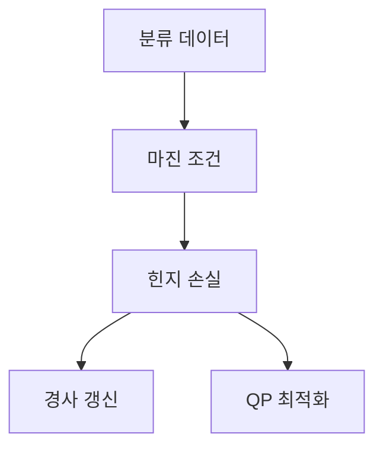

> [!NOTE]
> 선형 SVM은 결정 경계와 가장 가까운 표본 사이의 간격을 최대화하고, 힌지 손실은 경계 안쪽에 들어온 표본만 갱신 대상으로 만든다.

---

## 분류 경계의 출발점

**핵심:** 가중치 벡터는 경계에 수직이고 편향은 경계의 위치를 옮긴다.

$$
f(\mathbf{x})=\mathbf{w}^{T}\mathbf{x}+b
$$

| 위치 | 판별식 | 의미 |
| :-- | :-- | :-- |
| 결정 경계 | $f(\mathbf{x})=0$ | 두 클래스를 가르는 초평면 |
| 양의 영역 | $f(\mathbf{x})>0$ | 양의 클래스로 판별 |
| 음의 영역 | $f(\mathbf{x})<0$ | 음의 클래스로 판별 |

---

## 점과 초평면 사이 거리

경계 위 점 $\mathbf{x}_p$와 임의의 점 $\mathbf{x}_i$를 가중치의 단위 방향으로 연결한다.

$$
\mathbf{x}_i=\mathbf{x}_p+\rho\frac{\mathbf{w}}{\lVert\mathbf{w}\rVert}
$$

$f(\mathbf{x}_p)=0$을 적용하면 부호 있는 거리는 다음과 같다.

$$
\rho=\frac{f(\mathbf{x}_i)}{\lVert\mathbf{w}\rVert}
$$

---

## 지지 초평면과 제약

**핵심:** 최근접 양·음 표본의 판별값을 각각 $+1$, $-1$로 고정한다.

| 표본 집합 | 지지 초평면 | 제약 |
| :-- | :-- | :-- |
| 양의 클래스 | $\mathbf{w}^{T}\mathbf{x}+b=1$ | $\mathbf{w}^{T}\mathbf{x}+b\ge 1$ |
| 음의 클래스 | $\mathbf{w}^{T}\mathbf{x}+b=-1$ | $\mathbf{w}^{T}\mathbf{x}+b\le -1$ |
| 통합 표현 | 두 초평면 | $y_i(\mathbf{w}^{T}\mathbf{x}_i+b)\ge 1$ |

---

## 마진의 길이

두 지지 초평면 위 점을 $\mathbf{x}_{+}$와 $\mathbf{x}_{-}$로 두면 두 점의 차는 $\mathbf{w}$ 방향이다.

$$
\mathbf{x}_{+}=\mathbf{x}_{-}+\lambda\mathbf{w},
\qquad
\lambda=\frac{2}{\mathbf{w}^{T}\mathbf{w}}
$$

따라서 전체 마진은 다음과 같다.

$$
\lVert\mathbf{x}_{+}-\mathbf{x}_{-}\rVert_2
=\lVert\lambda\mathbf{w}\rVert_2
=\frac{2}{\lVert\mathbf{w}\rVert_2}
$$

> [!IMPORTANT]
> 마진을 넓히는 일은 $\lVert\mathbf{w}\rVert$을 작게 만드는 최적화와 같은 방향이다.

---

## 힌지 손실

$$
L_i=\max\left(0,\,1-y_i(\mathbf{w}^{T}\mathbf{x}_i+b)\right)
$$

판별 점수가 1 이상이면 손실은 0이고, 1보다 작으면 경계 안쪽 거리만큼 손실이 남는다.

```html preview
<div style="font-family:system-ui,sans-serif;padding:20px;color:var(--foreground)">
  <h3 style="margin:0 0 14px;font-size:15px;font-weight:600">판별 점수별 힌지 손실</h3>
  <div id="bars" style="display:flex;align-items:flex-end;gap:14px;height:170px"></div>
  <script>
    var data = [['점수 -1', 2], ['점수 0', 1], ['점수 0.5', 0.5], ['점수 1', 0]];
    var max = Math.max.apply(null, data.map(function (d) { return d[1]; }));
    document.getElementById('bars').innerHTML = data.map(function (d, i) {
      return '<div style="flex:1;display:flex;flex-direction:column;align-items:center;' +
        'gap:6px;height:100%;justify-content:flex-end">' +
        '<span style="font-size:12px;font-weight:600">' + d[1] + '</span>' +
        '<div style="width:100%;height:' + (d[1] / max * 100) + '%;' +
        'background:var(--chart-' + (i + 1) + ');' +
        'border-radius:var(--radius) var(--radius) 0 0"></div>' +
        '<span style="font-size:12px;color:var(--muted-foreground)">' + d[0] + '</span>' +
        '</div>';
    }).join('');
  </script>
</div>
```

---

## 손실 구간별 갱신

<Tabs>
  <Tab label="마진 충족">

$y_if(\mathbf{x}_i)\ge 1$이면 힌지 손실의 기울기는 0이다. 이 표본은 손실 항의 갱신을 만들지 않는다.

  </Tab>
  <Tab label="마진 위반">

$y_if(\mathbf{x}_i)<1$이면 손실 항에서 $\partial L/\partial\mathbf{w}=-y_i\mathbf{x}_i$가 나온다. 편향 미분의 source 표기는 아래 경고에서 별도로 다룬다.

  </Tab>
</Tabs>

---

## 학습 관점의 두 경로



- **경사 경로:** 표본의 마진 조건을 검사하면서 반복적으로 매개변수를 갱신한다.
- **QP 경로:** 마진 제약을 포함한 볼록 최적화 문제로 가중치와 편향을 구한다.

---

## 거리 유도 다시 보기

<details>
<summary>부호 있는 거리에서 마진까지</summary>

$\mathbf{x}_i-\mathbf{x}_p$를 $\mathbf{w}/\lVert\mathbf{w}\rVert$ 방향의 길이 $\rho$로 놓고 판별식에 대입한다.

$$
\mathbf{w}^{T}\mathbf{x}_i+b
=
\mathbf{w}^{T}\left(
\mathbf{x}_p+\rho\frac{\mathbf{w}}{\lVert\mathbf{w}\rVert}
\right)+b
=
\rho\lVert\mathbf{w}\rVert
$$

양의 지지 초평면과 음의 지지 초평면 사이 판별값 차이가 2이므로 전체 거리는 $2/\lVert\mathbf{w}\rVert$이 된다.

</details>

---

## 원본 표기와 판독 경계

> [!WARNING]
> 원본은 파일명에서 `Suport`, 본문에서 `Gradient Decent`와 `Qudratic`을 사용한다. 또한 마진 위반 구간의 편향 미분을 $\partial L/\partial b=+y_i$로 적었지만, 같은 페이지의 힌지 손실 식을 직접 미분하면 $-y_i$가 된다. $y_if(\mathbf{x}_i)\ge0$은 분류 부호가 맞다는 조건일 뿐 손실이 0인 조건은 아니다. 실제 자료는 33쪽인데 footer는 31쪽 체계를 넘어서며, 추출문은 전치·노름·분수 일부를 잃어 수식은 원본 화면과 함께 대조했다.

---

## 정리

| 핵심 개념 | 의미 | 적용 경계 |
| :-- | :-- | :-- |
| 결정 경계 | $\mathbf{w}^{T}\mathbf{x}+b=0$인 초평면 | 선형 분리 기준 |
| 지지 초평면 | 판별값이 $-1$과 $+1$인 최근접 경계 | 마진을 결정 |
| 마진 | $2/\lVert\mathbf{w}\rVert_2$ | 가중치 노름과 반비례 |
| 힌지 손실 | 마진이 1보다 작은 표본의 위반량 | 분류 정답과 zero-loss 조건을 구분 |
