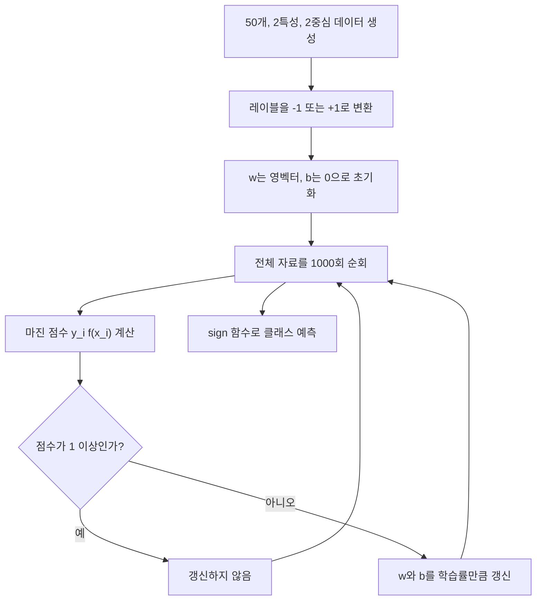

SVM은 두 클래스를 가장 넓은 간격으로 나누는 선형 결정 경계를 찾는다. 이 자료의 구현은 힌지 손실식을 직접 계산하기보다 마진 조건 위반 여부로 갱신을 결정한다.

> [!IMPORTANT]
> 이 노트는 현재 `SVM.pdf`의 내용만 사용한다. PDF 원본 이미지와 페이지 표시는 공개 노트에 싣지 않는다.

---

## 학습 목표

- 결정 함수와 세 종류의 경계 값을 구분한다.
- 마진 조건을 만족하지 않는 샘플만 갱신하는 이유를 설명한다.
- 자료의 수동 GD 구현이 다루는 범위와 다루지 않는 범위를 판별한다.

---

## 결정 함수와 레이블

결정 함수는 다음과 같다.

$$
f(x)=w^T x+b
$$

학습 전에 원래 레이블이 0 이하이면 -1, 그 밖에는 +1로 바꾼다. 예측은 `sign(f(x))`로 -1 또는 +1을 반환한다.

| 기호 | 역할 | 자료의 구현 |
| --- | --- | --- |
| $w$ | 경계의 법선 방향을 정하는 가중치 벡터 | 영벡터로 초기화 |
| $b$ | 경계 위치를 옮기는 절편 | 0으로 초기화 |
| $y_i$ | 이진 클래스 레이블 | -1 또는 +1 |
| $f(x)$ | 선형 출력 | $w^T x+b$ |

---

## 경계 세 층과 마진

<Tabs>
  <Tab label="결정 경계">

  $w^T x+b=0$인 점들의 집합이다. 두 클래스의 예측 부호가 바뀌는 중심선이다.

  </Tab>
  <Tab label="음의 마진">

  $w^T x+b=-1$인 경계다.

  </Tab>
  <Tab label="양의 마진">

  $w^T x+b=+1$인 경계다.

  </Tab>
</Tabs>

두 마진 경계 사이의 거리는 자료에서 다음과 같이 제시한다.

$$
mathrm{margin}=rac{2}{lVert w
Vert}
$$

---

## 힌지 조건으로 보는 갱신

샘플별 마진 점수는 $y_i(w^T x_i+b)$이다.

$$
y_i(w^T x_i+b)ge 1
$$

조건을 만족하면 자료의 코드는 아무 갱신도 하지 않는다. 조건을 만족하지 않으면 다음과 같이 이동한다.

$$
w leftarrow w+eta y_i x_i,qquad
b leftarrow b+eta y_i
$$

> [!NOTE]
> 자료는 이를 “힌지 손실 함수의 그래디언트”에 따른 갱신으로 설명하지만, 손실값 자체를 로그로 계산하거나 반환하지는 않는다.

---

## 학습 절차



---

## 초평면 오프셋 탐색

시각화 함수는 `offset`에 -1, 0, +1을 넣어 두 마진 경계와 결정 경계를 계산한다. 아래 컨트롤은 자료에 명시된 세 값만 이동한다.

```html preview
<div style="font-family:system-ui,sans-serif;padding:20px;color:var(--foreground)">
  <label for="amt" style="font-size:14px;font-weight:600">초평면 offset</label>
  <div id="out" style="font-size:30px;font-weight:700;color:var(--chart-1);margin:6px 0">0</div>
  <input id="amt" type="range" min="-1" max="1" step="1" value="0"
    style="width:100%;accent-color:var(--primary)" />
  <p style="font-size:13px;color:var(--muted-foreground)">-1은 음의 마진, 0은 결정 경계, +1은 양의 마진이다.</p>
  <script>
    var amt = document.getElementById('amt');
    var out = document.getElementById('out');
    amt.addEventListener('input', function () {
      out.textContent = Number(amt.value).toLocaleString();
    });
  </script>
</div>
```

---

## 자료에 명시된 실습 설정

| 항목 | 값 | 의미 |
| --- | ---: | --- |
| 샘플 수 | 50 | 생성 데이터 개수 |
| 특성 수 | 2 | $x_1$, $x_2$ |
| 중심 수 | 2 | 이진 클래스 |
| 군집 표준편차 | 1.05 | 생성 데이터 퍼짐 |
| 난수 상태 | 40 | 데이터 생성 재현 값 |
| 학습률 | 0.001 | 위반 시 갱신 크기 |
| 반복 횟수 | 1000 | 전체 데이터 순회 횟수 |

---

## 구현 골격

```python
for _ in range(n_iters):
    for idx, x_i in enumerate(X):
        condition = y[idx] * (np.dot(x_i, weights) + bias) >= 1
        if not condition:
            weights += learning_rate * y[idx] * x_i
            bias += learning_rate * y[idx]
```

자료의 `predict`는 선형 출력에 `np.sign`을 적용한다. 경계 위에서 부호가 0이 될 가능성에 대한 별도 처리는 제시하지 않는다.

---

## 시각화 해석

| 시각 요소 | 수학적 값 | 읽는 법 |
| --- | --- | --- |
| 중심 점선 | $w^T x+b=0$ | 결정 경계 |
| 아래 실선 | $w^T x+b=-1$ | 음의 마진 경계 |
| 위 실선 | $w^T x+b=+1$ | 양의 마진 경계 |
| 경계 가까운 점 | 마진에 가까운 샘플 | 서포트 벡터 후보 |

시각화 범위는 데이터의 두 번째 특성 최솟값과 최댓값에서 각각 3만큼 넓힌다.

---

## 적용 범위와 한계

> [!CAUTION]
>
> - 레이블은 -1과 +1이어야 한다.
> - 마진 조건을 어긴 샘플에 대해서만 갱신한다.
> - 선형 커널만 구현하므로 비선형 분류에는 맞지 않는다.
> - 자료에는 정규화 항이나 소프트 마진 매개변수 $C$가 없다.
> - 시각적 성공 문구는 있지만 정확도 같은 수치 평가는 제시하지 않는다.

---

## 자료 내부의 확인할 점

> [!WARNING]
> `fit` 본문에는 반환문이 없는데 학습 예시는 `margin_log = model.fit(X, y)`로 결과를 받는다. 따라서 이 변수에는 마진 기록이 들어간다고 볼 근거가 없다.

<details>
<summary>빠른 점검 질문</summary>

1. $y_i f(x_i)ge 1$이면 왜 갱신하지 않는가?
2. 마진 경계의 offset은 각각 무엇인가?
3. 이 구현을 비선형 데이터에 바로 적용할 수 없는 이유는 무엇인가?

</details>
