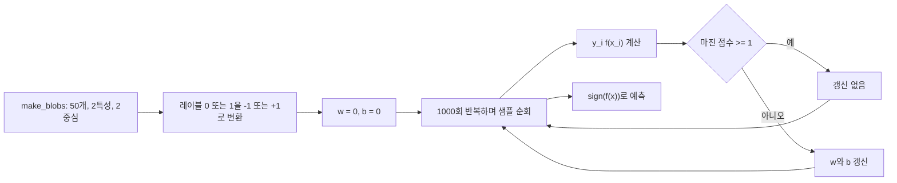

SVM은 데이터를 가장 잘 분리하는 최적 결정 경계를 찾고 마진을 최대화하는 지도학습 알고리즘이다. 원본 구현은 2특성·2중심의 선형 분리 데이터를 만들고, 마진 조건을 어긴 샘플만 가중치와 편향을 갱신한다.

> [!IMPORTANT]
> 수치와 구현 단계는 SVM.pdf에서 직접 확인한 값만 사용했다. 원본 이미지와 페이지 표시는 공개 노트에서 제외한다.

---

## 데이터와 결정 함수

자료의 테스트 데이터는 make_blobs(n_samples=50, n_features=2, centers=2, cluster_std=1.05, random_state=40)로 만든다. 레이블은 학습 전에 0 이하를 -1, 그 밖을 +1로 변환한다.

$$
f(x)=w^Tx+b
$$

예측은 선형 출력에 sign을 적용해 -1 또는 +1을 반환한다. 초평면은 $f(x)=0$인 점들의 집합이다.

| 기호 | 자료에서의 의미 |
| --- | --- |
| $w$ | 2개 특성에 대한 가중치 벡터 |
| $b$ | 절편, 0으로 초기화 |
| $y_i$ | -1 또는 +1 레이블 |
| $f(x)$ | 결정 함수 $w^Tx+b$ |

---

## 최대 마진의 세 경계

- 결정 경계: $w^Tx+b=0$
- 음의 마진 경계: $w^Tx+b=-1$
- 양의 마진 경계: $w^Tx+b=+1$

임의의 점과 초평면 사이 거리의 자료 식은 $\rho=f(x)/\lVert w\rVert$이고, 두 마진 경계 사이 거리는 다음과 같다.

$$
\mathrm{margin}=\frac{2}{\lVert w\rVert}
$$

```html preview
<div style="font-family:system-ui,sans-serif;padding:20px;color:var(--foreground)">
  <label for="amt" style="font-size:14px;font-weight:600">초평면 offset</label>
  <div id="out" style="font-size:30px;font-weight:700;color:var(--chart-1);margin:6px 0">0</div>
  <input id="amt" type="range" min="-1" max="1" step="1" value="0"
    style="width:100%;accent-color:var(--primary)" />
  <p style="font-size:13px;color:var(--muted-foreground)">자료의 -1, 0, +1 경계 오프셋을 드래그해 확인한다.</p>
  <script>
    var amt = document.getElementById('amt');
    var out = document.getElementById('out');
    amt.addEventListener('input', function () {
      out.textContent = '' + Number(amt.value).toLocaleString();
    });
  </script>
</div>
```

<Tabs>
  <Tab label="0 경계">
    $w^Tx+b=0$인 중심 결정 경계다.
  </Tab>
  <Tab label="-1 경계">
    음성 서포트 벡터 쪽의 마진 경계다.
  </Tab>
  <Tab label="+1 경계">
    양성 서포트 벡터 쪽의 마진 경계다.
  </Tab>
</Tabs>

---

## 마진 조건과 갱신

샘플이 올바르게 마진 바깥에 있으면

$$
y_i(w^Tx_i+b)\ge 1
$$

이므로 갱신하지 않는다. 조건을 만족하지 않는 샘플에 대해서만 코드가 다음을 수행한다.

$$
w\leftarrow w+\eta y_i x_i,
\qquad
b\leftarrow b+\eta y_i
$$

자료의 코드에서 학습률은 0.001, 반복 횟수는 1000이다.



---

## 결정 경계 시각화

자료의 get_hyperplane_value는 다음과 같이 offset을 적용한다.

$$
x_2=\frac{-w_1x_1-b+\mathrm{offset}}{w_2}
$$

시각화에서 노란 점선은 offset 0의 결정 경계, 검은 실선은 offset -1과 +1의 마진 경계다. 두 번째 특성의 최솟값·최댓값을 선분 범위로 사용하고 y축은 그 범위에서 3만큼 확장한다.

| 요소 | 자료의 표시 |
| --- | --- |
| 데이터 점 | 파란색·주황색 두 클래스 |
| 노란 점선 | 결정 경계 |
| 검은 실선 | 두 마진 경계 |
| 경계에 가까운 점 | 서포트 벡터 |

> [!WARNING]
> 이 구현은 선형 커널만 다룬다. 비선형 분류에 바로 적용할 수 없으며, 자료는 정확도 수치를 따로 제시하지 않는다.

<details>
<summary>구현 점검</summary>

- weights는 특성 수만큼 0으로 시작한다.
- fit에서 마진 조건을 만족하지 않는 경우에만 갱신한다.
- predict는 np.sign 결과를 반환한다.
- 자료의 시각화 함수는 학습된 weights와 bias를 받아 세 선을 그린다.

</details>
