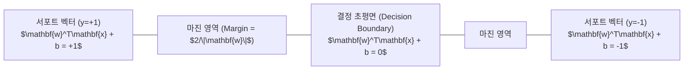

> [!abstract] 핵심 요약
> **서포트 벡터 머신(SVM, Support Vector Machine)**은 두 클래스 간의 최단 거리인 **마진(Margin $\frac{2}{\|\mathbf{w}\|}$)**을 최대화하는 최적의 결정 초평면(Decision Hyperplane)을 찾는 강건한 분류기이다.
> 데이터가 완벽히 선형 분리되지 않는 실전 문제를 위해 여유 변수($\xi_i$)와 정규화 파라미터 $C$를 도입한 **소프트 마진(Soft-Margin)** 구조를 사용하며, 이는 **힌지 손실(Hinge Loss $\max(0, 1 - y_i(\mathbf{w}^T\mathbf{x}_i + b))$**을 최소화하는 볼록 2차 계획법(QP) 문제로 귀결된다.

---

## 1. SVM 목적 함수와 마진 최대화 유도

$$\text{Margin} = \frac{2}{\|\mathbf{w}\|_2} \iff \min_{\mathbf{w}, b, \boldsymbol{\xi}} \frac{1}{2} \|\mathbf{w}\|^2 + C \sum_{i=1}^m \xi_i \quad \text{s.t. } y_i (\mathbf{w}^T \mathbf{x}_i + b) \ge 1 - \xi_i, \quad \xi_i \ge 0$$



---

## 2. 하드 마진 vs 소프트 마진 & C 하이퍼파라미터

| 구분 | 하드 마진 (Hard Margin) | 소프트 마진 (Soft Margin - $C$ 튜닝) |
| :-- | :-- | :-- |
| **오분류 허용 여부** | 0개 (이상치에 극도로 민감, 오차 불허) | 여유 변수 $\xi_i$로 일부 오분류/마진 침범 허용 |
| **$C$ 파라미터 역할** | $C \to \infty$에 해당 | **$C$ 큼**: 마진 좁히고 오분류 엄격 억제 (과적합 주의)<br/>**$C$ 작음**: 마진 넓히고 일반화 강화 (과소적합 주의) |
| **손실 함수 표현** | 제약 조건 엄격 만족 | $\mathcal{L}_{\text{SVM}} = \frac{1}{2}\|\mathbf{w}\|^2 + C \sum \max(0, 1 - y_i f(\mathbf{x}_i))$ |

---

## 3. 실시간 SVM 소프트 마진(C 파라미터) 분류 시뮬레이터

```html preview
<div style="font-family:system-ui,-apple-system,sans-serif;padding:20px;background:var(--card);color:var(--card-foreground);border:1px solid var(--border);border-radius:var(--radius)">
  <div style="font-size:16px;font-weight:700;margin-bottom:14px;color:var(--primary);display:flex;align-items:center;gap:8px">
    <span>🛡️ SVM 마진 폭 & 힌지 손실(C 하이퍼파라미터) 시뮬레이터</span>
  </div>

  <div style="margin-bottom:14px">
    <div style="display:flex;justify-content:space-between;font-size:11px;color:var(--muted-foreground);margin-bottom:4px">
      <span>규제 계수 C (오분류 페널티 강도):</span>
      <span id="svmCValOut" style="font-weight:700;color:var(--primary)">C = 1.0</span>
    </div>
    <input id="inSvmC" type="range" min="0.1" max="10.0" step="0.5" value="1.0" style="width:100%" />
  </div>

  <div style="display:grid;grid-template-columns:1fr 1fr;gap:12px;margin-bottom:12px">
    <div style="padding:10px;background:var(--background);border:1px solid var(--border);border-radius:var(--radius);text-align:center">
      <div style="font-size:10px;color:var(--muted-foreground)">마진 폭 (Margin Width = 2/||w||)</div>
      <div id="svmMarginOut" style="font-family:monospace;font-size:16px;font-weight:800;color:var(--primary);margin-top:2px">1.41 (적정)</div>
    </div>
    <div style="padding:10px;background:var(--background);border:1px solid var(--border);border-radius:var(--radius);text-align:center">
      <div style="font-size:10px;color:var(--muted-foreground)">서포트 벡터 수 (Support Vectors)</div>
      <div id="svmSvCountOut" style="font-family:monospace;font-size:16px;font-weight:800;color:var(--chart-1);margin-top:2px">4 개</div>
    </div>
  </div>

  <div id="svmStatusDesc" style="padding:10px;background:var(--background);border:1px solid var(--border);border-radius:var(--radius);font-size:11px">
    적절한 C값(1.0)으로 마진 폭과 이상치 허용 간의 최적의 균형을 유지하고 있습니다.
  </div>

  <script>
    document.getElementById('inSvmC').oninput = function() {
      var c = parseFloat(this.value);
      document.getElementById('svmCValOut').textContent = "C = " + c.toFixed(1);

      var margin = 2.0 / Math.sqrt(1.0 + c * 0.8);
      var svCount = Math.max(2, Math.round(8 / (1.0 + c * 0.3)));

      document.getElementById('svmMarginOut').textContent = margin.toFixed(2);
      document.getElementById('svmSvCountOut').textContent = svCount + " 개";

      if (c >= 6.0) {
        document.getElementById('svmStatusDesc').innerHTML = "<span style='color:var(--destructive,#ef4444);font-weight:700'>⚠️ [하드 마진 경향]</span> C가 커서 오분류를 극도로 배제하므로 마진이 좁아지고 이상치에 민감해집니다.";
      } else if (c <= 0.5) {
        document.getElementById('svmStatusDesc').innerHTML = "<span style='color:var(--chart-2);font-weight:700'>⚠️ [소프트 마진 과다]</span> C가 작아 마진 폭은 매우 넓어지나 마진 내 오분류 샘플이 다수 발생합니다.";
      } else {
        document.getElementById('svmStatusDesc').innerHTML = "<span style='color:var(--primary);font-weight:700'>✅ [최적 마진 달성]</span> 일반화 오차를 최소화하는 이상적인 최대 마진 초평면입니다.";
      }
    };
  </script>
</div>
```
