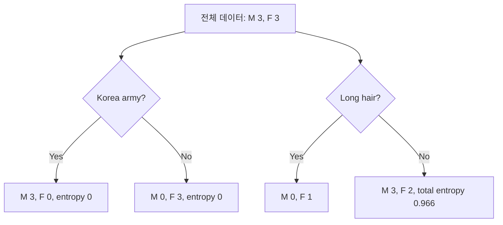

엔트로피는 분류 집합의 불확실성을 수치화한다. 결정 트리는 엔트로피가 감소하는 threshold를 먼저 찾아 데이터를 나누고, 같은 규칙을 재귀적으로 적용한다.

> [!IMPORTANT]
> 원본의 coin·사람·스포츠 예시와 구현 설명을 사용했으며, 슬라이드 그림은 포함하지 않는다.

---

## 엔트로피의 정의와 범위

Shannon entropy는 클래스 확률 $p_i$로 다음과 같이 쓴다.

$$
H(X)=-\sum_i p_i\log p_i
$$

이진 분류는 $0\le H\le1$, 8-class는 $0\le H\le3$, 16-class는 $0\le H\le4$다. 균등분포의 최대 엔트로피는 클래스 수 $n$에 대해 $\log_2 n$으로 제시된다.

```html preview
<div style="font-family:system-ui,sans-serif;padding:20px;color:var(--foreground)">
  <label for="amt" style="font-size:14px;font-weight:600">동전 앞면 비율(%)</label>
  <div id="out" style="font-size:30px;font-weight:700;color:var(--chart-1);margin:6px 0">50</div>
  <input id="amt" type="range" min="0" max="100" step="50" value="50"
    style="width:100%;accent-color:var(--primary)" />
  <p style="font-size:13px;color:var(--muted-foreground)">자료에 있는 0%, 50%, 100%의 분포를 전환한다.</p>
  <script>
    var amt = document.getElementById('amt');
    var out = document.getElementById('out');
    amt.addEventListener('input', function () {
      out.textContent = '' + Number(amt.value).toLocaleString();
    });
  </script>
</div>
```

| 앞면 | 뒷면 | 자료의 엔트로피 |
| ---: | ---: | ---: |
| 50% | 50% | 1 |
| 100% | 0% | 0 |
| 90% | 10% | 0.47 |

불확실성이 높을수록 엔트로피가 크다. 슬라이더는 자료에 명시된 0·50·100% 예시만 직접 탐색하며 90/10 예시는 표로 보존했다.

---

## 손실·활성학습에서의 활용

자료는 엔트로피의 용도를 세 가지로 분류한다.

1. Deep Learning의 loss function
2. Decision Tree
3. Active Learning

Cross Entropy Error 예시에서 정답 one-hot이 숫자 2에 있고 모델 확률이 0.8이면

$$
CEE=-1\times\log(0.8)=0.2231
$$

이다. Active Learning 표는 다음 확률·엔트로피를 보여준다.

| 입력 문장 | Happy | Unhappy | Entropy |
| --- | ---: | ---: | ---: |
| I love you | 0.99 | 0.01 | 0.08 |
| I am angry | 0.05 | 0.95 | 0.29 |
| I am sad | 0.30 | 0.70 | 0.88 |
| I am feeing blue | 0.60 | 0.40 | 0.97 |

모델은 엔트로피가 높은 문장을 uncertain으로 보고 retrain 대상으로 삼는다.

> [!NOTE]
> 원본 표의 “I am feeing blue” 철자는 자료에 적힌 그대로 유지했다.

---

## 결정 트리의 분기

사람 예시에는 6명이 있고, Korea army?와 Long hair? 두 특징으로 Gender를 분류한다. Korea army?로 나누면 왼쪽이 M:3 F:0, 오른쪽이 M:0 F:3으로 total entropy 0이다. Long hair? 분기는 M:0 F:1과 M:3 F:2로 total entropy 0.966이다. 따라서 Korea army?가 더 확실한 첫 분기다.



---

## 재귀 구현의 뼈대

실습 자료의 결정 트리는 feature와 threshold를 기준으로 left/right 데이터를 만들고, entropy가 낮아지는 분기를 선택한다. 분기 뒤에도 같은 함수를 재귀 호출한다.

<Tabs>
  <Tab label="분기 선택">
    각 feature의 threshold 후보를 확인하고 entropy 감소가 큰 기준점을 선택한다.
  </Tab>
  <Tab label="재귀 호출">
    left와 right 부분집합을 새 노드로 넘겨 같은 규칙을 반복한다.
  </Tab>
</Tabs>

```html preview
<div style="font-family:system-ui,sans-serif;padding:20px;color:var(--foreground)">
  <label for="amt" style="font-size:14px;font-weight:600">예시 class 수</label>
  <div id="out" style="font-size:30px;font-weight:700;color:var(--chart-1);margin:6px 0">3</div>
  <input id="amt" type="range" min="2" max="3" step="1" value="3"
    style="width:100%;accent-color:var(--primary)" />
  <p style="font-size:13px;color:var(--muted-foreground)">실습 예시는 2개 특성, 3개 class 분류도 함께 보여준다.</p>
  <script>
    var amt = document.getElementById('amt');
    var out = document.getElementById('out');
    amt.addEventListener('input', function () {
      out.textContent = '' + Number(amt.value).toLocaleString();
    });
  </script>
</div>
```

> [!WARNING]
> 원본은 분기 그림과 코드 일부를 이미지로 제시하고 완전한 수치 표를 제공하지 않는다. 따라서 threshold의 실제 숫자나 정확도는 만들지 않는다.

<details>
<summary>엔트로피 점검</summary>

- $H=0$은 한 클래스만 남은 순수 노드다.
- 균등한 이진 분포의 $H=1$이 최대다.
- 첫 분기는 전체 엔트로피를 가장 크게 낮추는 기준을 선택한다.

</details>
