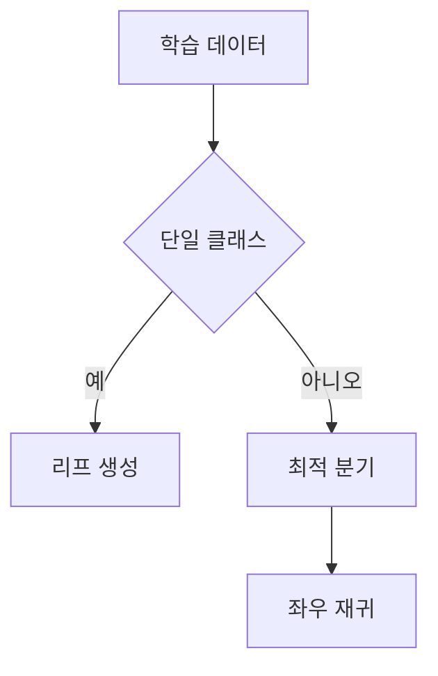

> [!NOTE]
> 엔트로피는 클래스 혼합 정도를 수치화하고, 결정 트리는 엔트로피를 가장 크게 줄이는 특성과 임곗값을 반복해서 선택한다.

---

## 엔트로피의 정의

확률변수 $X$의 각 사건 확률을 $p_i$라 하면 Shannon entropy는 다음과 같다.

$$
H(X)=-\sum_i p_i\log_2p_i
$$

- **균등한 분포:** 어느 결과가 나올지 불확실해 엔트로피가 커진다.
- **한쪽으로 몰린 분포:** 결과가 사실상 정해져 엔트로피가 작아진다.
- **클래스 수:** 균등 분포의 최대 엔트로피는 $H_{\max}=\log_2n$이다.

---

## 동전 분포로 읽는 불확실성

| 앞면·뒷면 확률 | source의 엔트로피 | 해석 |
| :-- | --: | :-- |
| 50%·50% | 1 | 두 결과가 같은 확률 |
| 100%·0% | 0 | 한 결과로 확정 |
| 90%·10% | 0.47 | 한쪽이 우세하지만 불확실성이 남음 |

> [!WARNING]
> 90%·10% 예시의 계산 칸은 결과를 `0`으로 적지만, 같은 행의 entropy 칸은 `0.47`로 적는다. 이 문서는 두 표기를 함께 남기고 source 내부 모순으로 취급한다.

---

## 클래스 수와 최대 엔트로피

```html preview
<div style="font-family:system-ui,sans-serif;padding:20px;color:var(--foreground)">
  <h3 style="margin:0 0 14px;font-size:15px;font-weight:600">균등 분포의 최대 엔트로피</h3>
  <div id="bars" style="display:flex;align-items:flex-end;gap:14px;height:170px"></div>
  <script>
    var data = [['2개 클래스', 1], ['8개 클래스', 3], ['16개 클래스', 4]];
    var max = Math.max.apply(null, data.map(function (d) { return d[1]; }));
    document.getElementById('bars').innerHTML = data.map(function (d, i) {
      return '<div style="flex:1;display:flex;flex-direction:column;align-items:center;' +
        'gap:6px;height:100%;justify-content:flex-end">' +
        '<span style="font-size:12px;font-weight:600">' + d[1] + '</span>' +
        '<div style="width:100%;height:' + (d[1] / max * 100) + '%;' +
        'background:var(--chart-' + (i + 1) + ');' +
        'border-radius:var(--radius) var(--radius) 0 0"></div>' +
        '<span style="font-size:12px;color:var(--muted-foreground)">' + d[0] + '</span>' +
        '</div>';
    }).join('');
  </script>
</div>
```

---

## 세 가지 사용 장면

<Tabs>
  <Tab label="교차 엔트로피">

정답이 두 번째 클래스인 one-hot label이고 모델이 그 클래스에 $0.8$을 주면 source 계산은 다음과 같다.

$$
-\log(0.8)=0.2231
$$

나머지 확률 예시는 여섯 번째와 여덟 번째 클래스에 각각 $0.1$이다.

  </Tab>
  <Tab label="결정 트리">

6명의 성별 예제에서 대한민국 군 복무 여부로 나눈 뒤의 전체 entropy는 0이고, 긴 머리 여부로 나눈 값은 0.966이다. source는 더 작은 entropy를 만드는 분기를 선택한다.

  </Tab>
  <Tab label="능동 학습">

모델이 확신하지 못하는 표본을 entropy로 고르고, 사람이 label을 보충한 뒤 다시 학습하는 순서를 제시한다. source 표의 `certain`과 `uncertain` 표기는 아래 경고처럼 반대로 배치되어 있다.

  </Tab>
</Tabs>

---

## 능동 학습 후보 표

| 문장 | 긍정 확률 | 부정 확률 | entropy | 재학습 뒤 확률 |
| :-- | --: | --: | --: | :-- |
| I love you | 0.99 | 0.01 | 0.08 | 제시 없음 |
| I am angry | 0.05 | 0.95 | 0.29 | 제시 없음 |
| I am sad | 0.30 | 0.70 | 0.88 | 0.01·0.99 |
| I am feeling blue | 0.60 | 0.40 | 0.97 | 0.04·0.96 |

---

## 결정 트리의 재귀 구조



**핵심:** 현재 node가 순수하면 class label을 저장하고, 그렇지 않으면 최적 특성·임곗값으로 나눈 두 subset을 재귀적으로 처리한다.

---

## Iris 실습의 데이터 형태

| 구성 | 정확한 source 값 | 처리 |
| :-- | --: | :-- |
| 표본 | 150 | 전체 행 |
| 측정 특성 | 4 | `iris.data` |
| 종 | 3 | `iris.target` |
| DataFrame 열 | 6 | 네 측정값 + target + class_name |

---

## Node와 종료 조건

| 필드·조건 | 역할 |
| :-- | :-- |
| `feature` | 현재 분기에 사용할 특성 |
| `threshold` | 좌우를 나누는 임곗값 |
| `left`, `right` | 두 자식 node |
| `value` | leaf의 class 값 |
| 단일 class | `Node(value=y[0])` 반환 |
| 유효 분기 없음 | `np.bincount(y).argmax()`로 다수 class 반환 |

---

## 재귀 scaffold 펼쳐 보기

<details>
<summary>source가 채운 부분과 비워 둔 부분</summary>

`build_tree(X, y, depth=0)`는 단일 class 종료 조건과 다수 class fallback을 제공한다. 이어서 최적 feature와 threshold를 찾고, 좌우 index와 subset을 만든 뒤 두 자식에 재귀 호출해야 한다. 그러나 실습 source는 최적 분기 helper, 좌우 split assignment, 실제 재귀 대입의 핵심 줄을 빈칸으로 둔다. 공개 note에서는 이 빈칸을 임의 코드로 완성하지 않고 알고리즘 scaffold로만 다룬다.

</details>

---

## 스포츠 규칙 트리

source 예제는 공의 크기와 중앙 net 유무, 손 사용 여부를 차례로 물어 야구·배구·축구·농구를 구분한다.

| 질문 | 답 | 다음 결과 |
| :-- | :-- | :-- |
| 공이 작은가 | 예 | 야구 |
| 공이 작은가 | 아니오 | 중앙 net 확인 |
| 중앙 net이 있는가 | 예 | 배구 |
| 중앙 net이 있는가 | 아니오 | 손 사용 확인 |
| 손을 사용하는가 | 아니오·예 | 축구·농구 |

---

## 원본 오류와 추출 한계

> [!WARNING]
> 능동 학습 표는 낮은 entropy 문장을 `uncertain`, 높은 entropy 문장을 `certain`으로 표시해 label이 뒤집혀 있다. entropy 자료는 실제 17쪽이지만 footer가 16쪽 체계이며, 일부 수식과 도형 텍스트가 추출에서 누락됐다. 결정 트리 실습 자료는 22쪽 모두 text-poor이고 핵심 구현 줄이 빈 scaffold다. 스포츠 트리에서는 축구가 `아니오` 가지를 따르는데 축구와 농구 아래에 모두 `Right`라고 적혀 있다.

---

## 정리

| 핵심 개념 | 의미 | 적용 또는 경계 |
| :-- | :-- | :-- |
| entropy | 클래스 분포의 불확실성 | 확률과 로그 밑을 함께 확인 |
| 정보가 큰 분기 | 자식 집합의 혼합을 줄이는 질문 | 최적 feature·threshold 탐색 |
| leaf | 더 나누지 않는 예측 node | 순수 class 또는 다수 class |
| 재귀 학습 | split 뒤 두 subset에 같은 절차 반복 | source 빈칸을 임의 구현하지 않음 |
