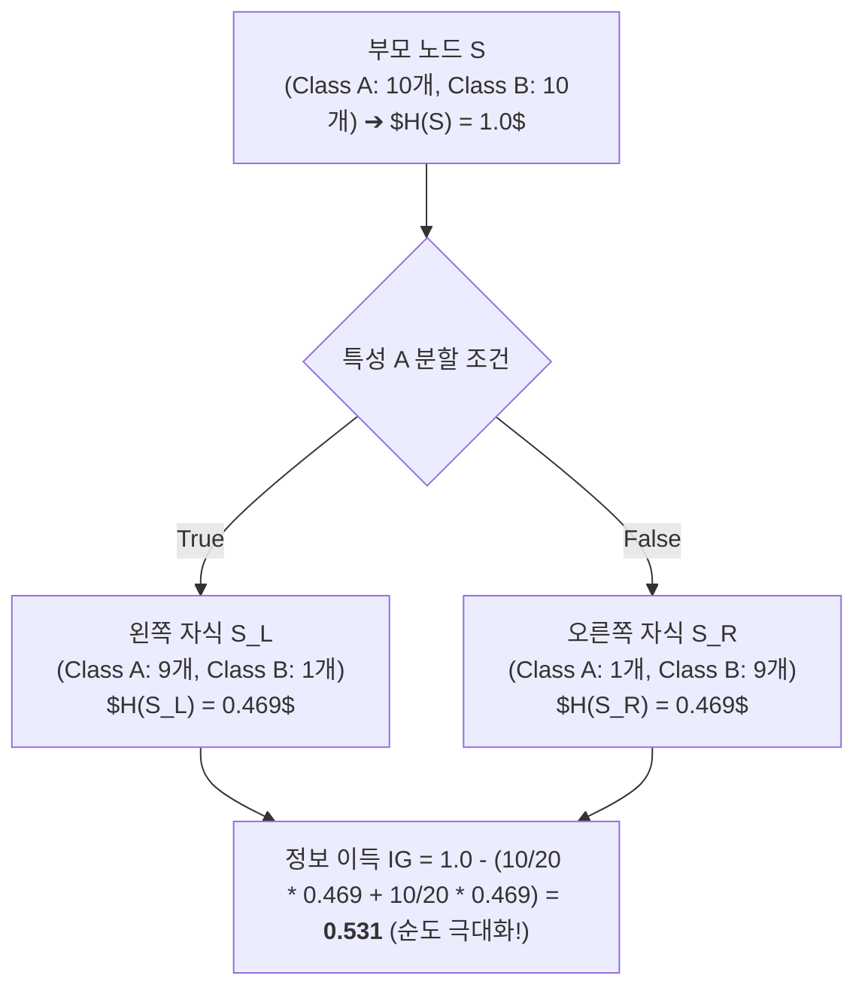

> [!abstract] 핵심 요약
> **의사결정나무(Decision Tree)**는 데이터를 가장 순수(Pure)하게 분할하는 조건 분기 규칙을 재귀적으로 구축하는 화이트박스 해석 가능 모델이다.
> 분할 전후의 불순도 감소량을 측정하는 **정보 이득(Information Gain $IG = H(S) - \sum \frac{|S_v|}{|S|} H(S_v)$)** 및 **지니 불순도(Gini Impurity)**를 수식적으로 유도하고, 별도의 훈련 단계 없이 거리 기반 이웃 다수결 투표로 예측을 수행하는 **K-최근접 이웃(KNN)**의 비모수적 특성을 비교 이해해야 한다.

---

## 1. 불순도(Impurity) 측정 지표 수식 비교

### 1) 섀넌 엔트로피 (Shannon Entropy)
$$H(S) = -\sum_{i=1}^{C} p_i \log_2 p_i \quad (p_i \text{는 클래스 } i \text{의 비율})$$

### 2) 정보 이득 (Information Gain)
$$IG(S, A) = H(S) - \sum_{v \in \text{Values}(A)} \frac{|S_v|}{|S|} H(S_v)$$

### 3) 지니 불순도 (Gini Impurity - CART 기본)
$$Gini(S) = 1 - \sum_{i=1}^C p_i^2$$



---

## 2. 의사결정나무 vs KNN 알고리즘 비교

| 비교 항목 | 의사결정나무 (Decision Tree) | K-최근접 이웃 (KNN) |
| :-- | :-- | :-- |
| **학습 방식** | Eager Learning (사전 트리 모델 구축) | **Lazy Learning (학습 없음, 추론 시 연산)** |
| **해석 가능성** | **우수 (if-then 규칙 시각화 가능)** | 블랙박스 (거리 기반 이웃 확인 필요) |
| **차원의 저주** | 영향 적음 (유의미한 특성만 분기 선택) | **극심한 영향 (차원 증가 시 거리 무력화)** |
| **이상치 민감도** | 가지치기(Pruning)로 제어 가능 | $K$값 크기로 조절 ($K$ 작을수록 민감) |

---

## 3. 실시간 2클래스 엔트로피 & 정보 이득(Information Gain) 계산기

```html preview
<div style="font-family:system-ui,-apple-system,sans-serif;padding:20px;background:var(--card);color:var(--card-foreground);border:1px solid var(--border);border-radius:var(--radius)">
  <div style="font-size:16px;font-weight:700;margin-bottom:14px;color:var(--primary);display:flex;align-items:center;gap:8px">
    <span>🌳 의사결정나무 섀넌 엔트로피(Entropy) & 불순도 계산기</span>
  </div>

  <div style="display:grid;grid-template-columns:1fr 1fr;gap:12px;margin-bottom:14px">
    <div>
      <label style="font-size:11px;color:var(--muted-foreground)">클래스 1 샘플 수 (Class Positive):</label>
      <input id="inCountPos" type="number" min="0" max="100" value="9" style="width:100%;padding:4px 8px;background:var(--background);color:var(--foreground);border:1px solid var(--border);border-radius:var(--radius);font-weight:700" />
    </div>
    <div>
      <label style="font-size:11px;color:var(--muted-foreground)">클래스 2 샘플 수 (Class Negative):</label>
      <input id="inCountNeg" type="number" min="0" max="100" value="1" style="width:100%;padding:4px 8px;background:var(--background);color:var(--foreground);border:1px solid var(--border);border-radius:var(--radius);font-weight:700" />
    </div>
  </div>

  <div style="display:grid;grid-template-columns:1fr 1fr;gap:12px;margin-bottom:12px">
    <div style="padding:10px;background:var(--background);border:1px solid var(--border);border-radius:var(--radius);text-align:center">
      <div style="font-size:10px;color:var(--muted-foreground)">섀넌 엔트로피 H(S) [0.0 ~ 1.0]</div>
      <div id="entropyOut" style="font-family:monospace;font-size:16px;font-weight:800;color:var(--chart-1);margin-top:2px">0.469</div>
    </div>
    <div style="padding:10px;background:var(--background);border:1px solid var(--border);border-radius:var(--radius);text-align:center">
      <div style="font-size:10px;color:var(--muted-foreground)">지니 불순도 Gini(S) [0.0 ~ 0.5]</div>
      <div id="giniOut" style="font-family:monospace;font-size:16px;font-weight:800;color:var(--primary);margin-top:2px">0.180</div>
    </div>
  </div>

  <div id="entropyStatusDesc" style="padding:10px;background:var(--background);border:1px solid var(--border);border-radius:var(--radius);font-size:11px">
    샘플이 9:1로 편향되어 노드의 순도(Purity)가 매우 높고 불순도가 낮습니다.
  </div>

  <script>
    function updateEntropy() {
      var pCount = parseInt(document.getElementById('inCountPos').value) || 0;
      var nCount = parseInt(document.getElementById('inCountNeg').value) || 0;
      var total = pCount + nCount;

      if (total === 0) return;

      var p1 = pCount / total;
      var p2 = nCount / total;

      var ent = 0;
      if (p1 > 0) ent -= p1 * Math.log2(p1);
      if (p2 > 0) ent -= p2 * Math.log2(p2);

      var gini = 1.0 - (p1 * p1 + p2 * p2);

      document.getElementById('entropyOut').textContent = ent.toFixed(3);
      document.getElementById('giniOut').textContent = gini.toFixed(3);

      if (ent === 0) {
        document.getElementById('entropyStatusDesc').innerHTML = "✨ <b>[완벽한 순수 노드 (Pure Node)]</b> 한 클래스만 존재하므로 엔트로피가 0이며 추가 분할이 불필요합니다.";
      } else if (ent > 0.95) {
        document.getElementById('entropyStatusDesc').innerHTML = "⚠️ <b>[최대 불확실성 노드]</b> 5:5로 팽팽하게 섞여 있어 엔트로피가 1.0에 근접하며 가장 분할이 시급한 상태입니다.";
      } else {
        document.getElementById('entropyStatusDesc').textContent = "순도 비율: " + (p1*100).toFixed(1) + "% vs " + (p2*100).toFixed(1) + "%";
      }
    }

    ['inCountPos', 'inCountNeg'].forEach(function(id) {
      document.getElementById(id).addEventListener('input', updateEntropy);
    });
    updateEntropy();
  </script>
</div>
```
