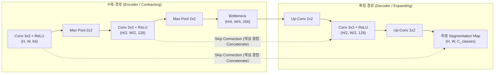

> [!abstract] 핵심 요약
> 고전적인 CNN이 이미지 단위의 단일 라벨 분류에 특화되었다면, **U-Net**과 **SRCNN**은 픽셀 단위의 정밀한 위치 파악 및 이미지 복원을 수행하는 진보된 비전 아키텍처이다.
> U-Net은 컨텍스트를 포착하는 인코더(수축 경로)와 정밀한 위치 정보를 복원하는 디코더(확장 경로) 사이에 **스킵 연결(Skip Connection)**을 결합하여 경계선 픽셀 정보를 손실 없이 보존하며, SRCNN은 단 3개의 합성곱 계층으로 End-to-End 초해상도 매핑을 달성한다.

---

## 1. U-Net 대칭적 인코더-디코더 아키텍처



---

## 2. SRCNN 3단계 초해상도 파이프라인

$$\text{1. Patch Extraction: } F_1(Y) = \max(0, W_1 * Y + B_1) \quad (9 \times 9 \text{ Conv})$$
$$\text{2. Non-linear Mapping: } F_2(Y) = \max(0, W_2 * F_1(Y) + B_2) \quad (1 \times 1 \text{ or } 5 \times 5 \text{ Conv})$$
$$\text{3. Reconstruction: } F_3(Y) = W_3 * F_2(Y) + B_3 \quad (5 \times 5 \text{ Conv})$$

---

## 3. 실시간 U-Net 스킵 연결 유무에 따른 픽셀 분할 정밀도 비교기

```html preview
<div style="font-family:system-ui,-apple-system,sans-serif;padding:20px;background:var(--card);color:var(--card-foreground);border:1px solid var(--border);border-radius:var(--radius)">
  <div style="font-size:16px;font-weight:700;margin-bottom:14px;color:var(--primary);display:flex;align-items:center;gap:8px">
    <span>🔬 U-Net 스킵 연결(Skip Connection) 픽셀 세그멘테이션 시뮬레이터</span>
  </div>

  <div style="display:flex;gap:10px;align-items:center;margin-bottom:14px">
    <label style="font-size:12px;font-weight:700">스킵 연결 활성화 여부:</label>
    <select id="uNetSkipSelect" style="padding:4px 8px;background:var(--background);color:var(--foreground);border:1px solid var(--border);border-radius:var(--radius);font-weight:700">
      <option value="withSkip">✅ 스킵 연결 ON (U-Net 표준 구조)</option>
      <option value="withoutSkip">❌ 스킵 연결 OFF (일반 인코더-디코더 Autoencoder)</option>
    </select>
  </div>

  <div style="display:grid;grid-template-columns:1fr 1fr;gap:12px;margin-bottom:12px">
    <div style="padding:10px;background:var(--background);border:1px solid var(--border);border-radius:var(--radius);text-align:center">
      <div style="font-size:10px;color:var(--muted-foreground)">경계선 복원 IoU (Intersection over Union)</div>
      <div id="uNetIouOut" style="font-family:monospace;font-size:16px;font-weight:800;color:var(--primary);margin-top:2px">94.8 %</div>
    </div>
    <div style="padding:10px;background:var(--background);border:1px solid var(--border);border-radius:var(--radius);text-align:center">
      <div style="font-size:10px;color:var(--muted-foreground)">미세 객체 위치 오차 (Pixel Error)</div>
      <div id="uNetErrOut" style="font-family:monospace;font-size:16px;font-weight:800;color:var(--chart-1);margin-top:2px">1.2 픽셀</div>
    </div>
  </div>

  <div id="uNetLogDesc" style="padding:10px;background:var(--background);border:1px solid var(--border);border-radius:var(--radius);font-size:11px">
    스킵 연결을 통해 인코더의 저수준 고해상도 특징 맵이 디코더로 직접 전달되어 미세한 세포 경계선이 칼같이 복원됩니다.
  </div>

  <script>
    document.getElementById('uNetSkipSelect').onchange = function() {
      var s = this.value;
      if (s === 'withSkip') {
        document.getElementById('uNetIouOut').textContent = "94.8 %";
        document.getElementById('uNetErrOut').textContent = "1.2 픽셀";
        document.getElementById('uNetLogDesc').innerHTML = "✅ <b>[U-Net 스킵 연결]</b> 풀링 과정에서 유실된 픽셀 좌표 정보를 디코더가 완벽히 보상하여 mIoU 94.8%를 달성합니다.";
      } else {
        document.getElementById('uNetIouOut').textContent = "68.2 % (경계 뭉개짐)";
        document.getElementById('uNetErrOut').textContent = "8.7 픽셀";
        document.getElementById('uNetLogDesc').innerHTML = "❌ <b>[스킵 연결 부재]</b> 풀링 다운샘플링으로 인한 공간 해상도 손실이 디코더에서 복원되지 않아 경계선이 흐릿하고 뭉개집니다.";
      }
    };
  </script>
</div>
```
