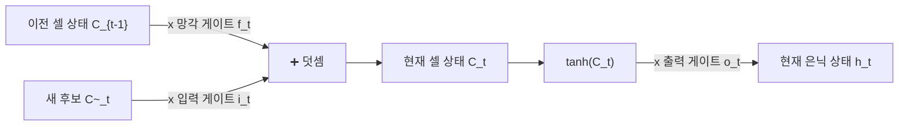

> [!abstract] 핵심 요약
> **순환 신경망(RNN)**은 이전 시점의 은닉 상태($\mathbf{h}_{t-1}$)를 현재 시점의 입력($\mathbf{x}_t$)과 결합하여 순차적 맥락을 기억하는 모델이다.
> 그러나 시퀀스 길이가 길어지면 **BPTT** 과정에서 연쇄 곱에 의해 기울기가 지수적으로 소실되는 **장기 의존성(Long-Term Dependency)** 문제가 발생한다.
> **LSTM(Long Short-Term Memory)**은 선형적으로 정보가 흐르는 **셀 상태($\mathbf{C}_t$)**와 3개의 시그모이드 게이트(망각 $\mathbf{f}_t$, 입력 $\mathbf{i}_t$, 출력 $\mathbf{o}_t$)를 도입하여 장기 기억을 완벽히 보존한다.

---

## 1. LSTM 셀 4대 핵심 게이트 수학적 수식

$$\mathbf{f}_t = \sigma(\mathbf{W}_f [\mathbf{h}_{t-1}, \mathbf{x}_t] + \mathbf{b}_f) \quad (\text{망각 게이트: 과거 정보 삭제 비율 결정 } [0, 1])$$
$$\mathbf{i}_t = \sigma(\mathbf{W}_i [\mathbf{h}_{t-1}, \mathbf{x}_t] + \mathbf{b}_i), \quad \tilde{\mathbf{C}}_t = \tanh(\mathbf{W}_c [\mathbf{h}_{t-1}, \mathbf{x}_t] + \mathbf{b}_c) \quad (\text{입력 게이트 및 신규 정보})$$
$$\mathbf{C}_t = \mathbf{f}_t \odot \mathbf{C}_{t-1} + \mathbf{i}_t \odot \tilde{\mathbf{C}}_t \quad (\text{셀 상태 갱신 - 덧셈 연산으로 기울기 보존})$$
$$\mathbf{o}_t = \sigma(\mathbf{W}_o [\mathbf{h}_{t-1}, \mathbf{x}_t] + \mathbf{b}_o), \quad \mathbf{h}_t = \mathbf{o}_t \odot \tanh(\mathbf{C}_t) \quad (\text{출력 은닉 상태})$$



---

## 2. 실시간 LSTM 게이트(망각 ft vs 입력 it) 셀 상태 제어 시뮬레이터

```html preview
<div style="font-family:system-ui,-apple-system,sans-serif;padding:20px;background:var(--card);color:var(--card-foreground);border:1px solid var(--border);border-radius:var(--radius)">
  <div style="font-size:16px;font-weight:700;margin-bottom:14px;color:var(--primary);display:flex;align-items:center;gap:8px">
    <span>🧠 LSTM 셀 상태(Cell State) & 4대 게이트 실시간 시뮬레이터</span>
  </div>

  <div style="display:grid;grid-template-columns:1fr 1fr;gap:12px;margin-bottom:14px">
    <div>
      <div style="display:flex;justify-content:space-between;font-size:11px;color:var(--muted-foreground)">
        <span>망각 게이트 (Forget Gate f_t):</span>
        <span id="lstmFtVal" style="font-weight:700;color:var(--chart-1)">0.80</span>
      </div>
      <input id="inLstmFt" type="range" min="0" max="1" step="0.05" value="0.8" style="width:100%" />
    </div>
    <div>
      <div style="display:flex;justify-content:space-between;font-size:11px;color:var(--muted-foreground)">
        <span>입력 게이트 (Input Gate i_t):</span>
        <span id="lstmItVal" style="font-weight:700;color:var(--chart-2)">0.50</span>
      </div>
      <input id="inLstmIt" type="range" min="0" max="1" step="0.05" value="0.5" style="width:100%" />
    </div>
  </div>

  <div style="display:grid;grid-template-columns:repeat(3, 1fr);gap:10px;margin-bottom:12px">
    <div style="padding:10px;background:var(--background);border:1px solid var(--border);border-radius:var(--radius);text-align:center">
      <div style="font-size:10px;color:var(--muted-foreground)">이전 기억 C_{t-1}</div>
      <div style="font-family:monospace;font-size:14px;font-weight:700">10.0</div>
    </div>
    <div style="padding:10px;background:var(--background);border:1px solid var(--border);border-radius:var(--radius);text-align:center">
      <div style="font-size:10px;color:var(--muted-foreground)">새 후보 C~_t</div>
      <div style="font-family:monospace;font-size:14px;font-weight:700">+4.0</div>
    </div>
    <div style="padding:10px;background:var(--background);border:1px solid var(--border);border-radius:var(--radius);text-align:center">
      <div style="font-size:10px;color:var(--muted-foreground)">갱신된 셀 상태 C_t</div>
      <div id="lstmCtOut" style="font-family:monospace;font-size:15px;font-weight:800;color:var(--primary)">10.00</div>
    </div>
  </div>

  <div id="lstmGateDesc" style="padding:10px;background:var(--background);border:1px solid var(--border);border-radius:var(--radius);font-size:11px">
    과거 기억의 80% (8.0)를 유지하고, 새로운 정보의 50% (+2.0)를 더하여 최종 기억 C_t = 10.0을 형성합니다.
  </div>

  <script>
    function updateLstmMath() {
      var ft = parseFloat(document.getElementById('inLstmFt').value);
      var it = parseFloat(document.getElementById('inLstmIt').value);
      document.getElementById('lstmFtVal').textContent = ft.toFixed(2);
      document.getElementById('lstmItVal').textContent = it.toFixed(2);

      var prevC = 10.0;
      var candC = 4.0;
      var newC = ft * prevC + it * candC;

      document.getElementById('lstmCtOut').textContent = newC.toFixed(2);
      document.getElementById('lstmGateDesc').innerHTML = "계산식: <code>C_t = (" + ft.toFixed(2) + " × 10.0) + (" + it.toFixed(2) + " × 4.0) = " + (ft*10).toFixed(1) + " + " + (it*4).toFixed(1) + " = <b>" + newC.toFixed(2) + "</b></code>";
    }

    ['inLstmFt', 'inLstmIt'].forEach(function(id) {
      document.getElementById(id).addEventListener('input', updateLstmMath);
    });
    updateLstmMath();
  </script>
</div>
```
