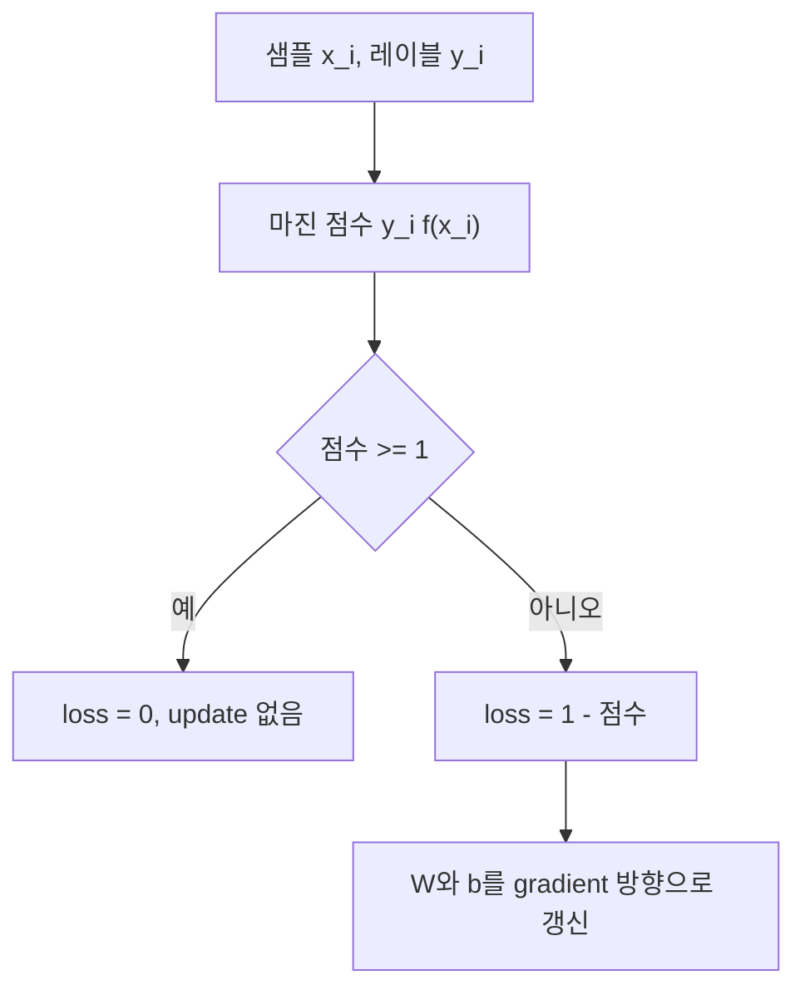
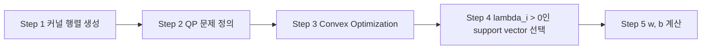

실습 자료는 최대 마진 초평면을 구하는 두 해법을 제시한다. GD는 힌지 손실의 조건부 gradient로 $W,b$를 갱신하고, QP는 커널 행렬과 볼록 최적화를 거쳐 $lambda_i>0$인 서포트 벡터를 선택한다.

> [!IMPORTANT]
> 아래 수식과 단계는 두 원본 실습 자료에 있는 표현을 따랐다. 원본의 오탈자(Qudratic, Decent)는 의미를 바꾸지 않는 범위에서 설명 문장만 정리했다.

---

## 공통 목표와 거리

최적 분리 초평면은

$$
f(X)=W^TX+b=0
$$

이고, 마진 경계는 $f(X)=\pm1$이다. 자료의 마진은

$$
\mathrm{Margin}=\frac{2}{\lVert W\rVert}
$$

로 제시된다.

```html preview
<div style="font-family:system-ui,sans-serif;padding:20px;color:var(--foreground)">
  <label for="amt" style="font-size:14px;font-weight:600">힌지 입력 점수</label>
  <div id="out" style="font-size:30px;font-weight:700;color:var(--chart-1);margin:6px 0">0.5</div>
  <input id="amt" type="range" min="-1" max="1" step="0.5" value="0.5"
    style="width:100%;accent-color:var(--primary)" />
  <p style="font-size:13px;color:var(--muted-foreground)">자료의 -1, 0, 0.5, +1 점수 예시를 따라간다.</p>
  <script>
    var amt = document.getElementById('amt');
    var out = document.getElementById('out');
    amt.addEventListener('input', function () {
      out.textContent = '' + Number(amt.value).toLocaleString();
    });
  </script>
</div>
```

---

## 힌지 손실

정답 레이블이 +1이면 $f(X_i)\ge1$, -1이면 $f(X_i)\le-1$일 때 정상 분류다. 샘플별 손실은

$$
L_i=\max(0,1-y_i(W^Tx_i+b))
$$

이다. 자료의 예시 점수와 손실은 다음과 같다.

| $y_i(W^Tx_i+b)$ | Hinge loss |
| ---: | ---: |
| -1 | 2 |
| 0 | 1 |
| 0.5 | 0.5 |
| +1 | 0 |

조건을 만족하는 경우 $\partial L/\partial W=0$, $\partial L/\partial b=0$이라 갱신하지 않는다. 그 밖에는 자료에 적힌 gradient $\partial L/\partial W=-y_ix_i$, $\partial L/\partial b=-y_i$를 이용한다.



---

## GD 절차

자료가 설명한 Gradient decent algorithm은 현재 지점에서 미분하고, learning rate를 곱한 뒤 반대 방향으로 update한다. 예시 값은 learning rate 0.1, gradient 0.8, 이동량 0.08이다.

1. 데이터와 레이블을 준비한다.
2. 조건을 만족하지 않는 샘플을 순회한다.
3. $W\leftarrow W+\eta y_ix_i$, $b\leftarrow b+\eta y_i$로 갱신한다.
4. 학습된 $W,b$로 경계를 그린다.

<Tabs>
  <Tab label="조건 충족">
    $y_i f(x_i)\ge1$이면 손실이 0이고 update를 수행하지 않는다.
  </Tab>
  <Tab label="조건 위반">
    $y_i f(x_i)<1$이면 손실이 양수이고 가중치·편향을 update한다.
  </Tab>
</Tabs>

---

## QP 기반 흐름

QP 자료와 실습 마지막 부분은 fit 함수를 다섯 단계로 나눈다.



QP의 목적은 마진 조건을 만족하는 해를 찾는 것이다. 실습 슬라이드에는 목적함수 min w와 제약조건 $y_i(W^Tx_i+b)\ge1$가 함께 제시된다. 이 문서는 QP 라이브러리의 실제 출력이나 수치 해를 제공하지 않는다.

> [!WARNING]
> QP 자료는 한 페이지 요약이라 커널 행렬의 원소나 solver 호출 코드가 제공되지 않는다. 빈 부분을 외부 구현으로 보충하지 않는다.

---

## 코드에서 확인할 설정

| 항목 | GD 실습 값 |
| --- | ---: |
| 데이터 생성 API | sklearn.datasets |
| 샘플 수 | 50 |
| 특성 수 | 2 |
| 중심 수 | 2 |
| cluster_std | 1.05 |
| random_state | 40 |
| learning_rate | 0.001 |
| n_iters | 1000 |

자료의 시각화는 offset 0, -1, +1로 결정 경계와 마진을 그린다. 선형 커널 가정 밖의 성능은 자료 범위에 포함되지 않는다.

<details>
<summary>시험 전 확인</summary>

- 레이블을 -1, +1로 변환했는가?
- 조건부 gradient가 0인 경우를 건너뛰는가?
- QP에서는 lambda가 양수인 벡터만 support vector로 선택하는가?
- 목적함수와 제약조건을 혼동하지 않는가?

</details>
