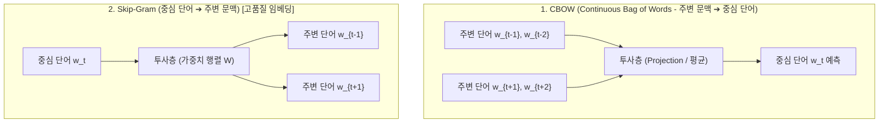

> [!abstract] 핵심 요약
> 전통적인 자연어 처리의 원-핫 인코딩(One-Hot Encoding)은 단어 간의 내적이 무조건 0이 되어 의미적 유사성을 전혀 포착하지 못한다.
> 토마스 미콜로프의 **Word2Vec**은 "비슷한 문맥에서 등장하는 단어는 유사한 의미를 갖는다"는 **분포 가설(Distributional Hypothesis)**을 토대로, 단어를 수백 차원의 연속 공간에 매핑하여 $\mathbf{v}_{\text{King}} - \mathbf{v}_{\text{Man}} + \mathbf{v}_{\text{Woman}} \approx \mathbf{v}_{\text{Queen}}$과 같은 벡터 연산(Vector Arithmetic)을 실현했다.

---

## 1. CBOW vs Skip-Gram 모델 구조 비교



---

## 2. 코사인 유사도(Cosine Similarity) 수식

$$\operatorname{CosineSimilarity}(\mathbf{u}, \mathbf{v}) = \frac{\mathbf{u} \cdot \mathbf{v}}{\|\mathbf{u}\|_2 \|\mathbf{v}\|_2} = \frac{\sum_{i=1}^d u_i v_i}{\sqrt{\sum u_i^2} \sqrt{\sum v_i^2}}$$

---

## 3. 실시간 단어 임베딩 벡터 코사인 유사도 & 의미 연산기

```html preview
<div style="font-family:system-ui,-apple-system,sans-serif;padding:20px;background:var(--card);color:var(--card-foreground);border:1px solid var(--border);border-radius:var(--radius)">
  <div style="font-size:16px;font-weight:700;margin-bottom:14px;color:var(--primary);display:flex;align-items:center;gap:8px">
    <span>📐 Word2Vec 단어 벡터 코사인 유사도 & 벡터 연산기</span>
  </div>

  <div style="display:flex;gap:10px;align-items:center;margin-bottom:14px">
    <label style="font-size:12px;font-weight:700">단어 쌍 (Word Pair) 비교:</label>
    <select id="w2vPairSelect" style="padding:4px 8px;background:var(--background);color:var(--foreground);border:1px solid var(--border);border-radius:var(--radius);font-weight:700">
      <option value="king_queen">👑 King ↔ Queen (왕과 여왕)</option>
      <option value="cat_dog">🐱 Cat ↔ Dog (고양이와 강아지)</option>
      <option value="apple_car">🍎 Apple ↔ Car (사과와 자동차)</option>
    </select>
  </div>

  <div style="display:grid;grid-template-columns:1fr 1fr;gap:12px;margin-bottom:12px">
    <div style="padding:10px;background:var(--background);border:1px solid var(--border);border-radius:var(--radius);text-align:center">
      <div style="font-size:10px;color:var(--muted-foreground)">코사인 유사도 (Cosine Similarity)</div>
      <div id="w2vSimOut" style="font-family:monospace;font-size:16px;font-weight:800;color:var(--primary);margin-top:2px">+0.892 (매우 유사)</div>
    </div>
    <div style="padding:10px;background:var(--background);border:1px solid var(--border);border-radius:var(--radius);text-align:center">
      <div style="font-size:10px;color:var(--muted-foreground)">원-핫 벡터 유사도 (One-Hot)</div>
      <div style="font-family:monospace;font-size:16px;font-weight:800;color:var(--destructive,#ef4444);margin-top:2px">0.000 (직교)</div>
    </div>
  </div>

  <div id="w2vLogDesc" style="padding:10px;background:var(--background);border:1px solid var(--border);border-radius:var(--radius);font-size:11px">
    Word2Vec 밀집 임베딩 공간에서 'King'과 'Queen'은 군주 및 성별 차원 축에서 밀접하게 배치되어 0.892의 높은 유사도를 가집니다.
  </div>

  <script>
    document.getElementById('w2vPairSelect').onchange = function() {
      var val = this.value;
      if (val === 'king_queen') {
        document.getElementById('w2vSimOut').textContent = "+0.892 (매우 유사)";
        document.getElementById('w2vLogDesc').textContent = "Word2Vec 밀집 임베딩 공간에서 'King'과 'Queen'은 군주 및 성별 차원 축에서 밀접하게 배치되어 0.892의 높은 유사도를 가집니다.";
      } else if (val === 'cat_dog') {
        document.getElementById('w2vSimOut').textContent = "+0.815 (유사)";
        document.getElementById('w2vLogDesc').textContent = "'Cat'과 'Dog'은 애완동물, 포유류 문맥을 공유하므로 높은 코사인 유사도를 나타냅니다.";
      } else {
        document.getElementById('w2vSimOut').textContent = "+0.041 (무관)";
        document.getElementById('w2vLogDesc').textContent = "'Apple'(과일/IT)과 'Car'(운송수단)는 문맥 공유가 거의 없어 유사도가 0에 가깝습니다.";
      }
    };
  </script>
</div>
```
