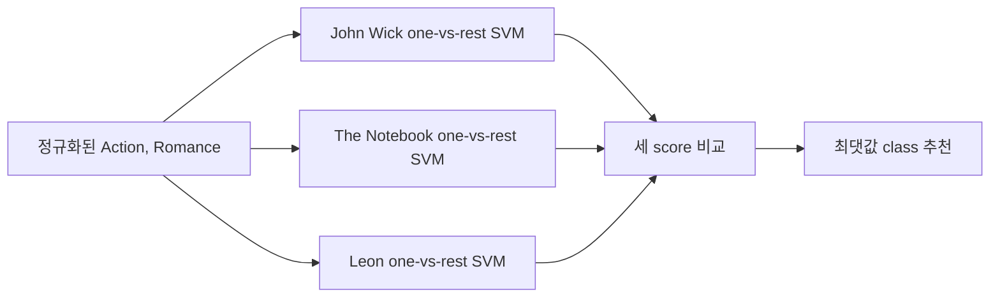

평가 문제는 고객의 Action·Romance 점수로 세 영화 중 하나를 추천하는 시스템을 설계하게 한다. 세 클래스는 John Wick(0), The Notebook(1), Leon(2)이다.

> [!IMPORTANT]
> 문제 요구사항과 대비문제 해설의 출력·모순을 함께 기록한다. 해설에 없는 KNN 결과는 추정하지 않는다.

---

## 데이터와 정규화

입력은 Action, Romance 두 열이고 label은 movie다. 대비문제 표의 일부 행은 다음과 같다.

| Index | Action | Romance | Label |
| ---: | ---: | ---: | --- |
| 0 | 49.14 | 79.97 | The Notebook |
| 1 | 85.28 | 53.01 | John Wick |
| 2 | 33.51 | 23.33 | Leon |
| 1999 | 25.88 | 40.63 | Leon |

각 입력 특성은 평균과 표준편차로 Gaussian normalization한 뒤 train/test 80:20으로 나눈다.

$$
x'=(x-\mu)/\sigma
$$

```html preview
<div style="font-family:system-ui,sans-serif;padding:20px;color:var(--foreground)">
  <label for="amt" style="font-size:14px;font-weight:600">영화 class index</label>
  <div id="out" style="font-size:30px;font-weight:700;color:var(--chart-1);margin:6px 0">1</div>
  <input id="amt" type="range" min="0" max="2" step="1" value="1"
    style="width:100%;accent-color:var(--primary)" />
  <p style="font-size:13px;color:var(--muted-foreground)">자료에 정의된 0 John Wick, 1 The Notebook, 2 Leon을 선택한다.</p>
  <script>
    var amt = document.getElementById('amt');
    var out = document.getElementById('out');
    amt.addEventListener('input', function () {
      out.textContent = '' + Number(amt.value).toLocaleString();
    });
  </script>
</div>
```

---

## 2-1. 세 개의 SVM

학습 설정은 learning rate 0.001, iteration 1000, hinge loss다. 각 영화 one-vs-rest 레이블을 만든다.

- John Wick: 해당 class는 +1, 나머지는 -1
- The Notebook: 해당 class는 +1, 나머지는 -1
- Leon: 해당 class는 +1, 나머지는 -1

마진 조건은 $y_i(w^Tx_i+b)\ge1$이고, 조건 위반 시 $w,b$를 갱신한다. 세 모델의 score

$$
s_k=x^Tw_k+b_k
$$

중 가장 큰 값을 가진 class를 선택한다.



---

## 2-2. KNN 요구사항

KNN은 정규화된 학습 데이터에서 1부터 30 사이의 홀수 K 후보를 시험한다. 각 후보는 테스트 데이터 정확도를 계산하고, 가장 높은 정확도의 K를 선택한다. 거리 척도는 L2(Euclidean)다.

- 후보: 1, 3, 5, …, 29
- 평가: 테스트 정확도
- 최종 예측: 선택한 K로 신규 입력 class 결정

> [!WARNING]
> 두 원본 파일은 문제 요구사항을 제시하지만 실제 최적 K 값이나 KNN 신규 예측 출력은 제공하지 않는다. 숫자를 만들어 채우지 않는다.

---

## 2-3. 신규 입력과 제공된 SVM 출력

신규 입력은 Action 26.5점, Romance 66.5점이다. 반드시 학습 평균·표준편차로 정규화한 뒤 세 SVM score와 KNN에 넣는다.

대비문제 해설이 제공한 SVM score는 다음과 같다.

| Class | score |
| --- | ---: |
| JohnWick | -4.3933 |
| TheNotebook | 0.2566 |
| Leon | -0.1623 |

최댓값은 TheNotebook(0.2566)이므로 해설의 SVM 추천은 노트북이다.

<details>
<summary>제출 전 체크리스트</summary>

- 세 모델의 one-vs-rest label을 정확히 만들었는가?
- 신규 Action·Romance를 정규화했는가?
- SVM은 세 score 중 최댓값을 선택했는가?
- KNN은 테스트 정확도로 최적 홀수 K를 먼저 정했는가?

</details>

> [!CAUTION]
> 문제 본문은 KNN 결과까지 요구하지만 대비문제 해설에는 SVM 출력과 노트북 정답만 있다. KNN 결과를 SVM 결과와 동일하다고 간주할 근거는 없다.
