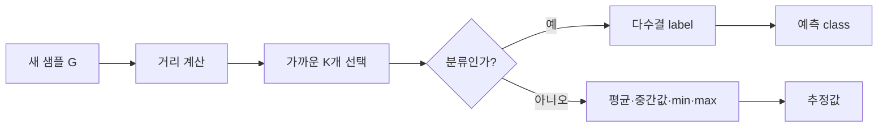

K-Nearest Neighbors는 새 샘플과 가장 가까운 $K$개 학습 샘플을 찾아 분류하거나 값을 추정하는 memory-based, lazy learning 방식이다. 자료는 K=1과 K=3의 경계·투표 차이부터 거리식과 직접 구현까지 이어간다.

> [!IMPORTANT]
> 원본의 감기 표, 수치 예시, 거리 공식, 실습 순서를 그대로 재구성했다. 외부 데이터나 임의 정확도는 추가하지 않았다.

---

## K와 결정 경계

K=1은 가장 가까운 한 샘플의 label을 사용해 선형에 가까운 경계를 만들 수 있고, K=3은 세 샘플의 majority voting으로 비선형 경계를 만들 수 있다. KNN 응용은 (1) KNN 분류, (2) KNN 추정이다.

```html preview
<div style="font-family:system-ui,sans-serif;padding:20px;color:var(--foreground)">
  <label for="amt" style="font-size:14px;font-weight:600">이웃 수 K</label>
  <div id="out" style="font-size:30px;font-weight:700;color:var(--chart-1);margin:6px 0">3</div>
  <input id="amt" type="range" min="1" max="3" step="2" value="3"
    style="width:100%;accent-color:var(--primary)" />
  <p style="font-size:13px;color:var(--muted-foreground)">자료에 제시된 K=1과 K=3을 전환한다.</p>
  <script>
    var amt = document.getElementById('amt');
    var out = document.getElementById('out');
    amt.addEventListener('input', function () {
      out.textContent = '' + Number(amt.value).toLocaleString();
    });
  </script>
</div>
```

| 작업 | 이웃들의 집계 |
| --- | --- |
| 분류 | 다수결(majority voting) |
| 추정·회귀 | 평균, 중간값, 최솟값, 최댓값 중 선택 |

자료의 회귀 예시는 K=1일 때 new=15, K=3일 때 (10+12+20)/3=14를 보여준다.

---

## 감기 분류 예시

새 관측치 G의 기침·콧물·가래·발열 값은 자료 표에 있고, A~F의 새 관측치와 거리는 다음처럼 제시된다.

| 사람 | 상태 | 거리 |
| --- | --- | ---: |
| A | 정상 | 1.54 |
| B | 정상 | 0.76 |
| C | 정상 | 2.00 |
| D | 감기 | 0.78 |
| E | 감기 | 1.28 |
| F | 감기 | 1.31 |

가장 가까운 이웃은 B(0.76), D(0.78)다. 자료의 결론은 K=1이면 정상, K=3이면 감기다.



---

## 거리 측정

자료가 열거한 척도는 다음과 같다.

$$
D_{L1}(x,y)=\sum_i|x_i-y_i|
$$

$$
D_{L2}(x,y)=\sqrt{\sum_i(a_i-b_i)^2}
$$

Mahalanobis 거리는 공분산 행렬의 역행렬 $\Sigma^{-1}$을 사용하고, correlation distance는 $1-r$로 제시된다.

<Tabs>
  <Tab label="L1 / Manhattan">
    각 특성 차이의 절댓값을 합산한다.
  </Tab>
  <Tab label="L2 / Euclidean">
    특성 차이를 제곱·합산·제곱근해 직선거리를 얻는다.
  </Tab>
  <Tab label="기타">
    Mahalanobis와 correlation distance도 자료의 비교 목록에 포함된다.
  </Tab>
</Tabs>

---

## 최적 K와 손실

K가 너무 작으면 overfitting, 너무 크면 underfitting 위험이 있다. 자료는 분류에서 MisclassError, 회귀에서 SSE를 K=1,2,…,K*에 대해 비교해 최적 K를 찾는다고 설명한다.

- 분류: indicator function으로 오분류 수를 센다.
- 회귀: $SSE=\sum_i(y_i-\hat y_i)^2$를 비교한다.
- 실습 흐름: Euclidean distance 함수 작성 → KNN 모델 작성 → 예측·성능 평가 → label과 prediction 시각화.

```html preview
<div style="font-family:system-ui,sans-serif;padding:20px;color:var(--foreground)">
  <label for="amt" style="font-size:14px;font-weight:600">K 후보 상한</label>
  <div id="out" style="font-size:30px;font-weight:700;color:var(--chart-1);margin:6px 0">3</div>
  <input id="amt" type="range" min="1" max="30" step="1" value="3"
    style="width:100%;accent-color:var(--primary)" />
  <p style="font-size:13px;color:var(--muted-foreground)">중간고사 자료의 후보 K가 1~30 사이이므로, 실습 탐색 상한을 보여준다.</p>
  <script>
    var amt = document.getElementById('amt');
    var out = document.getElementById('out');
    amt.addEventListener('input', function () {
      out.textContent = '' + Number(amt.value).toLocaleString();
    });
  </script>
</div>
```

> [!WARNING]
> 중간고사 자료의 1~30 후보 범위는 평가 문제에 해당하고, KNN 강의의 일반식 자체가 보장하는 최적 K는 아니다. 실제 최적값은 테스트 정확도/SSE를 계산해 결정해야 한다.

<details>
<summary>직접 구현 점검</summary>

- 거리 함수에서 각 특성 차이를 같은 기준으로 계산했는가?
- 분류는 이웃 label의 다수결을 사용했는가?
- 회귀는 선택한 집계(평균·중간값·min·max)를 명시했는가?
- K를 바꾸어 경계와 성능이 어떻게 달라지는지 확인했는가?

</details>
