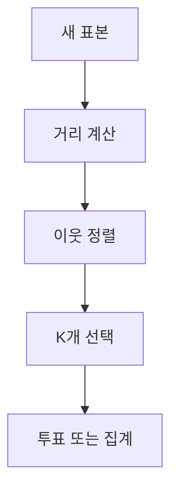

> [!NOTE]
> KNN은 새 표본과 가까운 학습 표본을 찾고, 분류에서는 다수결을, 회귀에서는 수치 집계를 사용한다.

---

## 기억 기반 예측 흐름



KNN은 학습 단계에서 매개변수 모델을 만들기보다 학습 표본을 보관하고, 예측 시점에 거리를 계산한다.

---

## 감기 판별 예제의 이웃

새 표본 G의 네 특성은 $(3.05,3.10,3.95,3.70)$이다.

| 표본 | 네 특성 | label | G와의 거리 |
| :-- | :-- | :-- | --: |
| A | 1.85, 3.40, 4.12, 2.95 | 정상 | 1.54 |
| B | 2.90, 3.20, 3.77, 3.10 | 정상 | 0.76 |
| C | 2.35, 2.95, 5.25, 3.48 | 정상 | 2.00 |
| D | 3.70, 3.80, 4.05, 3.85 | 감기 | 0.78 |
| E | 3.45, 2.90, 2.95, 4.10 | 감기 | 1.28 |
| F | 3.95, 2.60, 3.40, 4.20 | 감기 | 1.31 |

> [!IMPORTANT]
> source의 정렬 결과에서 $K=1$은 정상, $K=3$은 감기로 예측한다.

---

## 분류와 회귀

<Tabs>
  <Tab label="KNN 분류">

가까운 $K$개 이웃의 class label을 세고 가장 많은 label을 반환한다. 동률 처리 규칙은 source에 제시되지 않는다.

  </Tab>
  <Tab label="KNN 회귀">

source의 수치 예제는 가까운 값 $10$, $12$, $20$을 사용한다. $K=1$에서는 새 값이 $15$이고, $K=3$ 평균은 다음과 같다.

$$
\frac{10+12+20}{3}=14
$$

source는 평균 외에도 median, minimum, maximum을 집계 방법으로 열거한다.

  </Tab>
</Tabs>

---

## 거리 함수

| 거리 | source 식 | 특징 |
| :-- | :-- | :-- |
| Manhattan | $\sum_i\lvert x_i-y_i\rvert$ | 축별 절댓값 차이의 합 |
| Euclidean | $\sqrt{\sum_i(a_i-b_i)^2}$ | 직선거리 |
| Mahalanobis | $\sqrt{(X-Y)^T\Sigma^{-1}(X-Y)}$ | 공분산 구조 포함 |
| correlation | $1-r$ | 상관이 클수록 거리 감소 |

---

## K 선택과 복잡도

- **작은 K:** 가까운 개별 표본의 영향을 크게 받아 overfitting 쪽으로 기울 수 있다.
- **큰 K:** 넓은 이웃을 평균화해 underfitting 쪽으로 기울 수 있다.
- **허용 범위:** source는 $1\le K\le N$을 제시한다.

분류와 회귀에서 후보 K를 평가하는 source 식은 각각 다음과 같다.

$$
\operatorname{MisclassError}_k
=
\frac{1}{k}\sum_{i=1}^{k}I(c_i\ne\hat{c}_i)
$$

$$
\operatorname{SSE}_k
=
\sum_{i=1}^{k}(y_i-\hat{y}_i)^2
$$

---

## 직접 구현 실습의 측정값

```html preview
<div style="font-family:system-ui,sans-serif;padding:20px">
  <div id="cards" style="display:flex;gap:14px;flex-wrap:wrap"></div>
  <script>
    var stats = [
      ['생성 표본', '500', 'make_classification', 'var(--chart-2)'],
      ['클래스', '3', '분류 대상', 'var(--chart-1)'],
      ['정확도', '0.81', 'source 실행 출력', 'var(--chart-5)']
    ];
    document.getElementById('cards').innerHTML = stats.map(function (s) {
      return '<div style="flex:1;min-width:150px;padding:16px;background:var(--card);' +
        'color:var(--card-foreground);border:1px solid var(--border);' +
        'border-radius:var(--radius)">' +
        '<div style="font-size:13px;color:var(--muted-foreground)">' + s[0] + '</div>' +
        '<div style="font-size:26px;font-weight:700;margin-top:4px">' + s[1] + '</div>' +
        '<div style="font-size:12px;font-weight:600;margin-top:4px;color:' + s[3] + '">' +
        s[2] + '</div>' +
        '</div>';
    }).join('');
  </script>
</div>
```

---

## synthetic data 설정

| 매개변수 | 값 |
| :-- | --: |
| `n_features` | 2 |
| `n_clusters_per_class` | 1 |
| `n_informative` | 2 |
| `n_redundant` | 0 |
| `random_state` | 40 |
| KNN 기본 `k` | 3 |

---

## L2 거리와 예측 메서드

$$
d(\mathbf{x}_1,\mathbf{x}_2)
=
\sqrt{\sum_j(x_{1j}-x_{2j})^2}
$$

`fit`은 훈련 특성과 label을 저장한다. `predict`는 각 test 표본마다 모든 훈련 표본과의 L2 거리를 구하고, 가장 가까운 index를 선택한 다음 다수 label을 반환한다.

---

## 평가와 결과 비교

예측 label과 실제 test label의 일치 비율은 다음 식으로 계산한다.

$$
\operatorname{accuracy}
=
\frac{\sum I(y_{\mathrm{pred}}=y_{\mathrm{test}})}
{\operatorname{len}(y_{\mathrm{test}})}
$$

source는 실제 label scatter와 예측 label scatter를 나란히 그려 결과를 비교한다. 이 plot의 좌표별 값은 텍스트로 제공되지 않으므로 공개 note에 재구성하지 않는다.

---

## K 탐색 자료 펼쳐 보기

<details>
<summary>source 그래프를 결과로 해석하지 않는 이유</summary>

K에 따른 오분류율과 SSE 그래프는 $K=5$를 최적점처럼 표시한다. 그러나 그래프에 사용된 표본별 수치나 실행 코드가 함께 제시되지 않아 이 값은 현재 실습 데이터의 측정 결과가 아니라 K 선택 원리를 설명하는 예시로만 다룬다. 시험 자료의 홀수 K 탐색 역시 별도 문제 범위이며 이 note의 interactive control 기본값으로 가져오지 않는다.

</details>

---

## 원본 오류와 추출 한계

> [!WARNING]
> source는 KNN을 `model-based learning`에 놓고 K-means를 `memory-based or lazy learning`에 배치하지만, 같은 자료의 KNN 절차는 학습 표본을 저장해 예측 시 이웃을 찾는 lazy 구조다. $K=1$ 경계를 linear, $K=3$ 경계를 non-linear라고 단정한 그림은 해당 예시에 한정된다. 수치 평균 예제는 `KNN 분류`로 적혀 있으나 계산 내용은 회귀다. correlation distance의 보조식은 `where = σ_XY`처럼 불완전하게 추출된다. 이론 자료는 실제 17쪽과 16쪽 footer가 어긋나고, 실습 자료의 배정 구간은 모두 text-poor라 코드·출력 화면을 직접 대조했다.

---

## 정리

| 판단 단계 | 분류 | 회귀 |
| :-- | :-- | :-- |
| 이웃 선택 | 같은 거리 함수와 K 사용 | 같은 거리 함수와 K 사용 |
| 결과 결합 | class 다수결 | 수치 평균 등 집계 |
| 후보 K 평가 | 오분류율 | SSE |
| 구현 경계 | test 시 거리 계산 | 집계 규칙을 명시해야 함 |
