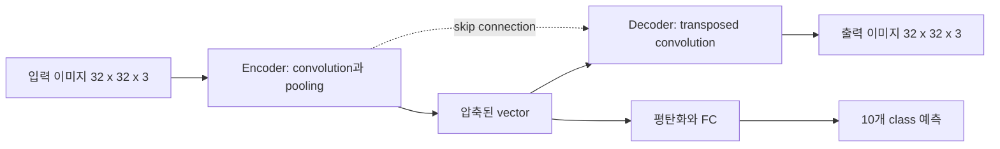

U-Net 자료는 2015년 semantic segmentation 모델로 등장한 encoder–decoder 구조를 CIFAR-10 분류 실습에 연결한다. encoder가 입력 특징을 압축하고 decoder가 feature map에서 이미지를 복원하며, skip connection은 앞 단계의 정교한 feature map을 전달한다.

> [!IMPORTANT]
> 아래 층 크기와 채널 수는 원본 U-Net 구조 슬라이드에 표시된 값만 옮겼다. 원본 네트워크 그림은 포함하지 않는다.

---

## U-Net의 두 경로

- **Encoder**: 입력 이미지에서 특징을 학습하고 해상도를 줄여 압축된 vector를 만든다.
- **Decoder**: 압축 vector에서 feature map과 출력 이미지를 복원한다.
- **Skip connection**: encoder의 feature map을 decoder로 전달해 정교한 segmentation map을 만든다.
- **분류 연결**: 압축된 vector를 평탄화·fully connected 층에 넣어 10개 class를 예측한다.

```html preview
<div style="font-family:system-ui,sans-serif;padding:20px;color:var(--foreground)">
  <label for="amt" style="font-size:14px;font-weight:600">자료의 채널 끝점</label>
  <div id="out" style="font-size:30px;font-weight:700;color:var(--chart-1);margin:6px 0">24</div>
  <input id="amt" type="range" min="6" max="32" step="26" value="24"
    style="width:100%;accent-color:var(--primary)" />
  <p style="font-size:13px;color:var(--muted-foreground)">구조에 등장하는 6채널과 32채널 끝점을 전환한다.</p>
  <script>
    var amt = document.getElementById('amt');
    var out = document.getElementById('out');
    amt.addEventListener('input', function () {
      out.textContent = '' + Number(amt.value).toLocaleString();
    });
  </script>
</div>
```



---

## 원본 encoder–decoder 층

U-Net 분류 구조의 입력과 층은 다음 순서로 표시된다.

| 단계 | 원본 설정 |
| --- | --- |
| 입력 | 32×32×3 |
| Conv1 | [5×5×3]×6, s1, p2, ReLU |
| Pool1 | AvgPool, k2, s2 |
| Conv2 | [5×5×6]×16, s1, p2, ReLU |
| Conv3 | [5×5×16]×24, s1, p2, ReLU |
| Pool2 | AvgPool, k2, s2 |
| Conv4 | [5×5×24]×32, s1, p2, ReLU |
| Up1 | [4×4×32]×24, s2, p1, ReLU |
| Conv5 | [5×5×24]×16, s1, p2, ReLU |
| Up2 | [4×4×16]×6, s2, p1, ReLU |
| Conv6 | [5×5×6]×3, s1, p2, ReLU |
| 출력 | 32×32×3 |

자료는 encoder의 feature map을 decoder에 전달하면 segmentation map을 더 정교하게 만들 수 있다고 설명한다.

---

## Auto encoder 관점

U-Net은 auto encoder 구조를 이용해 입력 정보를 압축할 수 있다.

<Tabs>
  <Tab label="Encoder">
    입력 이미지에서 압축된 vector를 만든다. vector가 어떤 정보를 정확히 포함하는지는 별도로 해석되지 않는다.
  </Tab>
  <Tab label="Decoder">
    압축된 vector로부터 입력 이미지와 segmentation map을 생성한다.
  </Tab>
  <Tab label="분류">
    vector를 평탄화한 뒤 FC1 2048×120, FC2 120×84, FC3 84×10을 거쳐 10×1 결과를 낸다.
  </Tab>
</Tabs>

> [!NOTE]
> 원본은 segmentation 설명과 CIFAR-10 분류 FC 경로를 같은 구조 그림에 배치한다. 따라서 U-Net의 기본 용도와 이 실습의 분류 출력은 구분해 읽어야 한다.

---

## 전치 합성곱의 설정 규칙

자료는 transposed convolution을 up-sampling 층으로 정의하고, feature map을 N배 키우려면 다음 설정을 제시한다.

$$
\mathrm{Kernel\ size}=2N,
\qquad
\mathrm{Stride}=N,
\qquad
\mathrm{Padding}=0.5N
$$

원본 구조의 Up1·Up2는 kernel 4×4, stride 2, padding 1로 표시되어 위 규칙의 N=2 사례에 해당한다.

<details>
<summary>구조 점검</summary>

- 일반 convolution과 transposed convolution의 역할을 혼동하지 않는다.
- pooling은 해상도를 줄이고, transposed convolution은 up-sampling을 수행한다.
- skip connection이 encoder의 feature map을 decoder로 보낸다.
- 최종 이미지 경로와 10개 class 예측 경로를 따로 확인한다.

</details>

> [!WARNING]
> 원본의 일부 중간 U-Net 그림은 텍스트 추출이 불완전하지만, 명시된 층 사양·채널 수·up-sampling 규칙은 텍스트로 확인된다. 그림에서 읽어야 하는 추가 수치는 만들지 않았다.
