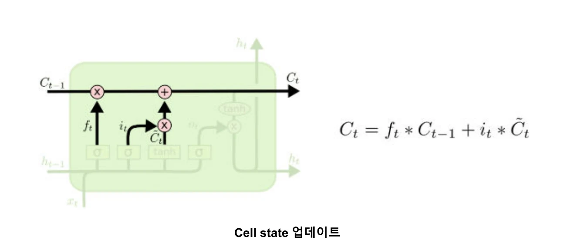
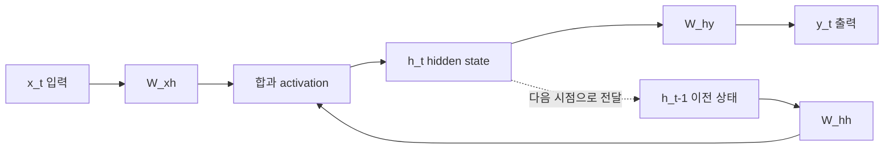
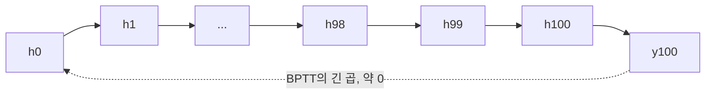
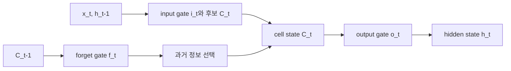

자료는 LLM의 역사에서 RNN과 LSTM을 출발점으로 삼아, 순서가 있는 데이터의 상태 전달·BPTT·장기 의존성 문제와 LSTM의 세 gate를 설명한다.

> [!IMPORTANT]
>
> 원본의 연도·문장 예시·gate 벡터와 수식을 직접 옮겼다. 손글씨 판서는 사용하지 않고, cell-state 갱신을 설명하는 데 필요한 영역만 아래에 크롭했다.
>
> **LSTM cell-state 갱신 도식**
>
> 
>
> _forget·input gate의 곱셈 결과가 이전 cell state와 더해지는 경로를 보여준다._
>
> <!-- provenance: source=머신러닝_RNN_LSTM.pdf; page=49; crop=cell-state-update-only -->

---

## 언어 모델과 시계열

Language Model은 인간의 언어를 이해·생성하기 위한 모델이고, LLM은 방대한 데이터로 학습한 많은 parameter를 가진 모델이다. 자료가 제시한 흐름은 RNN(1986) → LSTM(1997) → Seq2Seq(NIPS 2014) → Attention(ICLR 2015) → Transformer(NIPS 2017) → GPT-1(2018)이다.

RNN이 필요한 이유는 현재가 과거 상태의 영향을 받는 데이터 때문이다. 센서 예시에서는 12:00·13:00 정상, 14:00 센서 값 변화와 불량, 15:00 불량, 24:00 정상의 시간 흐름을 제시한다. 언어도 “안녕하세요 머신러닝 강의 너무 좋아요”처럼 단어 순서와 맥락이 의미를 만든다.

```html preview
<div style="font-family:system-ui,sans-serif;padding:20px;color:var(--foreground)">
  <label for="amt" style="font-size:14px;font-weight:600">RNN 시간 인덱스</label>
  <div id="out" style="font-size:30px;font-weight:700;color:var(--chart-1);margin:6px 0">100</div>
  <input id="amt" type="range" min="0" max="100" step="1" value="100"
    style="width:100%;accent-color:var(--primary)" />
  <p style="font-size:13px;color:var(--muted-foreground)">자료의 h0와 h98·h99·h100 장기 의존성 그림을 따라간다.</p>
  <script>
    var amt = document.getElementById('amt');
    var out = document.getElementById('out');
    amt.addEventListener('input', function () {
      out.textContent = '' + Number(amt.value).toLocaleString();
    });
  </script>
</div>
```

---

## RNN 한 시점

기본 신경망은 이전 정보를 반영하지 않아 “나는 → I, 머신러닝이 → Like, 좋다 → Machine Learning”의 번역 맥락을 놓칠 수 있다. RNN은 입력과 이전 hidden state를 함께 사용한다.

$$
h_t=f(W_{xh}x_t+W_{hh}h_{t-1}+b)
$$

$$
y_t=f(W_{hy}h_t+b)
$$

$W\_{xh}$, $W\_{hh}$, $W\_{hy}$는 모든 시점에서 같은 값을 공유한다. 출력 길이와 입력 길이에 따라 one-to-one, many-to-one, one-to-many, many-to-many로 나눌 수 있으며, 자료는 한글 문장을 영어 문장으로 옮기는 Sequence-to-Sequence 예시를 many-to-many로 보여준다.



---

## Sequence-to-Sequence와 학습

번역 예시는 입력 “나는, 머신러닝이, 좋다” 뒤에 출력 시작 토큰 &lt;SOS&gt;, “I, Like, Machine learning”을 순서대로 생성한다. 학습에서는 각 시점의 예측과 정답으로 loss를 계산하고, shared parameter를 한 번에 업데이트한다.

$W\_{hy}$의 gradient는 출력 loss에서 $\hat y_t$와 $h_t$를 거쳐 연결된다. $W\_{hh}$와 $W\_{xh}$는 현재 시점뿐 아니라 $h\_{t-1}$, $h\_{t-2}$ 등 이전 시점으로 이어지는 항들의 합으로 미분한다.

$$
\frac{\partial Loss}{\partial W_{hh}}
=\sum_{k=0}^{t}
\frac{\partial Loss}{\partial \hat y_t}
\frac{\partial \hat y_t}{\partial h_t}
\frac{\partial h_t}{\partial h_k}
\frac{\partial h_k}{\partial W_{hh}}
$$

이 순차 미분이 BPTT(시간을 거꾸로 전파)다.

---

## 장기 의존성과 기울기 소실

자료는 h0에서 h100까지 이어지는 곱을 예로 든다. 각 미분 항이 0\~1이면 긴 곱이 거의 0이 되어 t=0의 영향이 사라지고 parameter가 업데이트되지 않는다.



영어 “Don't Look Up”에서 “Don't”와 출력 “마세요”는 의미상 연결되지만 먼 시점의 정보가 소실되면 번역 정확도가 낮아질 수 있다고 자료가 설명한다.

---

## LSTM의 상태와 세 gate

LSTM은 RNN의 장기 의존성 문제를 완화하기 위해 cell state를 제안하고 forget, input, output gate를 추가한다.

| 구성 | 자료의 역할 |
| --- | --- |
| Cell state $C_t$ | 장기 정보 유지 |
| Hidden state $h_t$ | 단기 정보 유지 |
| Forget gate $f_t$ | 불필요한 과거 정보를 잊음 |
| Input gate $i_t$ | 현재 정보를 기억 |
| Output gate $o_t$ | cell state를 hidden state에 얼마나 반영할지 결정 |

Forget·input·output gate는 sigmoid라 0\~1 가중치다. 자료의 forget 예시는 $C\_{t-1}=(0.2,0.1,0.3,0.5,0.2,0.2,0.3)$에 대해 모두 0이면 모두 잊고, 모두 1이면 그대로 기억하는 경우를 보여준다. Input 예시는 $i_t=(0.1,0,0.8,0.2,0.8,0.7,1)$, 후보 cell $\tilde C_t=(0.1,0.3,0.6,0.2,0.9,0.1,0.4)$와 곱해 $(0.01,0,0.48,0.04,0.72,0.07,0.4)$를 만든다.

Cell state는 불필요한 과거를 제거한 항과 현재 후보 항을 합쳐 갱신한다. Hidden state는 output gate의 가중치를 반영한다.



---

## Transformer로 이어지는 한계

LSTM도 긴 sequence에서 모든 정보를 저장하는 데 한계가 있고, RNN·LSTM은 순차 입력·출력이라 병렬처리가 어렵다. 자료는 self-attention을 사용하는 Transformer가 이 문제를 해결하고 이후 여러 분야에서 연구되었다고 정리한다.

> [!WARNING]
> 원본은 LSTM을 장기 의존성 문제의 완전한 해법이라고 말하지 않는다. “완화”했지만 긴 sequence와 병렬 처리에는 여전히 한계가 있다고 명시한다.

<details>
<summary>RNN·LSTM 복습</summary>

RNN은 shared parameter와 hidden state 순환으로 문맥을 전달하고, LSTM은 cell state와 세 gate로 장기·단기 정보를 분리한다. BPTT의 긴 곱이 0에 가까워지는 것이 RNN의 핵심 실패 모드다.

</details>
