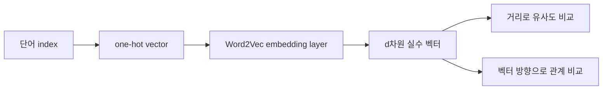

Word2Vec 자료는 RNN·LSTM 리뷰 뒤에 one-hot encoding의 한계를 설명하고, 낮은 차원의 embedding vector로 단어를 표현하는 Word2Vec과 문맥 학습 방식인 CBOW·Skip-Gram을 비교한다.

> [!IMPORTANT]
> 임베딩 좌표·확률·손실 값은 원본 예시에 표시된 값만 사용했다. 외부 말뭉치나 새로운 벡터는 추가하지 않았다.

---

## One-hot의 두 한계

자료의 4단어 예시는 cat=0, apple=1, dog=2, banana=3으로 인덱스를 부여한다. 각 단어는 길이 4의 one-hot vector가 된다.

| 단어 | index | one-hot |
| --- | ---: | --- |
| cat | 0 | (1,0,0,0) |
| apple | 1 | (0,1,0,0) |
| dog | 2 | (0,0,1,0) |
| banana | 3 | (0,0,0,1) |

어휘가 100,000개면 one-hot vector도 100,000차원이 되어 메모리·계산량이 커진다. 또 서로 다른 one-hot vector 사이 L2 거리는 항상 같아 단어 간 유사도나 특징을 설명하지 못한다.

$$
L2(A,B)=\lVert A-B\rVert_2
=\sqrt{\sum_{i=0}^{N-1}(A_i-B_i)^2}
$$

```html preview
<div style="font-family:system-ui,sans-serif;padding:20px;color:var(--foreground)">
  <label for="amt" style="font-size:14px;font-weight:600">어휘 차원</label>
  <div id="out" style="font-size:30px;font-weight:700;color:var(--chart-1);margin:6px 0">4</div>
  <input id="amt" type="range" min="4" max="100000" step="99996" value="4"
    style="width:100%;accent-color:var(--primary)" />
  <p style="font-size:13px;color:var(--muted-foreground)">자료의 4단어 예시와 100,000단어 one-hot 차원을 전환한다.</p>
  <script>
    var amt = document.getElementById('amt');
    var out = document.getElementById('out');
    amt.addEventListener('input', function () {
      out.textContent = '' + Number(amt.value).toLocaleString();
    });
  </script>
</div>
```

---

## Word2Vec embedding

Word2Vec은 단어를 낮은 차원의 실수 벡터로 바꾼다. 자료는 100,000차원 one-hot을 embedding dimension $d$로 투영하는 구조를 보여준다. $d$는 hyperparameter다.

예시 좌표는 다음과 같다.

| 단어 | embedding 예시 |
| --- | --- |
| cat | (0.8, 0.7) |
| dog | (0.7, 0.6) |
| apple | (0.2, 0.4) |
| banana | (0.3, 0.2) |

cat·dog는 동물 영역에서 가깝고 apple·banana는 과일 영역에서 가깝게 배치된다. 자료는 잘 학습된 경우 유사도는 거리로, 관계는 벡터 방향으로 표현할 수 있으며 woman→man과 queen→king 벡터가 유사한 예를 든다.



---

## 독립 단어 학습 예시

4개 단어 I, love, cute, cat을 one-hot input으로 사용하는 모델에서 $W_1$은 4×2, $W_2$는 2×4이며 hidden vector 차원 $d=2$인 예시가 제시된다. hidden node 차원은 hyperparameter다.

충분히 학습되지 않은 love 예시의 output 확률은 0.12, 0.24, 0.50, 0.14이고 cross-entropy loss는 1.38이다. 충분히 학습된 예시는 0.03, 0.90, 0.05, 0.02로 love 확률이 가장 커진다. 학습이 끝난 뒤 embedding vector는 input weight의 해당 행으로 표현한다.

```html preview
<div style="font-family:system-ui,sans-serif;padding:20px;color:var(--foreground)">
  <h3 style="margin:0 0 14px;font-size:15px;font-weight:600">love 예측 확률</h3>
  <div id="bars" style="display:flex;align-items:flex-end;gap:14px;height:170px"></div>
  <script>
    var data = [['I', 0.03], ['love', 0.90], ['cute', 0.05], ['cat', 0.02]];
    var max = Math.max.apply(null, data.map(function (d) { return d[1]; }));
    document.getElementById('bars').innerHTML = data.map(function (d, i) {
      return '<div style="flex:1;display:flex;flex-direction:column;align-items:center;' +
        'gap:6px;height:100%;justify-content:flex-end">' +
        '<span style="font-size:12px;font-weight:600">' + d[1] + '</span>' +
        '<div style="width:100%;height:' + (d[1] / max * 100) + '%;' +
        'background:var(--chart-' + (i + 1) + ');' +
        'border-radius:var(--radius) var(--radius) 0 0"></div>' +
        '<span style="font-size:12px;color:var(--muted-foreground)">' + d[0] + '</span>' +
        '</div>';
    }).join('');
  </script>
</div>
```

> [!WARNING]
> 독립적인 단어 변환만 학습하면 여러 단어 사이의 연속 관계를 파악할 수 없다. 자료는 이 한계를 CBOW와 Skip-Gram으로 해결한다고 제시한다.

---

## CBOW와 Skip-Gram

CBOW는 여러 주변 단어(context)를 주고 가운데 단어를 예측한다. 자료의 예시는 “I ??? cat”, “We ??? movie”, “You ??? picture”, “Cat ??? dog”처럼 문맥으로 빈칸을 채운다. “I love cat”에서 I와 cat의 one-hot을 입력해 love를 출력한다.

Skip-Gram은 반대로 하나의 단어를 주고 주변에 나타날 여러 단어를 출력한다. “I love cat”에서 love를 입력해 I와 cat을 예측하는 데이터가 예시다.

<Tabs>
  <Tab label="CBOW">
    context 여러 개 → 가운데 target 하나. 문장 전체의 문맥 관계를 학습한다.
  </Tab>
  <Tab label="Skip-Gram">
    target 하나 → 주변 context 여러 개. CBOW와 반대 방향으로 학습한다.
  </Tab>
</Tabs>

<details>
<summary>Word2Vec 핵심 점검</summary>

- one-hot은 어휘 크기만큼 차원이 커지고 거리도 균일하다.
- embedding dimension $d$는 hyperparameter다.
- cross-entropy와 gradient descent로 output 확률을 조정한다.
- embedding vector는 학습된 input weight의 행이다.

</details>
