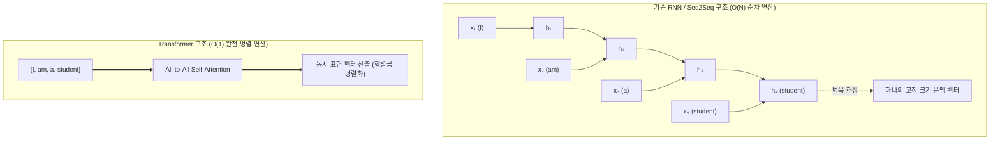

트랜스포머(Transformer, Vaswani et al., 2017)는 기존 순환 신경망(RNN)의 순차적(Sequential) 연산 병목을 제거하고, 전체 시퀀스를 한 번에 병렬 처리하면서 단어 간의 장거리 의존성(Long-term Dependency)을 완벽하게 포착하는 **주의집중(Attention) 메커니즘** 기반의 혁신적인 딥러닝 아키텍처다.

---

## 1. 언어 모델링(Language Modeling)과 패러다임 전환

### 1) 언어 모델의 본질과 확률 분해

언어 모델은 단어들의 시퀀스 $W = (w_1, w_2, \dots, w_T)$에 대해 자연스러운 문장이 나타날 결합 확률(Joint Probability)을 할당한다:
$$P(w_1, w_2, \dots, w_T) = \prod_{t=1}^T P(w_t \mid w_1, w_2, \dots, w_{t-1})$$

```text
[자기회귀(Autoregressive) 생성 예시]
"안녕하세요,"  ──>  "오늘"  ──>  "날씨가"  ──>  "정말"  ──>  [ ? (맑네요 / 좋네요) ]
```

### 2) 순차 모델(RNN/LSTM)의 한계와 트랜스포머의 등장



| 비교 항목 | RNN / LSTM / GRU | Transformer (Attention Is All You Need) |
| :--- | :--- | :--- |
| **순차 처리 여부** | 필수 (이전 은닉 상태 $h_{t-1}$ 계산 전까지 $h_t$ 계산 불가) | **불필요 (전체 토큰 시퀀스 동시 입력 및 병렬 행렬 연산)** |
| **최대 경로 길이** | $O(N)$ (문장이 길어질수록 그래디언트 소실/왜곡 발생) | **$O(1)$ (모든 단어 쌍이 1회 내적으로 직접 상호작용)** |
| **GPU 가속 효율** | 시계열 의존성으로 인해 병렬 처리 제한 | **대규모 GPU 텐서 코어 병렬 연산에 극대화** |

---

## 2. 위치 인코딩 (Positional Encoding)

트랜스포머는 RNN처럼 순차적으로 입력을 받지 않기 때문에, 문장 내 단어의 순서 정보가 자동으로 반영되지 않는다.
예를 들어 `"I love you"`와 `"You love I"`는 Self-Attention만 적용하면 동일한 집합으로 인식된다. 이를 해결하기 위해 입력 임베딩에 **주기함수(삼각함수)** 기반의 위치 벡터 $PE$를 더해준다.

### 사인·코사인 위치 인코딩 수식

각 단어의 시퀀스 내 위치 $pos \in [0, \text{seq\_len}-1]$와 임베딩 차원의 인덱스 $i \in [0, d_{\text{model}}/2 - 1]$에 대해:

$$PE_{(pos, 2i)} = \sin\left( \frac{pos}{10000^{2i / d_{\text{model}}}} \right)$$
$$PE_{(pos, 2i+1)} = \cos\left( \frac{pos}{10000^{2i / d_{\text{model}}}} \right)$$

$$\text{Final Input Matrix } X = \text{WordEmbedding} + PE$$

> [!NOTE]
> **왜 삼각함수를 사용하는가?**
> 임의의 오프셋 $k$에 대해 $PE_{pos+k}$는 $PE_{pos}$의 선형 변환으로 표현될 수 있어, 모델이 상대적인 거리(Relative Position)를 손쉽게 학습할 수 있기 때문이다.

---

## 3. 인터랙티브 위치 인코딩 & 기계번역 인코더-디코더 시뮬레이터

문장 길이와 위치 $pos$를 선택하면 주기별 $\sin / \cos$ 진동 패턴과 기계번역(영어 $\to$ 프랑스어) 시 인코더-디코더 크로스 어텐션의 정렬 과정을 실시간으로 확인할 수 있다.

```html preview
<div style="font-family:system-ui,-apple-system,sans-serif;padding:20px;background:var(--card);color:var(--card-foreground);border:1px solid var(--border);border-radius:var(--radius);max-width:100%">
  <!-- 상단 컨트롤: 단어 위치 pos 및 차원 선택 -->
  <div style="display:flex;gap:12px;align-items:center;margin-bottom:14px;flex-wrap:wrap">
    <div style="display:flex;align-items:center;gap:6px">
      <span style="font-size:12px;font-weight:700">단어 토큰 (pos):</span>
      <select id="pe-sel-pos" style="padding:4px 8px;border:1px solid var(--border);border-radius:var(--radius);background:var(--background);color:var(--foreground);font-size:12px;font-weight:700">
        <option value="0">pos 0: "I"</option>
        <option value="1" selected>pos 1: "am"</option>
        <option value="2">pos 2: "a"</option>
        <option value="3">pos 3: "student"</option>
      </select>
    </div>

    <div style="display:flex;gap:4px">
      <button id="pe-btn-enc" style="padding:5px 10px;background:var(--primary);color:#fff;border:none;border-radius:var(--radius);font-size:11px;font-weight:600;cursor:pointer">인코더 Self-Attention</button>
      <button id="pe-btn-dec" style="padding:5px 10px;background:transparent;border:1px solid var(--border);color:var(--foreground);border-radius:var(--radius);font-size:11px;font-weight:600;cursor:pointer">디코더 Cross-Attention</button>
    </div>
  </div>

  <!-- SVG 위치 인코딩 파형 -->
  <div style="background:var(--background);border:2px dashed var(--border);border-radius:var(--radius);padding:10px;display:flex;justify-content:center">
    <svg id="pe-svg" width="400" height="150" style="overflow:visible"></svg>
  </div>

  <!-- 번역 및 어텐션 상태 박스 -->
  <div style="margin-top:12px;padding:12px;background:var(--background);border:1px solid var(--border);border-radius:var(--radius);display:grid;grid-template-columns:1fr 1fr;gap:10px;font-size:12px">
    <div>
      <div style="color:var(--muted-foreground)">인코더 입력 토큰 (영어)</div>
      <div id="pe-enc-text" style="font-weight:700;color:var(--chart-1);font-size:14px;margin-top:2px">I am a student</div>
    </div>
    <div>
      <div style="color:var(--muted-foreground)">디코더 생성 토큰 (프랑스어)</div>
      <div id="pe-dec-text" style="font-weight:700;color:var(--chart-2);font-size:14px;margin-top:2px">&lt;sos&gt; je suis étudiant &lt;eos&gt;</div>
    </div>
  </div>
</div>

<script>
(function() {
  var selPos = document.getElementById('pe-sel-pos');
  var btnEnc = document.getElementById('pe-btn-enc');
  var btnDec = document.getElementById('pe-btn-dec');
  var svg = document.getElementById('pe-svg');
  var encText = document.getElementById('pe-enc-text');
  var decText = document.getElementById('pe-dec-text');

  var dModel = 16;
  var isCross = false;

  function render() {
    var pos = parseInt(selPos.value, 10);
    svg.innerHTML = '';

    // 바차트 형태로 16개 차원의 PE 값 렌더링
    var barW = 18;
    var ox = 30, oy = 75;

    // 중심 기준선
    var zeroLine = document.createElementNS('http://www.w3.org/2000/svg', 'line');
    zeroLine.setAttribute('x1', 20); zeroLine.setAttribute('y1', oy);
    zeroLine.setAttribute('x2', 380); zeroLine.setAttribute('y2', oy);
    zeroLine.setAttribute('stroke', 'var(--border)');
    svg.appendChild(zeroLine);

    for (var i = 0; i < dModel; i++) {
      var val = 0;
      var dimIdx = Math.floor(i / 2);
      var denom = Math.pow(10000, (2 * dimIdx) / dModel);
      if (i % 2 === 0) {
        val = Math.sin(pos / denom);
      } else {
        val = Math.cos(pos / denom);
      }

      var barH = val * 55;
      var rect = document.createElementNS('http://www.w3.org/2000/svg', 'rect');
      var x = ox + i * 22;
      var y = val >= 0 ? (oy - barH) : oy;

      rect.setAttribute('x', x);
      rect.setAttribute('y', y);
      rect.setAttribute('width', barW);
      rect.setAttribute('height', Math.abs(barH));
      rect.setAttribute('fill', i % 2 === 0 ? 'var(--chart-1)' : 'var(--chart-2)');
      rect.setAttribute('rx', '2');
      svg.appendChild(rect);

      // 레이블
      var txt = document.createElementNS('http://www.w3.org/2000/svg', 'text');
      txt.setAttribute('x', x + 9);
      txt.setAttribute('y', 142);
      txt.setAttribute('text-anchor', 'middle');
      txt.setAttribute('font-size', '9px');
      txt.setAttribute('fill', 'var(--muted-foreground)');
      txt.textContent = 'd' + i;
      svg.appendChild(txt);
    }
  }

  selPos.addEventListener('change', render);

  btnEnc.addEventListener('click', function() {
    isCross = false;
    btnEnc.style.background = 'var(--primary)';
    btnEnc.style.color = '#fff';
    btnDec.style.background = 'transparent';
    btnDec.style.color = 'var(--foreground)';
    encText.textContent = 'I am a student (인코더 양방향 Self-Attention)';
    decText.textContent = '인코더의 Key, Value 생성 대기';
    render();
  });

  btnDec.addEventListener('click', function() {
    isCross = true;
    btnDec.style.background = 'var(--primary)';
    btnDec.style.color = '#fff';
    btnEnc.style.background = 'transparent';
    btnEnc.style.color = 'var(--foreground)';
    encText.textContent = '인코더 출력: [K_enc, V_enc] 제공';
    decText.textContent = '디코더: Q_dec ("je suis") 와 K_enc 매핑 진행';
    render();
  });

  render();
})();
</script>
```

---

## 4. 인코더와 디코더의 블록 구성 비교

```text
[인코더 계층 (Encoder Stack)]                     [디코더 계층 (Decoder Stack)]
         ┌───────────────┐                                ┌───────────────┐
         │ Feed-Forward  │                                │ Feed-Forward  │
         └───────┬───────┘                                └───────┬───────┘
                 │ (Add & Norm)                                   │ (Add & Norm)
         ┌───────┴───────┐                                ┌───────┴───────┐
         │ Self-Attention│                                │Cross-Attention│ ◄── [K, V from Encoder]
         └───────┬───────┘                                └───────┬───────┘
                 │ (Add & Norm)                                   │ (Add & Norm)
         ┌───────┴───────┐                                ┌───────┴───────┐
         │ Input Embed+PE│                                │Masked Self-Att│ (Look-ahead Masking)
         └───────────────┘                                └───────┬───────┘
                                                                  │ (Add & Norm)
                                                          ┌───────┴───────┐
                                                          │Output Embed+PE│
                                                          └───────────────┘
```

1. **인코더 (Encoder)**:
   - 입력 시퀀스의 모든 단어가 서로를 양방향(Bidirectional)으로 자유롭게 참조.
   - 출력: 디코더의 교차 어텐션에서 사용할 메모리 표현 행렬 $K_{\text{enc}}, V_{\text{enc}}$.
2. **디코더 (Decoder)**:
   - **마스크된 셀프 어텐션 (Masked Self-Attention)**: 이전 시점까지 생성된 단어들만 참조할 수 있도록 미래 위치를 $-\infty$로 가리는 Look-ahead Mask 적용.
   - **인코더-디코더 교차 어텐션 (Cross-Attention)**: 디코더의 현재 상태를 $Q$로 사용하고, 인코더의 전체 문맥 출력 $K, V$와 매칭하여 번역에 필요한 원문 단어에 집중.
