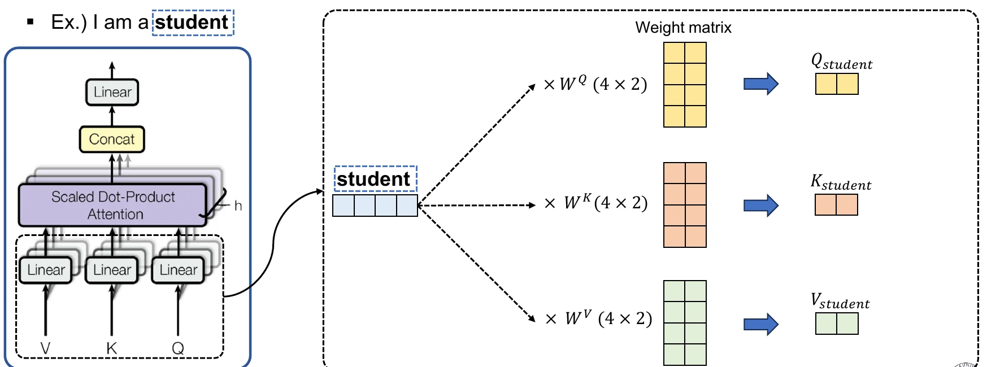
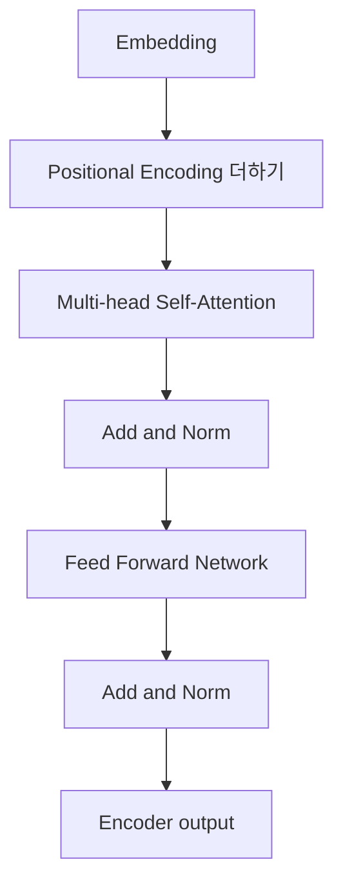

Transformer 자료의 encoder 부분은 단어를 벡터로 바꾸고 위치를 더한 뒤, 단어 간 관련도를 self-attention으로 계산한다. Scaled dot-product와 multi-head를 거쳐 Add & Norm, Feed Forward Network를 반복한다.

> [!IMPORTANT]
>
> attention weight·차원·head 수·식은 원본 예시의 값을 사용했다. attention 행렬을 새로 계산하지 않고, Q·K·V 투영을 읽는 데 필요한 영역만 아래에 크롭했다.
>
> **Multi-head self-attention의 Q·K·V 투영 도식**
>
> 
>
> _student 벡터가 각각의 가중치 행렬을 거쳐 Query·Key·Value로 분기되는 과정을 보여준다._
>
> <!-- provenance: source=14주차_머신러닝_Transformer_강의자료.pdf; page=23; crop=multihead-qkv-only -->

---

## Embedding과 위치 정보

딥러닝 모델은 텍스트를 직접 이해하지 못하므로 embedding으로 단어를 숫자 벡터로 바꾼다. Positional encoding은 각 단어의 위치 인덱스와 벡터 차원 인덱스를 이용해 위치 정보를 만들고 embedding vector에 덧셈한다.

자료의 예시는 “I love you”와 “You love I”가 단어는 같아도 순서가 달라 의미가 달라진다고 설명한다. 모든 벡터를 동시에 처리하는 Transformer에 위치 정보가 없으면 두 문장을 같게 볼 수 있다.

```html preview
<div style="font-family:system-ui,sans-serif;padding:20px;color:var(--foreground)">
  <label for="amt" style="font-size:14px;font-weight:600">multi-head 수</label>
  <div id="out" style="font-size:30px;font-weight:700;color:var(--chart-1);margin:6px 0">2</div>
  <input id="amt" type="range" min="1" max="2" step="1" value="2"
    style="width:100%;accent-color:var(--primary)" />
  <p style="font-size:13px;color:var(--muted-foreground)">자료가 가정한 head(h)=2와 단일 head 비교를 전환한다.</p>
  <script>
    var amt = document.getElementById('amt');
    var out = document.getElementById('out');
    amt.addEventListener('input', function () {
      out.textContent = '' + Number(amt.value).toLocaleString();
    });
  </script>
</div>
```

---

## Encoder 블록

Encoder는 embedding + positional encoding을 입력으로 받는다.



- **Q(Query)**: 비교 기준, 분석 대상 단어의 가중치 vector
- **K(Key)**: attention을 수행할 단어 집합의 비교 대상
- **V(Value)**: attention weight를 적용할 참조 정보

자료의 문장 “The animal didn’t cross the street because it was too tired.”에서 it이 street인지 animal인지 판단하려면 문장 내 단어들의 유사도를 계산해 가중치를 부여해야 한다.

---

## Scaled Dot-Product Attention

예시 “I am a student”에서 student의 Query를 모든 Key와 내적한다. 내적 결과를 $\sqrt{d_k}$로 나누고 SoftMax해 attention weight를 만든 뒤 Value를 가중합한다.

$$
\mathrm{Attention}(Q,K,V)
=\mathrm{softmax}\left(\frac{QK^T}{\sqrt{d_k}}\right)V
$$

자료 예시에서 $d_k$는 embedding dimension이고 2로 제시된다. student Query의 attention weight는 I 0.4, am 0.1, a 0.1, student 0.4로 표시되며, 의미 없는 값은 0으로 처리하는 단계도 설명한다.

```html preview
<div style="font-family:system-ui,sans-serif;padding:20px;color:var(--foreground)">
  <h3 style="margin:0 0 14px;font-size:15px;font-weight:600">student attention weights</h3>
  <div id="bars" style="display:flex;align-items:flex-end;gap:14px;height:170px"></div>
  <script>
    var data = [['I', 0.4], ['am', 0.1], ['a', 0.1], ['student', 0.4]];
    var max = Math.max.apply(null, data.map(function (d) { return d[1]; }));
    document.getElementById('bars').innerHTML = data.map(function (d, i) {
      return '<div style="flex:1;display:flex;flex-direction:column;align-items:center;' +
        'gap:6px;height:100%;justify-content:flex-end">' +
        '<span style="font-size:12px;font-weight:600">' + d[1] + '</span>' +
        '<div style="width:100%;height:' + (d[1] / max * 100) + '%;' +
        'background:var(--chart-' + (i + 1) + ');' +
        'border-radius:var(--radius) var(--radius) 0 0"></div>' +
        '<span style="font-size:12px;color:var(--muted-foreground)">' + d[0] + '</span>' +
        '</div>';
    }).join('');
  </script>
</div>
```

---

## Multi-head와 차원

각 head에서 독립적으로 attention value를 계산한 뒤 결합한다. 자료는 head(h)만큼 수행하고

$$
d_{model}=d_{AV}\times h
$$

라고 설명하며 head(h)=2를 가정한다. $d\_{AV}$는 attention value의 차원, $d\_{model}$은 전체 embedding 차원이다.

---

## Residual, Layer Norm, FFN

Residual connection은 입력을 함수 출력에 더한다.

$$
H(x)=x+F(x)
$$

Layer normalization은 각 입력 벡터 $x_i$의 차원별 평균 $\mu_i$, 분산 $\sigma_i^2$, 0으로 나누는 것을 막는 $\epsilon$을 사용한다.

Feed Forward Network는 다음 두 층으로 제시된다.

$$
F_1=xW_1+b_1,
\qquad
F_2=\max(0,F_1),
\qquad
F_3=F_2W_2+b_2
$$

중간 활성화는 ReLU다.

<Tabs>
  <Tab label="Attention">
    Q와 K의 내적으로 관련도를 만들고, SoftMax weight로 V를 가중합한다.
  </Tab>
  <Tab label="Add & Norm">
    residual $x+F(x)$와 layer normalization으로 블록 출력을 안정화한다.
  </Tab>
  <Tab label="FFN">
    각 위치의 vector를 $W_1,b_1$로 변환하고 ReLU 뒤 $W_2,b_2$로 출력한다.
  </Tab>
</Tabs>

> [!WARNING]
> 원본은 차원 수로 내적값을 나누어 학습을 안정화한다고 설명한다. 구체적인 weight matrix의 원소나 전체 attention 결과는 제공하지 않으므로 계산값을 새로 만들지 않는다.

<details>
<summary>Encoder 블록 복습</summary>

Embedding → positional encoding → multi-head self-attention → Add & Norm → FFN → Add & Norm 순서를 한 번에 말할 수 있으면 된다.

</details>
