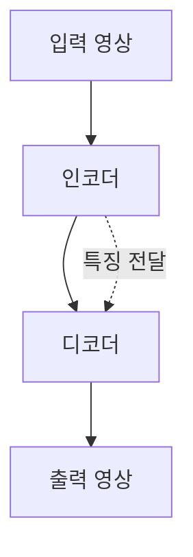

> [!NOTE]
> U-Net은 encoder가 입력 특징을 압축하고 decoder가 공간 크기를 복원하며, skip connection이 앞쪽 특징을 뒤쪽 복원 단계로 직접 전달하는 구조다.

---

## U-Net이 다루는 두 흐름

<Tabs>
  <Tab label="Encoder">합성곱과 pooling으로 입력 영상의 특징을 학습하고 압축된 표현을 만든다. 원본은 이 표현이 입력 정보를 담지만 그 의미를 직접 알기 어렵다고 설명한다.</Tab>
  <Tab label="Decoder">transposed convolution으로 특징 맵을 up-sampling하고 출력 영상을 만든다. skip connection은 encoder의 feature map을 전달해 더 정교한 segmentation map 생성을 돕는다.</Tab>
</Tabs>

> [!IMPORTANT]
> 원본은 U-Net을 2015년에 등장한 semantic segmentation 모델로 소개한 뒤, 복원된 특징을 평탄화해 CIFAR-10 분류기로 연결하는 별도 실습 구조를 제시한다.

---

## 압축과 복원의 관계

| 구간 | 주된 연산 | 원본에서 맡는 역할 |
| :-- | :-- | :-- |
| Encoder | convolution, ReLU, average pooling | 특징 학습과 정보 압축 |
| Bottleneck | 압축된 feature vector | 입력 정보를 모은 표현 |
| Decoder | transposed convolution, ReLU | 공간 크기 복원 |
| Skip connection | encoder feature 전달 | 세부 특징 보완 |
| Classifier head | flatten, fully connected | 복원 특징을 10개 클래스로 분류 |

---

## 원본의 channel 흐름

**핵심:** 입력과 출력은 모두 3개 channel이며, 가운데에서 channel 수가 32까지 증가한 뒤 다시 감소한다.

| 단계 | 설정 |
| :-- | :-- |
| 입력부 | $32 \times 32 \times 3$ |
| Encoder 1 | $[5 \times 5 \times 3] \times 6$, 이어서 $[5 \times 5 \times 6] \times 16$ |
| Encoder 2 | $[5 \times 5 \times 16] \times 24$, 이어서 $[5 \times 5 \times 24] \times 32$ |
| Decoder 1 | $[4 \times 4 \times 32] \times 24$, 이어서 $[5 \times 5 \times 24] \times 16$ |
| Decoder 2 | $[4 \times 4 \times 16] \times 6$, 이어서 $[5 \times 5 \times 6] \times 3$ |
| 분류부 | $2048 \to 120 \to 84 \to 10$ |

Encoder와 일반 convolution은 stride 1, padding 2인 $5 \times 5$ 설정을 중심으로 구성되고, 중간마다 kernel 2와 stride 2의 average pooling을 사용한다.

---

## Transposed convolution 설정

원본은 특징 맵을 $N$배 up-sampling할 때 다음 관계를 제시한다.

$$
K=2N,\qquad S=N,\qquad P=0.5N
$$

여기서 $K$는 kernel size, $S$는 stride, $P$는 padding이다.

| 확대 배율 | kernel size | stride | padding |
| :-- | :-- | :-- | :-- |
| $N$배 | $2N$ | $N$ | $0.5N$ |

---

## 분류 헤드로 연결하기

**핵심:** 이 실습은 U-Net의 복원 출력만 사용하는 대신 압축·복원 과정에서 만든 특징을 평탄화해 완전연결 분류기로 보낸다.

구조를 읽는 순서

1. $32 \times 32 \times 3$ 입력에서 encoder channel을 6, 16, 24, 32로 늘린다.
2. pooling으로 공간 크기를 줄여 압축 표현을 만든다.
3. transposed convolution으로 channel을 24, 16, 6으로 줄이며 공간 크기를 복원한다.
4. 마지막 convolution으로 3-channel 출력을 만든다.
5. 별도 분류 경로는 2,048개 값을 120, 84, 10개 출력으로 변환한다.

---

## 근거의 한계

> [!WARNING]
> 원본 중간의 여러 장은 animation 단계가 열 순서와 함께 뒤섞여 추출되었다. 또한 U-Net의 segmentation 목적과 CIFAR-10 classification 응용이 한 흐름에 함께 놓여 있다. 실행 코드, 학습 조건, 정확도는 텍스트에 없으므로 두 과제를 동일한 결과로 간주하거나 성능을 추정하지 않는다.

---

## 정리

| 핵심 개념 | 의미 | 적용 또는 경계 |
| :-- | :-- | :-- |
| Encoder | 특징 추출과 압축 | 압축 벡터의 의미는 직접 해석되지 않음 |
| Decoder | 특징 맵의 공간 크기 복원 | transposed convolution 사용 |
| Skip connection | encoder 특징을 decoder로 전달 | 세부 segmentation 정보 보완 |
| 분류 헤드 | 복원 구조의 특징을 10개 클래스로 변환 | 실행 결과는 제시되지 않음 |