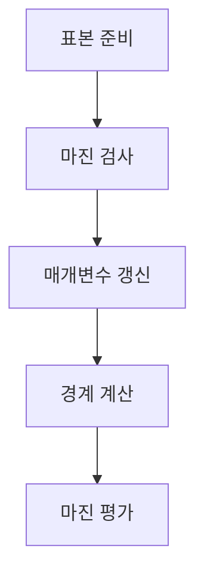

> [!NOTE]
> SVM 구현은 같은 최대 마진 조건을 반복 갱신으로 근사할 수도 있고, 이차 계획 문제나 선형 `SVC`로 직접 풀 수도 있다.

---

## 실습 데이터와 초기 조건

| 항목 | source 설정 | 역할 |
| :-- | :-- | :-- |
| 표본 수 | 50 | 두 클래스 점 생성 |
| 특성 수 | 2 | 평면에서 경계 시각화 |
| 중심 수 | 2 | 이진 분류 |
| 군집 표준편차 | 1.05 | 클래스 퍼짐 |
| 난수 seed | 40 | 동일 데이터 재현 |

`make_blobs`로 만든 레이블은 학습 전에 $-1$과 $+1$로 바꾸고, 가중치와 편향은 0에서 시작한다.

---

## 반복 갱신 흐름



- **학습률:** $0.001$
- **반복 횟수:** $1000$
- **판정:** $y_i(\mathbf{w}^{T}\mathbf{x}_i+b)<1$인 표본만 source 코드의 갱신을 실행한다.

---

## 구현 경로 비교

<Tabs>
  <Tab label="수동 GD">

마진을 위반한 표본에서 source 코드는 다음 갱신을 사용한다.

$$
\mathbf{w}\leftarrow\mathbf{w}+\alpha y_i\mathbf{x}_i,
\qquad
b\leftarrow b+\alpha y_i
$$

예측은 $\operatorname{sign}(\mathbf{w}^{T}\mathbf{x}+b)$로 정한다.

  </Tab>
  <Tab label="QP">

최대 마진 문제를 이차 목적함수와 선형 제약으로 표현한다.

$$
\min_{\mathbf{w},b}\frac{1}{2}\lVert\mathbf{w}\rVert^2
\quad\text{subject to}\quad
y_i(\mathbf{w}^{T}\mathbf{x}_i+b)\ge 1
$$

커널 행렬 구성, QP 정의, 볼록 최적화, $\lambda_i>0$인 지지 벡터 선택, $\mathbf{w}$와 $b$ 계산 순서로 진행한다.

  </Tab>
  <Tab label="선형 SVC">

`SVC(kernel='linear')`로 적합한 뒤 `coef_[0]`과 `intercept_`로 경계를 읽는다. 보조 자료는 `linear`, `rbf`, `poly`, `sigmoid` 커널 이름을 함께 열거하지만 실습 계산은 선형 커널만 사용한다.

  </Tab>
</Tabs>

---

## 수동 구현의 실제 출력

```html preview
<div style="font-family:system-ui,sans-serif;padding:20px">
  <div id="cards" style="display:flex;gap:14px;flex-wrap:wrap"></div>
  <script>
    var stats = [
      ['가중치 벡터', '[0.64070956, 0.14828428]', '수동 학습 출력', 'var(--chart-2)'],
      ['편향', '-0.12500000000000008', '수동 학습 출력', 'var(--chart-1)'],
      ['마진', '3.0411543613656318', '2 / ||w||', 'var(--chart-5)']
    ];
    document.getElementById('cards').innerHTML = stats.map(function (s) {
      return '<div style="flex:1;min-width:150px;padding:16px;background:var(--card);' +
        'color:var(--card-foreground);border:1px solid var(--border);' +
        'border-radius:var(--radius)">' +
        '<div style="font-size:13px;color:var(--muted-foreground)">' + s[0] + '</div>' +
        '<div style="font-size:26px;font-weight:700;margin-top:4px">' + s[1] + '</div>' +
        '<div style="font-size:12px;font-weight:600;margin-top:4px;color:' + s[3] + '">' +
        s[2] + '</div>' +
        '</div>';
    }).join('');
  </script>
</div>
```

---

## 결정 경계와 두 마진선

가중치가 $\mathbf{w}=[w_0,w_1]^T$일 때 평면의 선은 다음 식으로 그린다.

$$
x_2=-\frac{w_0x_1+b-c}{w_1}
$$

$c=0$이면 결정 경계이고, $c=-1$과 $c=1$이면 두 지지 초평면이다. 전체 마진은 다음과 같이 계산한다.

$$
\operatorname{margin}=\frac{2}{\sqrt{\mathbf{w}^{T}\mathbf{w}}}
$$

---

## QP가 해를 만드는 순서

| 단계 | 계산 대상 | source에서의 의미 |
| :-- | :-- | :-- |
| 1 | 커널 행렬 | 표본 쌍의 내적 구성 |
| 2 | 목적함수·제약 | QP 입력 형태 정의 |
| 3 | 볼록 최적화 | 라그랑주 승수 계산 |
| 4 | $\lambda_i>0$ | 지지 벡터 선택 |
| 5 | $\mathbf{w},b$ | 최종 경계 복원 |

---

## 구현 절차 펼쳐 보기

<details>
<summary>수동 반복과 예측 단계</summary>

1. 레이블을 $-1$, $+1$로 바꾼다.
2. $\mathbf{w}$와 $b$를 0으로 초기화한다.
3. 매 반복마다 모든 표본의 $y_i(\mathbf{w}^{T}\mathbf{x}_i+b)$를 검사한다.
4. 값이 1보다 작을 때만 source 코드의 가중치·편향 갱신을 수행한다.
5. 학습 뒤 판별식의 부호로 클래스를 예측하고, $c=0,-1,+1$인 세 선을 그린다.

</details>

---

## 방법별 관찰 가능 출력

| 방법 | 직접 얻는 값 | 후속 계산 |
| :-- | :-- | :-- |
| 수동 반복 | `w`, `b` | 부호 예측과 마진 |
| QP | 지지 벡터 승수 | 지지 벡터에서 경계 복원 |
| 선형 `SVC` | `coef_`, `intercept_` | 경계와 두 마진선 |

---

## 원본 구현과 추출 경계

> [!WARNING]
> `SVM.pdf`의 수동 갱신은 마진을 만족한 표본에서 아무 연산도 하지 않고, 목적함수의 $\lVert\mathbf{w}\rVert^2$에 해당하는 감쇠 항도 구현하지 않는다. 따라서 source 코드 자체는 완전한 soft-margin SVM 목적함수보다 perceptron-like hinge update에 가깝다. `QP SVM.pdf`는 1쪽짜리 보조 코드라 독립적인 QP 유도를 제공하지 않는다. 또한 주 실습 자료는 실제 33쪽이지만 footer가 31쪽 체계를 사용하며, 이 문서는 배정 범위인 21–31쪽만 사용하고 Q&A 뒤의 33쪽 예시는 제외했다.

---

## 정리

| 구현 | 장점 | source 범위의 한계 |
| :-- | :-- | :-- |
| 수동 반복 | 마진 검사와 갱신 순서를 직접 추적 | 정규화 항이 생략된 단순 갱신 |
| QP | 최대 마진 목적과 제약을 직접 표현 | 보조 자료의 코드·설명이 매우 짧음 |
| 선형 `SVC` | 적합 뒤 계수로 경계를 바로 계산 | 열거된 비선형 커널은 실습하지 않음 |
