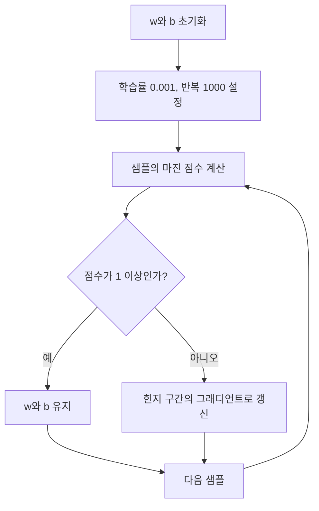

GD와 QP는 같은 최대 마진 목표를 향하지만 구현 표면이 다르다. GD 실습은 샘플을 순회하며 $w,b$를 갱신하고, QP 경로는 제약식이 있는 볼록 최적화 문제를 푼다.

> [!IMPORTANT]
> 두 자료의 구현 사실을 합치지 않는다. GD의 반복 갱신, QP의 제약 최적화, `SVC(kernel='linear')` 호출은 서로 다른 경로다.

---

## 공통 목표와 기하

결정 함수와 세 경계는 다음과 같다.

$$
f(x)=w^T x+b
$$

$$
w^T x+b=0,qquad w^T x+b=-1,qquad w^T x+b=+1
$$

자료는 두 서포트 벡터 경계 사이의 마진을 다음과 같이 계산한다.

$$
mathrm{margin}=rac{2}{lVert w
Vert_2}
$$

---

## 힌지 손실과 두 구간

힌지 손실은 자료에서 다음과 같이 제시된다.

$$
L_i=max(0,1-y_i(w^T x_i+b))
$$

| 마진 점수 $y_i f(x_i)$ | 손실 | GD 동작 |
| ---: | ---: | --- |
| -1 | 2 | 갱신 |
| 0 | 1 | 갱신 |
| 0.5 | 0.5 | 갱신 |
| 1 이상 | 0 | 갱신하지 않음 |

---

## GD 갱신 흐름

자료의 설명은 현재 파라미터에서 그래디언트를 구하고 학습률을 곱한 뒤 반대 방향으로 이동하는 순서다.

$$
	heta_{t+1}=	heta_t-alpharac{partial L}{partial	heta_t}
$$



---

## 자료의 GD 모델 표면

```python
class SVM:
    def __init__(self, learning_rate=0.001, n_iters=1000):
        # initialization

    def fit(self, X, y):
        # update parameters

    def predict(self, X):
        # prediction
```

실습 화면은 기본 학습률 0.001과 반복 횟수 1000을 명시한다. 세부 반복 본문은 화면에서 완성 코드가 아니라 작성 과제로 남아 있다.

---

## GD 실행 결과

실습 화면에 출력된 값은 다음과 같다.

| 항목 | 출력 |
| --- | --- |
| $w$ | $[0.64070956, 0.14828428]$ |
| $b$ | $-0.12500000000000008$ |
| 계산된 마진 | $3.0411543613656318$ |

마진 코드는 `2 / sqrt(dot(w.T, w))`를 사용한다.

> [!NOTE]
> 이 값들은 해당 자료 화면의 한 실행 결과다. 다른 데이터나 초기 조건까지 일반화된 성능 지표는 아니다.

---

## 힌지 점수 컨트롤

자료가 손실 예로 명시한 0, 0.5, 1의 마진 점수만 선택한다. 점수가 1에 도달하면 표의 손실은 0이 된다.

```html preview
<div style="font-family:system-ui,sans-serif;padding:20px;color:var(--foreground)">
  <label for="amt" style="font-size:14px;font-weight:600">마진 점수 yᵢf(xᵢ)</label>
  <div id="out" style="font-size:30px;font-weight:700;color:var(--chart-1);margin:6px 0">0.5</div>
  <input id="amt" type="range" min="0" max="1" step="0.5" value="0.5"
    style="width:100%;accent-color:var(--primary)" />
  <p style="font-size:13px;color:var(--muted-foreground)">0과 0.5는 갱신 구간, 1은 손실 0 경계다.</p>
  <script>
    var amt = document.getElementById('amt');
    var out = document.getElementById('out');
    amt.addEventListener('input', function () {
      out.textContent = Number(amt.value).toLocaleString();
    });
  </script>
</div>
```

---

## QP 문제 정의

하드 마진 QP는 다음 목적함수와 제약조건으로 제시된다.

$$
min_w rac{1}{2}lVert w
Vert^2
$$

$$
y_i(w^T x_i+b)ge 1
$$

GD처럼 샘플별 규칙을 손으로 반복하는 대신, 이 목적함수와 모든 제약을 하나의 볼록 최적화 문제로 둔다.

---

## QP의 fit 단계


자료는 $lambda_i>0$인 샘플을 서포트 벡터로 선택한다고 설명한다.

---

## 라이브러리 QP 경로

`QP SVM.pdf`와 실습 자료는 다음 고수준 호출을 제시한다.

```python
from sklearn.svm import SVC

clf = SVC(kernel='linear')
clf.fit(X, y)
visualize_svm(clf.coef_[0], clf.intercept_)
```

마진은 같은 방식으로 계산한다.

```python
margin = 2 / np.sqrt(np.dot(clf.coef_[0].T, clf.coef_[0]))
```

---

## GD와 QP 비교

<Tabs>
  <Tab label="수동 GD">

  샘플을 순회하며 마진 위반일 때만 $w,b$를 갱신한다. 학습률과 반복 횟수가 구현 표면에 드러난다.

  </Tab>
  <Tab label="QP 절차">

  목적함수와 제약조건을 정의하고 볼록 최적화를 거쳐 $lambda_i>0$인 서포트 벡터를 찾는다.

  </Tab>
  <Tab label="SVC 호출">

  `kernel='linear'`로 학습하고 `coef_`, `intercept_`를 시각화 함수에 전달한다. 자료는 라이브러리 내부 QP 코드를 직접 작성하지 않는다.

  </Tab>
</Tabs>

---

## 커널 선택의 경계

자료의 주석은 `linear`, `rbf`, `poly`, `sigmoid`를 열거하지만 실제 실행은 `linear`다.

| 구분 | 자료에 있는가 | 이 노트에서의 해석 |
| --- | --- | --- |
| 선형 SVC 실행 | 예 | $w$와 $b$를 직접 읽을 수 있는 경로 |
| 다른 커널 이름 | 주석에만 있음 | 실행 결과 없음 |
| 비선형 마진 계산 | 없음 | $2/lVert w
Vert$ 결과로 확장하지 않음 |
| 수동 QP 행렬 코드 | 없음 | 5단계 개념 절차만 확인 가능 |

---

## 자료 오류와 구현 caveat

> [!WARNING]
> 자료에는 “Gradient Decent”, “Qudratic” 표기가 반복된다. 이 노트에서는 개념을 Gradient Descent와 Quadratic Programming으로 적되, 원자료 표기가 잘못되었다는 사실을 보존한다.

> [!WARNING]
> 힌지 손실 그래디언트 화면은 위반 구간에서 $partial L/partial b=y_i$라고 적지만, $L=1-y_i(w^T x_i+b)$를 미분하면 부호가 맞지 않는다. 이 불일치를 조용히 수정해 원자료의 식인 것처럼 제시하지 않는다.

> [!CAUTION]
> `SVC` 예시는 QP 기반 최적화의 사용 표면이지, 커널 행렬부터 쌍대 변수까지 직접 구현한 증거가 아니다.

<details>
<summary>구현 점검 목록</summary>

- GD에서는 레이블을 -1과 +1로 맞췄는가?
- QP에서는 목적함수와 모든 마진 제약을 함께 정의했는가?
- 선형 실행의 `coef_`와 `intercept_`만 마진 식에 넣었는가?
- 수치 결과와 알고리즘 일반 성능을 구분했는가?

</details>
