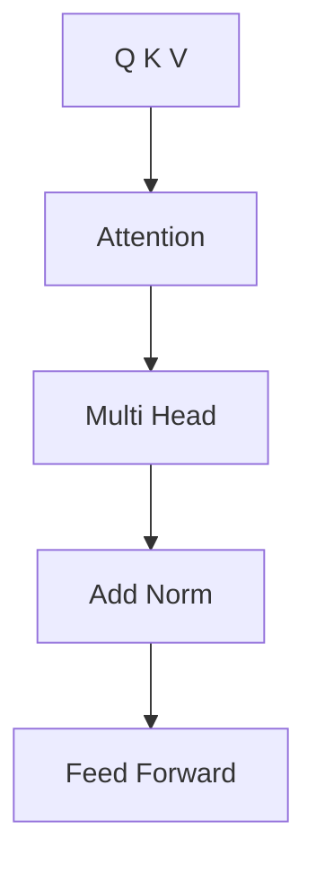

> [!NOTE]
> Self-attention은 각 단어의 Query를 다른 단어의 Key와 비교해 가중치를 만들고, 그 가중치로 Value를 결합해 문맥이 반영된 표현을 만든다.

---

## Query, Key, Value

| 요소 | 원본의 정의 | 계산에서 맡는 역할 |
| :-- | :-- | :-- |
| Query $Q$ | 비교 기준·분석 대상 단어의 가중치 vector | 어떤 정보를 찾는지 나타냄 |
| Key $K$ | 비교 대상·attention을 수행할 단어 집합 | Query와 relevance 계산 |
| Value $V$ | attention weights를 적용할 단어 정보 | 가중합으로 새 표현 생성 |

> [!EXAMPLE]
> “The animal didn’t cross the street because it was too tired.”에서 it이 animal과 street 중 무엇을 가리키는지 판단하려면 문장 안 단어끼리 relevance를 계산해야 한다.

---

## Student Query의 가중치

원본의 “I am a student” 예에서는 student Query가 네 Value를 다음 비율로 결합한다.

```html preview
<div style="font-family:system-ui,sans-serif;padding:20px;color:var(--foreground)">
  <h3 style="margin:0 0 14px;font-size:15px;font-weight:600">student Query의 attention weights</h3>
  <div id="bars" style="display:flex;align-items:flex-end;gap:14px;height:170px"></div>
  <script>
    var data = [['I', 0.4], ['am', 0.1], ['a', 0.1], ['student', 0.4]];
    var max = Math.max.apply(null, data.map(function (d) { return d[1]; }));
    document.getElementById('bars').innerHTML = data.map(function (d, i) {
      return '<div style="flex:1;display:flex;flex-direction:column;align-items:center;' +
        'gap:6px;height:100%;justify-content:flex-end">' +
        '<span style="font-size:12px;font-weight:600">' + d[1] + '</span>' +
        '<div style="width:100%;height:' + (d[1] / max * 100) + '%;' +
        'background:var(--chart-' + (i + 1) + ');' +
        'border-radius:var(--radius) var(--radius) 0 0"></div>' +
        '<span style="font-size:12px;color:var(--muted-foreground)">' + d[0] + '</span>' +
        '</div>';
    }).join('');
  </script>
</div>
```

Q, K, V projection의 예시 weight matrix 크기는 각각 $4 \times 2$이며, 원본은 $d_k=2$로 둔다.

---

## Attention에서 encoder 출력까지



<details>
<summary>한 head의 계산 순서</summary>

1. 입력 embedding에서 Q, K, V를 각각 만든다.
2. 한 Query를 모든 Key와 비교한다.
3. 원본이 제시한 scaling과 softmax를 적용해 weights를 만든다.
4. 각 Value에 weight를 곱해 더한다.
5. 같은 과정을 여러 head에서 수행한 뒤 다시 결합한다.

</details>

---

## 세 가지 attention 위치

<Tabs>
  <Tab label="Self-attention">Encoder 안에서 입력 문장의 각 단어가 같은 입력 문장의 다른 단어를 참조한다.</Tab>
  <Tab label="Masked self">Decoder가 아직 생성하지 않은 뒤쪽 token을 참조하지 않도록 처리한다.</Tab>
  <Tab label="Cross-attention">Encoder 출력의 K·V와 decoder 상태의 Q를 결합한다.</Tab>
</Tabs>

---

## Multi-head의 차원 관계

원본은 head 수와 attention value의 차원을 다음처럼 연결한다.

$$
d_{model}=d_{AV}\times h
$$

여기서 $d_{model}$은 전체 embedding 차원, $d_{AV}$는 한 attention value의 차원, $h$는 head 수다. 예시에서는 $h=2$로 가정한다.

---

## Residual connection과 정규화

Residual connection은 입력 $x$를 변환 결과에 더한다.

$$
H(x)=x+F(x)
$$

원본은 layer normalization을 설명하며 각 입력 vector $x_i$의 차원 수 $k$, 평균 $\mu_i$, 분산 $\sigma_i^2$, 분모가 0이 되는 것을 막는 $\epsilon$을 표시한다.

| 구성 | 역할 |
| :-- | :-- |
| Residual connection | 변환 전 입력을 출력에 직접 더함 |
| Layer normalization | 한 입력 vector의 차원 값들을 평균·분산으로 정규화 |
| $\epsilon$ | 정규화 분모가 0이 되는 상황 방지 |

---

## Feed-forward network

각 위치의 attention 결과는 다음 세 단계로 변환된다.

$$
F_1=xW_1+b_1
$$

$$
F_2=\max(0,F_1)
$$

$$
F_3=F_2W_2+b_2
$$

두 선형 변환 사이에서 ReLU가 음수 값을 0으로 만든다.

---

## 원본 수식과 희소 구간

> [!WARNING]
> scaled dot-product 도식은 내적을 $d_k$로 나누며 이를 embedding dimension 2로 설명한다. 원본 밖의 표준식으로 바꾸지 않았다. scaling의 미분 설명도 원본 표현만 보존해야 한다. 후반 연구 동향 장들은 구체 내용이 거의 없고, 마지막 번호는 46/45로 표시된다.

---

## 정리

| 핵심 개념 | 의미 | 적용 또는 경계 |
| :-- | :-- | :-- |
| Q·K·V | 기준, 비교 대상, 결합할 정보 | source의 역할 정의를 유지 |
| Scaled attention | 내적·scaling·softmax·Value 결합 | 나눗셈 표기에 warning 필요 |
| Multi-head | 여러 attention value를 병렬 결합 | 예시 head 수는 2 |
| Add and norm | residual과 normalization | 완전한 normalization 식은 추출되지 않음 |
| FFN | 선형→ReLU→선형 | 각 token 위치에 적용 |